CUDA Path Tracer
================

**University of Pennsylvania, CIS 565: GPU Programming and Architecture, Project 3**

* Tabatha Hickman
  * LinkedIn:https://www.linkedin.com/in/tabatha-hickman-335987140/
* Tested on: Windows 10 Pro, i7-5600U CPU @ 2.60GHz 16GB, GeForce 840M (personal computer)

## Path Tracer

### Main Features:

The following is a rough outline of the rendering process:

* A ray is generated for every pixel in the output image. Its origin is at the camera's position and its direction points toward the position in our scene which will appear at that pixel in the final image.
* Next, intersection tests are performed to determine if and what object each ray first hits in the scene. Once we know each ray has hit anything, we next need to know what the color of the surface it hits is. This is not as simple as just taking the color of the object. A path tracer determines how to shade a scene by estimating what light from other objects in the scene would have bounced onto this object and what they might contribute to the color at that point.
* So, for as many times as we want our path estimates to bounce around the scene (aka the depth), we determine intersections of each path with the scene then give each path a new origin at the location of this intersection and a new direction that is determined based on the type of material of the object intersected with and keep track of the colors contributed by those materials along the way.
* This procedure, from shooting the rays into the scene from the camera to getting final color values for each pixel, is then repeated for some number of iterations. This is done because for each iteration, we can only follow one possible path per pixel when there are infinitely many possible ones. Thus, the more iterations we do and combine the results, the more accurate of a final image we get.

For the first part of this assignment, I worked on simple physically based shading which would accurately accumulate color and redirect rays on each path and added some possible optimizations to the process which utilize the GPU. There were of course GPU kernels for processes like computing intersections and shading for each pixel, but there were some extra optimizations between path bounces and iterations that could make things even more efficient.

**Shading:** Diffuse materials contribute the color of the material to the path and new ray direction is computed by sampling a cosine-weighted hemisphere centered around the intersection point and the intersection normal to the surface. Purely reflective materials contribute the specular color of the material to the path and the new ray direction is computed by reflecting the ray about the intersection surface normal. Here is a Cornell box scene with diffuse walls, ceiling and floor and a reflective sphere in the middle.

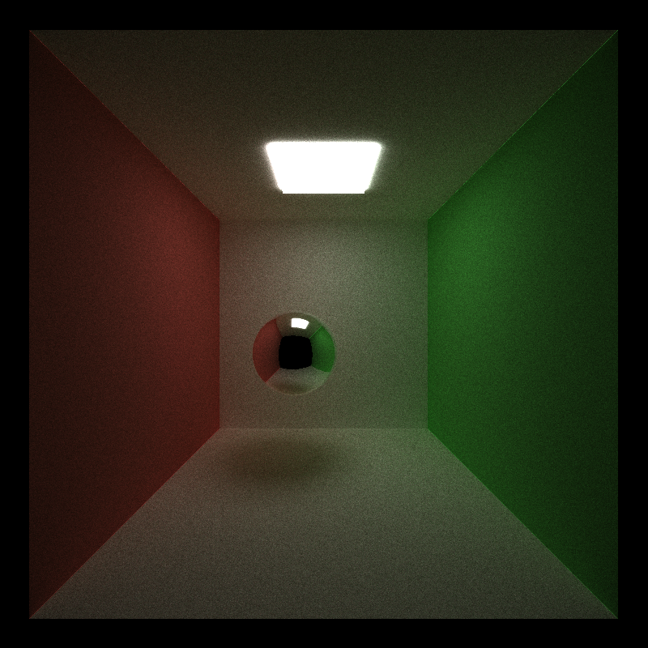

**Stream Compaction:** We can use stream compaction to remove any rays/paths which have terminated because they intersected with nothing. The ray can no longer bounce around the scene at this point so there's no reason to continue doing empty calculations for further depths. I used thrust::partition to accomplish this. We can see in the chart below that at lower trace depths (less than 20), using stream compaction actually causes render time to increase, probably because the overhead of the procedure is not worth the gain. However, at larger trace depths stream compaction is very useful, which makes sense because the more bounces we have to follow on each path, the more removing as many paths as possible benefits computation time.

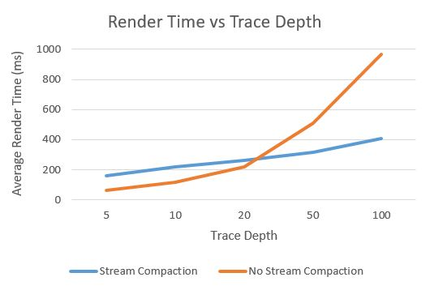

**Sorting Rays by Material Type:** We know that different types of materials take different amounts of time to compute shading and ray bounces. All the processes in one warp will take as long to compute as the slowest process in the warp, so the thought is that if we make the paths with the same materials contiguous in memory, we can reduce the amount of idle threads in the warps. However, this sorting takes some overhead and to really make this as useful as possible, it would take even more complex sorting. I didn't even put my data for this testing in this readme because the performance with sorting was atrociously worse (almost ten times worse). I sorted the paths by the materialID associated with the last intersection. This is the most simple method but it doesn't account for the fact that warps are in increments of 32 threads so even if they're sorted the likelihood that warps will still have a mix of materials is high. I could sort based on whether the material was refractive, reflective, some combination or none at all, since material IDs are not necessarily sorted in such an order, but I think this would be even more overhead for very little gain.

**Caching the First Bounce:** Another possible optimization has to do with the fact that for every iteration, we should always get the same first set of intersections because we are shooting rays to the same locations in the scene. This means on the first iteration we can cache all the intersections and use this on future iterations, avoiding some amount of computation. In the chart below I measured how the render time changes as the dimension of the output image increases and used a constant trace depth of 8. There is a very small but always positive gain to using the first bounce cache that increases slightly as we increase the image size. This makes sense, as we only save one out of 8 bounce compuations on each iteration and there is some overhead to copying memory into and out of the cache.

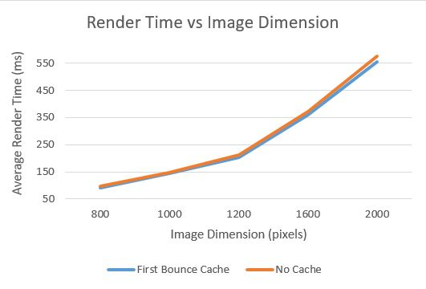

### Additional Features

**Refractive Materials:** I added support for refractive materials, both with and without Fresnel effects. For refractive materials, I refract the ray using Snell's Law and use the material's albedo color as a contribution to the path color. If total internal reflection occurs at this point, I instead reflect and use the specular color. For object's which are both reflective and refractive, we can use Fresnel dielectrics. Basically we compute a probability that reflection or refraction happens at this point and use a random number to decide which effect to apply on this bounce. Here is a Cornell box with a refractive sphere using Fresnel dielectrics. Below that is a comparison between a refractive sphere without and with Fresnel, respectively.

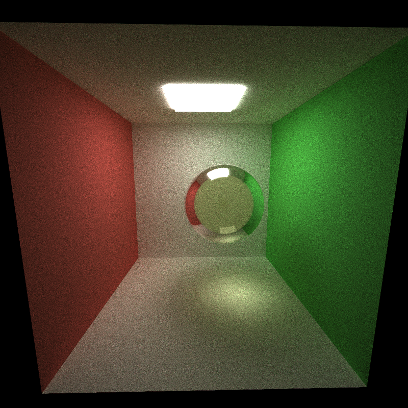

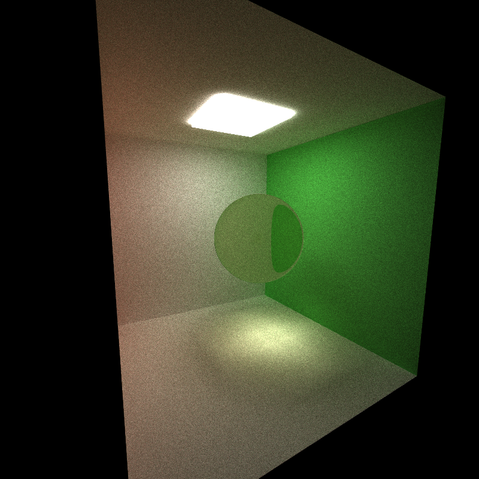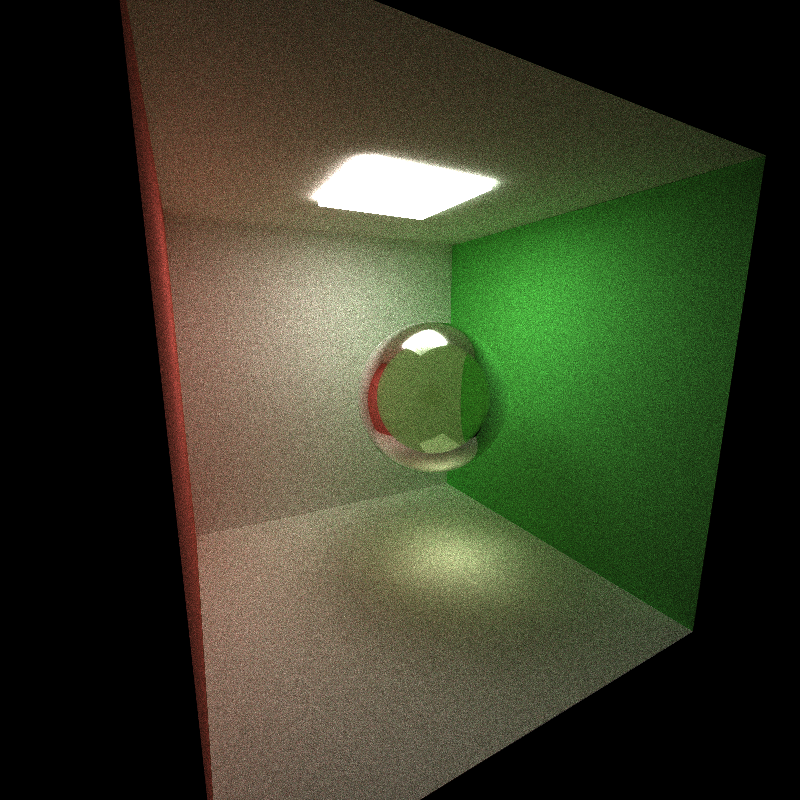

**Antialiasing:** To accomplish this, I simply added a random value between -0.5 and 0.5 to the x and y coordinates of each pixel when the initial rays were being generated. This jitters the ray slightly and over many iterations, it gives us smoother borders between shapes. This doesn't have any performance hit, but it does make it impossible to use the first bounce caching optimization described earlier. Here are two images with and without antialiasing, respectively.

**Direct Lighting:** Direct lighting is a different method of path tracing that is often used in conjunction with what we have done so far to give the best, most accurate appearing renders. In direct lighting, instead of bouncing the paths around the scene some number of times, on the first bounce, we direct the ray toward one of the lights in the scene and shade the pixel based on whether or not it is occluded from that light. This method is much faster because we only require one bounce per pixel. Similarly to regular path tracing, direct lighting benefits a lot from being able to parallelize computations per pixel. However, it cannot support a lot of features like global illumination, reflection, and refraction. Reflective and refractive surfaces appear black because they don't get a chance to interact with other surfaces and gain more information. Here is a cornell box with two different colored lights (red on the left and blue on the right) rendered with direct lighting. Below that are two images of a simple cornell box with a diffuse sphere, the first rendered with direct lighting and the second without.

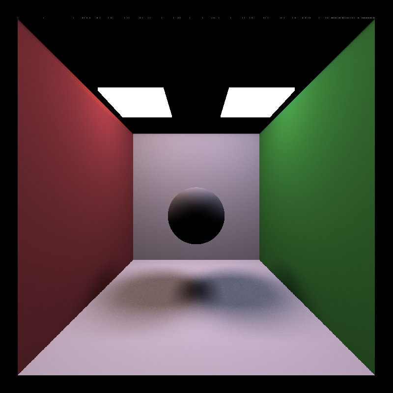

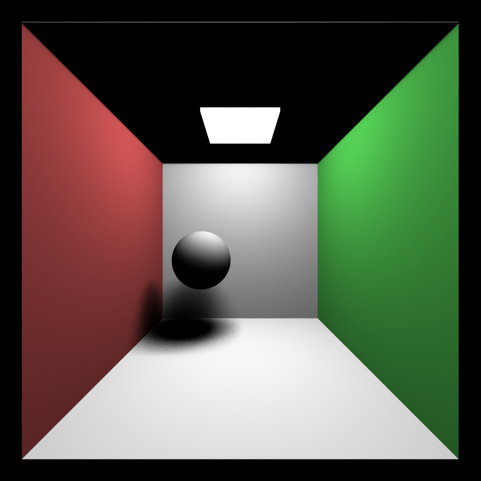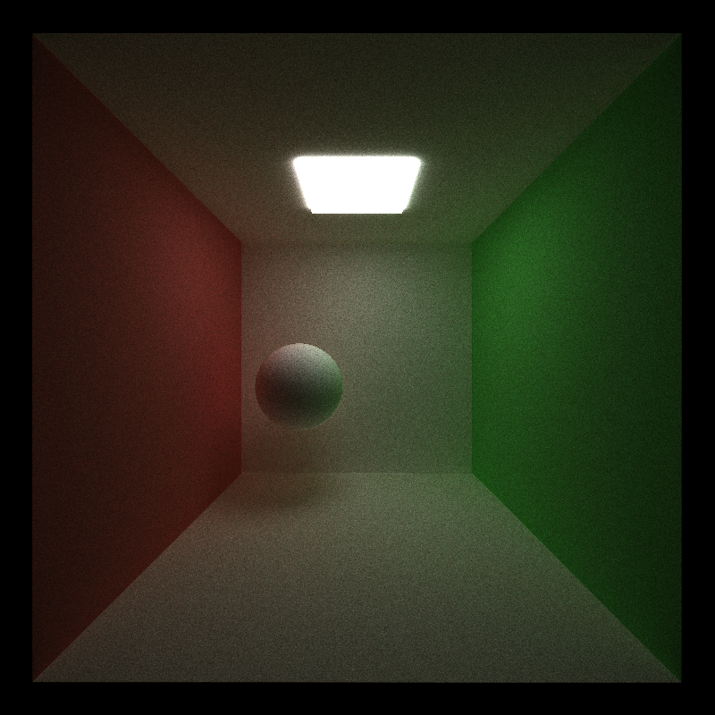

**Procedural Shapes and Textures:** I created two complex procedural shapes using sine distance functions. One is a warped torus and the other is a hollow shape made with constructive solid geometry operations on a sphere, a box, and three cylinders. For the intersection tests of these shapes I used sphere marching. Given a point on the ray, I calculate the closest distance to any point on the target shape and if that distance is smaller than some epsilon, I'm close enough that I can say this point has intersected with the shape, but otherwise, I move that distance further along the ray. If this process is iterated a few times, you either find that the distances are getting smaller and eventually you reach an intersection, or you find the distances getting larger, meaning the ray did not hit the shape. Rendering these shapes seems to take a performance hit in comparison to the primitive box and sphere (415 ms per iteration for these vs 100 for prims), which makes sense because intersection tests for the primitives don't require looping or any iteration. Also, to calculate the normals of these shapes I need to call the SDF 6 times more, which would definitely affect the performance. Having this on the GPU is definitely a performance benefit, since calculations for each path can be parallelized. Though I'm not sure exactly how, it seems like SDFs should be capabe of more optimization. There's definitely redundant calculation to be evaluating the functions over and over again for each pixel and each iteration of marching, etc. Maybe there could be some discretization of the shape using a grid or something that allows us to eliminate some paths and now the general area others will hit.

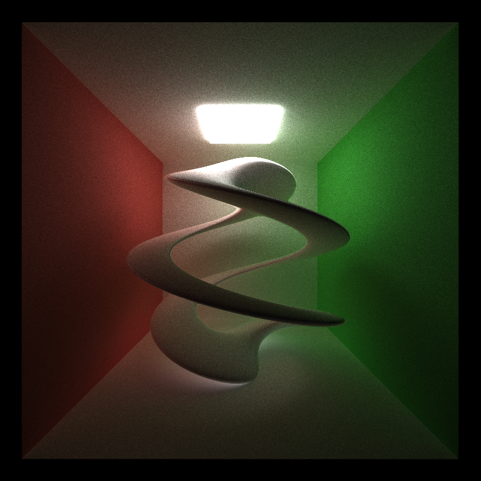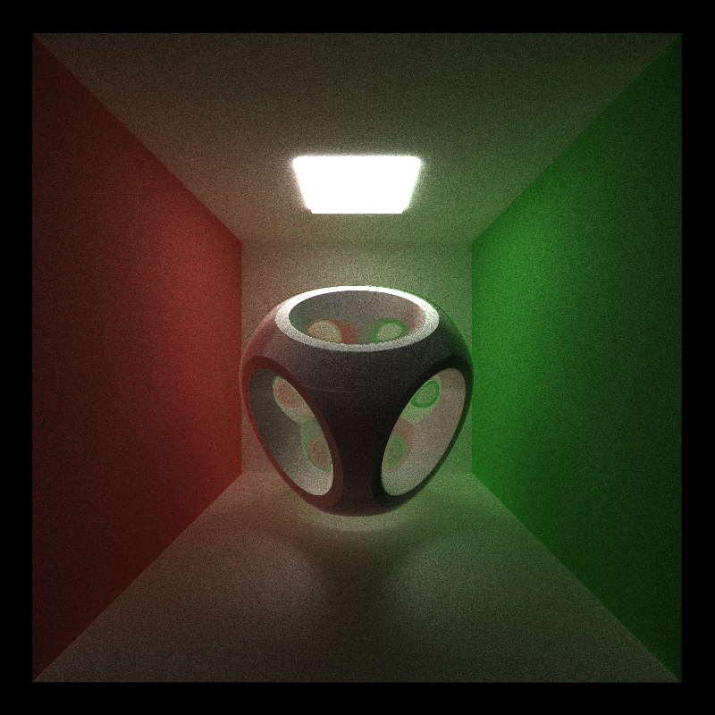

I can also texture these shapes procedurally, using the results of the SDFs to decide if I should use one material or another. In the twist below I used the abs dot product of the surface normal and the z axis to decide if the material at each point should be diffuse white or diffuse blue. In the hollow shape, I used the result of the final subtraction step of my CSG to decide whether or not the point was on the interior or exterior of the shape and color it reflective pink or diffuse white respectively.

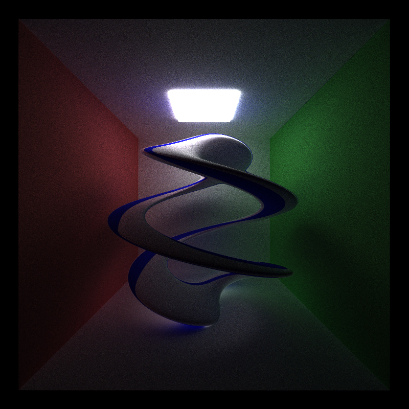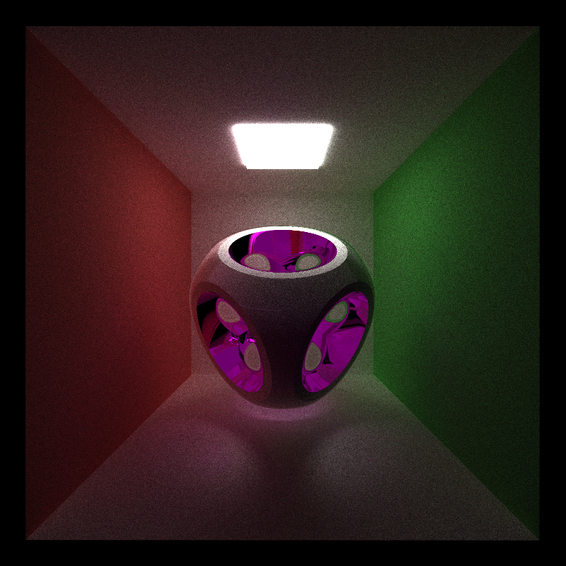 