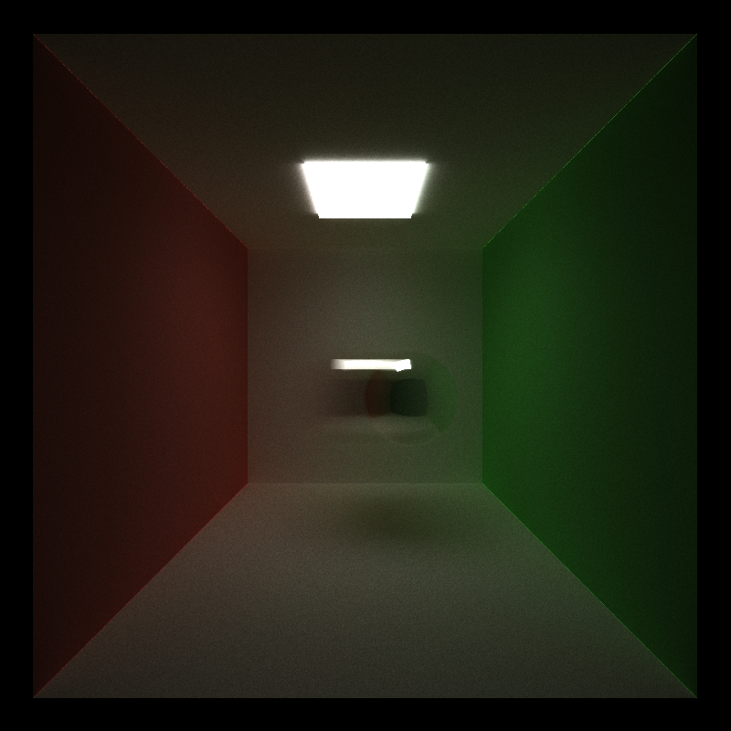
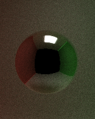
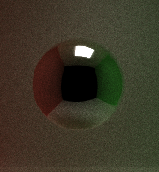
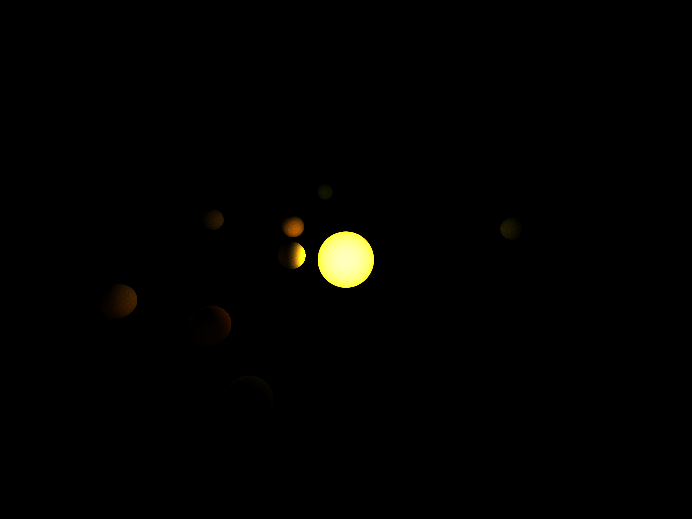

CUDA Path Tracer
================

**University of Pennsylvania, CIS 565: GPU Programming and Architecture, Project 3**

* Author : Kushagra
  - [LinkedIn](https://www.linkedin.com/in/kushagragoel/)
* Tested on:  Windows 10 Education, Intel(R) Core(TM) i7-6700 CPU @ 3.40GHz 16GB, NVIDIA Quadro P1000 @ 4GB (Moore 100B Lab)

### (CUDA Path Tracer)

## Table of Contents
1. [Introduction to Path Tracing](#intro)
2. [Features Implemented](#features)
2.1. [Motion Blur](#mblur)
2.2. [Stochastic Sampled Antialiasing](#aa)
2.3. [Direct Lighting](#dl)
2.4. [Depth Of Field](#df)
2.5. [Denoising](#dn)
2.6. [Reflection and Refraction](#rr)
2.7. [Sort By Material](#sbm)
2.8. [Stream Compact](#sc)
2.9. [Caching the First Bounce](#cb)
3. [Performance Analysis](#analysis)

<a name = "intro"/>  

## Introduction to Path Tracing
Path tracing is a computer graphics Monte Carlo method of rendering images of three-dimensional scenes such that the global illumination is faithful to reality. Fundamentally, the algorithm is integrating over all the illuminance arriving to a single point on the surface of an object. This illuminance is then reduced by a surface reflectance function (BRDF) to determine how much of it will go towards the viewpoint camera. This integration procedure is repeated for every pixel in the output image. When combined with physically accurate models of surfaces, accurate models of real light sources (light bulbs), and optically correct cameras, path tracing can produce still images that are indistinguishable from photographs.  

In this project I have implemented a simple path tracer with several of the features that are used in the industry. Let's talk about those features.  

<a name = "features">  
  
 ## Features
  
  
 <a name = "mblur">  
 
 ### Motion Blur  
Motion blur is the apparent streaking of moving objects in a photograph or a sequence of frames, such as a film or animation. It results when the image being recorded changes during the recording of a single exposure, due to rapid movement or long exposure.  
We simulate motion blur by gradually moving the object and averaging the illumination returned by the rays over the time domain.  Here are the results for a 100 % reflective ball moving in a cornell box.

 <a name = "aa">  
 
 ### Stochastic Sampled Antialiasing
In computer graphics, antialiasing is a software technique for diminishing jaggies - stairstep-like lines that should be smooth. Jaggies occur because the output device, the monitor or printer, doesn't have a high enough resolution to represent a smooth line.  
Here we demonstrate effects of anti-aliasing on a 100% reflective image. Notice the jagged edges of the black reflection in the image that was not antialiased.  
#### Aliased image
  
#### Anti-Aliased image

 <a name = "dl">  
 
 ### Direct Lighting
 This effect works by taking a final ray directly to a random point on an unoccluded emissive object acting as a light source instead of coloring it black if it doesn't hit an emissive source. This allows distant object to be lit which would otherwise would have been dark as the ray would not have any contribution. See that even the distant planets are recieving the color from Sun light.

 <a name = "df">  
 
 ### Depth Of Field
Depth of Field is an effect that comes up due to spherical approximation for the lenses. In it, the objects that are close to the focal point appear sharp whereas the objects that are far from it appear to be blurred. Here we have the same image with and without depth of field. Notice how the white ball in the background is blurred.

Without DOF             |  With DOF  
:-------------------------:|:-------------------------:
 | 

 <a name = "dn">  
 
 ### Intel Open Denoising
 
 
 <a name = "rr">  
 
 ### Reflection and Refraction
 We have implemented simple reflection and refraction with fresnel's effects using Schlick's approximation. Here we see a glass ball that is 50% reflective and 50% refractive. Notice how the lights on the wall have multiple images due to total internal reflection.
 

 <a name = "sb">  
 
 ### Sort By Material
In this we sort the rays by the material of intersection so that we get benefits due to the fact that nearby threads are accessing the same material and therefore we don't need to have multiple different globaly memory reads.  

 <a name = "sc">  
 
 ### Stream Compaction  
In this we repartition such that rays that have expired, i.e. they have no remaining bounces left, are moved next to each other. This results in more threads doing work on rays instead of just being blocked because their alloted ray have no bounce remaining.
 
 

 <a name = "cb">  
 
 ### Caching the first Bounce
In this we cache the first bounce because (if we are not using anti aliasing or any effect that randomly perturbs the rays) the rays that start from the camera and go through the image plane always hit the same point and therefore we don't need to recalculate the points again.
 
 
 <a name = "analysis">
 
 ## Performance Analysis
 
