CUDA Path Tracer
================

**University of Pennsylvania, CIS 565: GPU Programming and Architecture, Project 3**

* Name: Vaibhav Arcot
  - [LinkedIn](https://www.linkedin.com/in/vaibhav-arcot-129829167/)
* Tested on: Windows 10, i7-7700HQ @ 2.8GHz (3.8 Boost) 32GB, External GTX 1080Ti, 11G (My personal laptop)

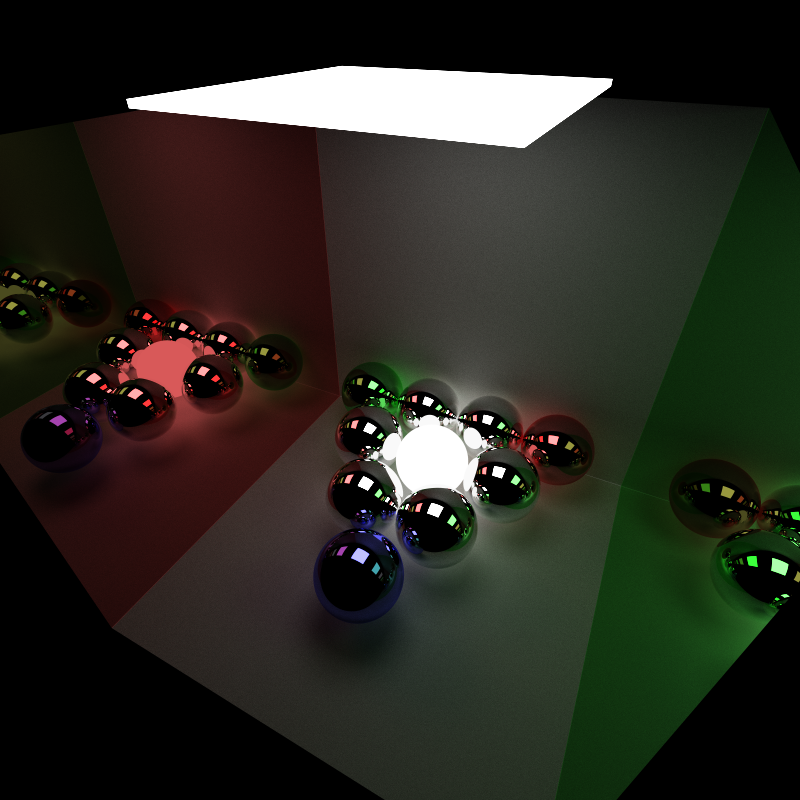

## Path Tracing overview

This repo is a path tracer written entirely in C++ and CUDA accelerated.

All images shown were created by running 5000 iterations unless otherwise specified, and all scene files and meshes are provided

### Dependencies

* CUDA 10+
* [tinyobjloader](https://github.com/syoyo/tinyobjloader) (Included in repo)

### Features
* Reflective and diffused materials
* Stream compaction
* Material sorting
* Caching first bounce
* Refractive materials using Schlick's approximation of Fresnel's law
* Motion blur
* Anti Aliasing
* Normal debugging view
* Loading arbitrary meshes and ray culling
## Cornell Box

The Cornell box is a simple stage, consisting of 5 diffusive walls (1 red, 1 green and the other 3 white). In the above sample, a diffusive sphere.

## Different Materials

Below is an image with the 4 types of materials inside a Cornell box.

## Effects

# Motion blur

### Anti Aliasing

To perform anti aliasing, I decided to use the simple approach of jittering the ray within the pixel every time we generate the rays for that scene. This prevent the ray from having the same first bounce, which can otherwise make the edges of objects appear jagged (aliasing, shown in the zoomed versions below).

| 
 <b>Anti Aliasing Off </b>
 | 
 <b>Anti Aliasing On </b>
|
| ---- | ---- |
|   |   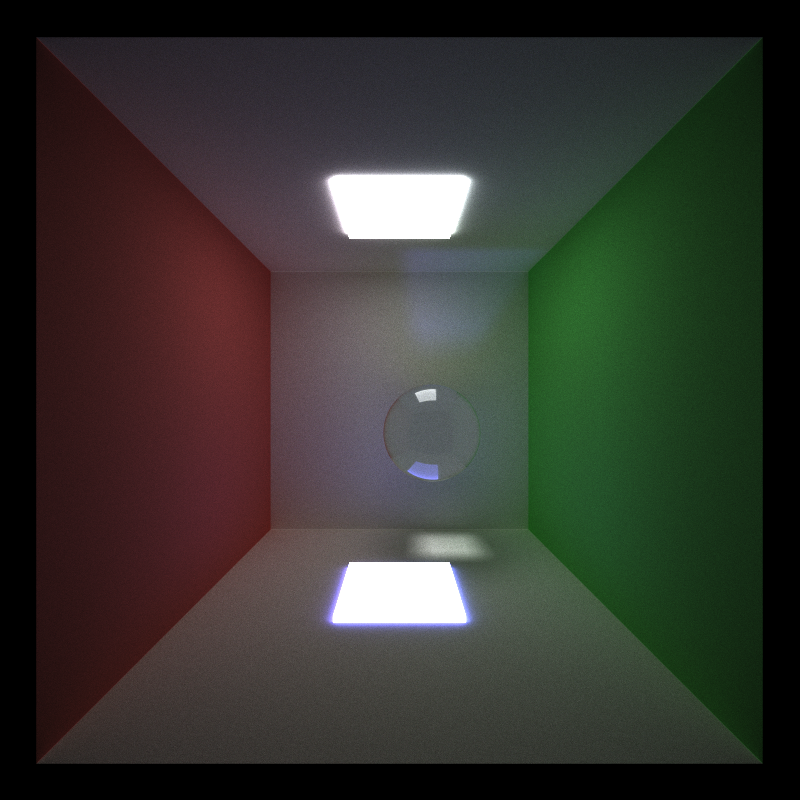   |
| 
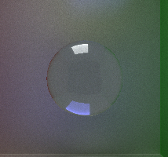
 | 
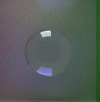
 |

### Fresnel's Effect

Fresnel's effect is the idea that even a refractive material has a reflective quality to it (based on the incident ray angle). To approximate this effect, Schlick's approximation was used. The results are shown below (the diffuse object is shows for orientation context).

| 
 Transparent object with Fresnel's effect Off </b>
 | 
 <b>Transparent object with Fresnel's effect On </b>
 |
| ------------------------------------------------------------ | ------------------------------------------------------------ |
| 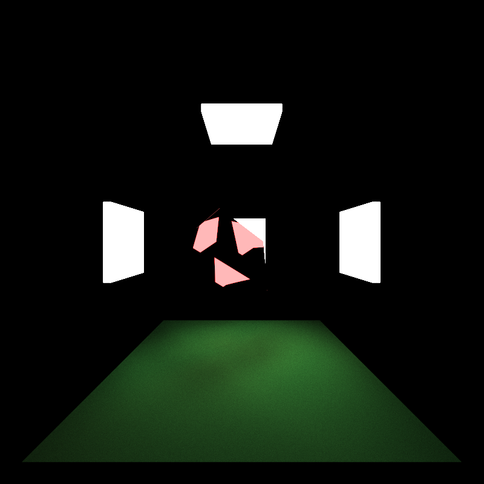                | 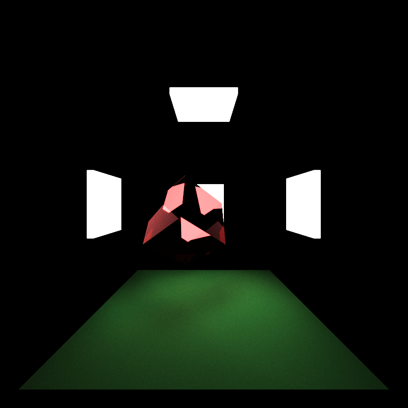                  |

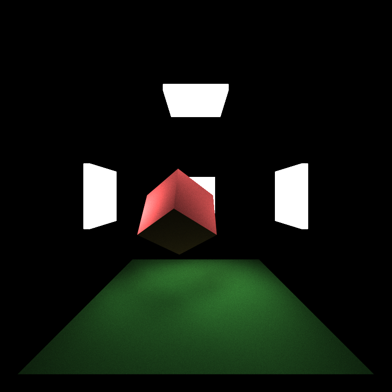

### Meshes

Mesh loading is supported in this path tracer with the help of *tinyobjloader*. The implementation allows for a mesh to have a rotation, translation and scale added to it, and also allows the importing of mesh files that have or lack normals defined inside them. Currently, only triangular meshes are supported, but the code should be easy to extend to higher order polygons.

#### Great Dodecicosacron

This mesh is one of the first meshes I was able to load and render (Besides a debugging square). This mesh has 360 vertices and 120 faces, with material used was a reflective dark blue color with a refractive index of 1.33. As mentioned previously, all scene files are present in the scenes/Scenes folder.

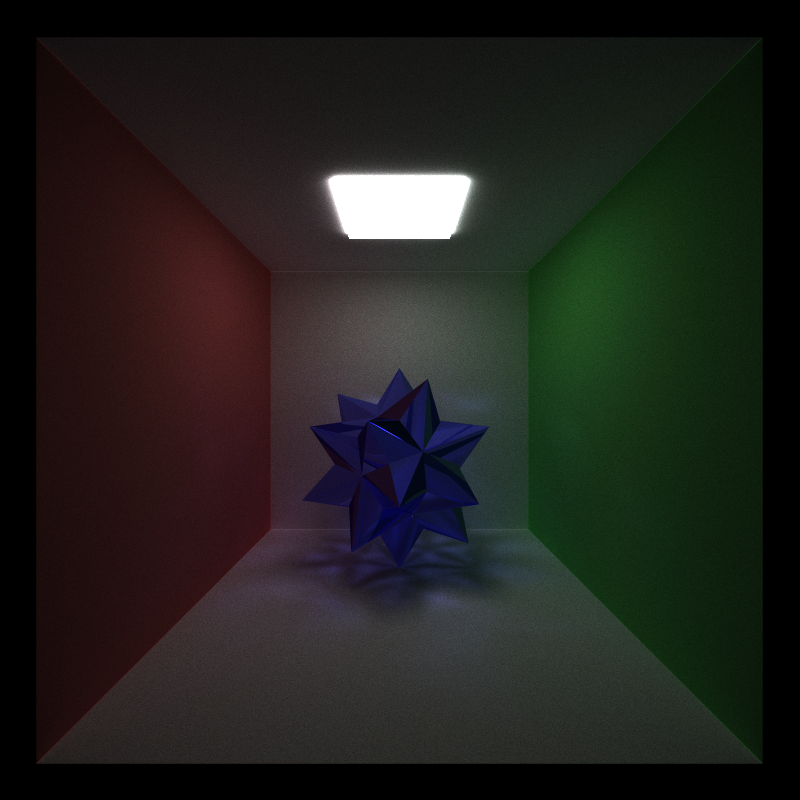

#### Elephant

Below is a mesh of an elephant with a diffused red surface (and diffused white ground). This mesh has 623 vertices and 1148 faces.

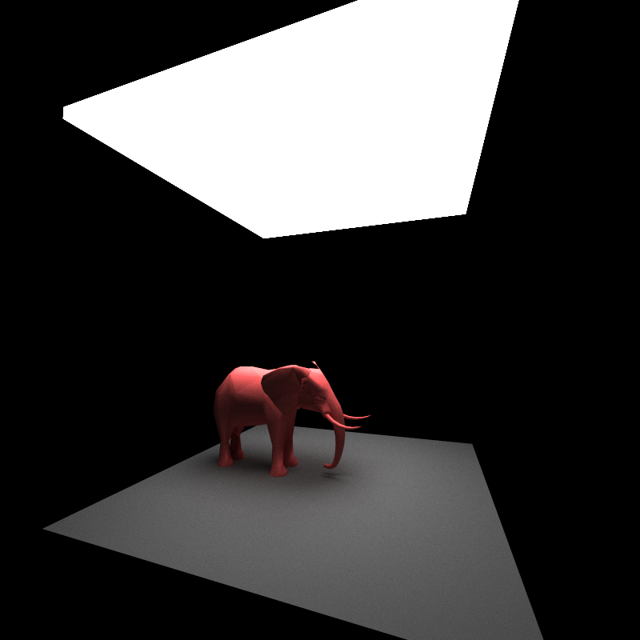

#### Stanford bunny

In the aim of pushing the system to its limits, I decided to load up the Stanford bunny. The material is a dark refractive material (It has a metallic quality only because it is hard to figure out if you are seeing a reflection or refraction which I like). This model has 34,817 vertices and 69,630 faces.

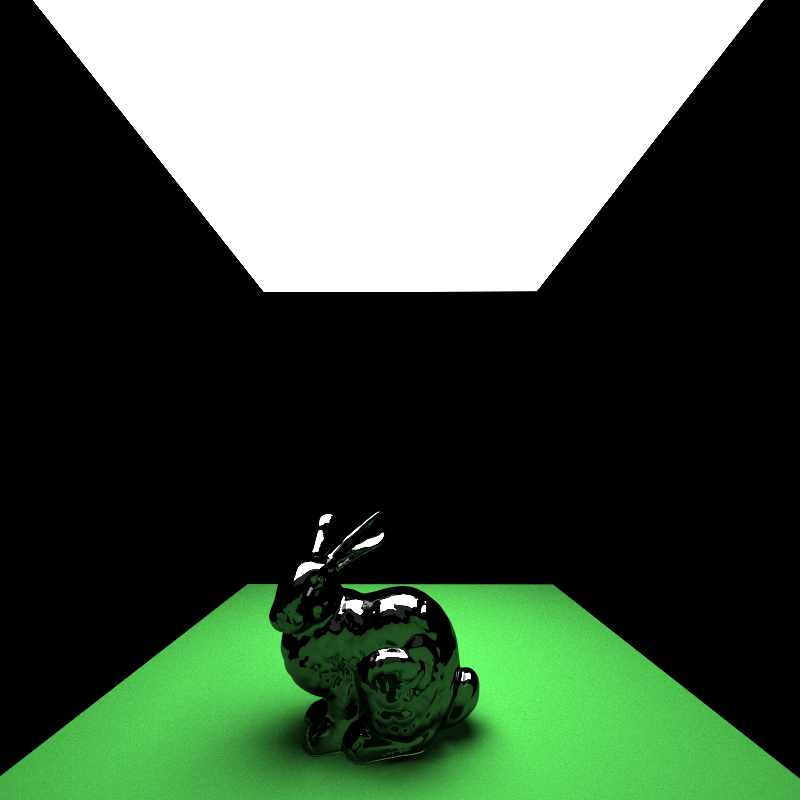

#### Stanford dragon

Finally, I decided to load the Stanford dragon mesh. This mesh has a staggering (for me) 435,545vertices and  871,306 faces. Due to time limitations, I was only able to run this for 2.5k iterations, and a octree or KD-tree would have added a massive speed up (Future work).

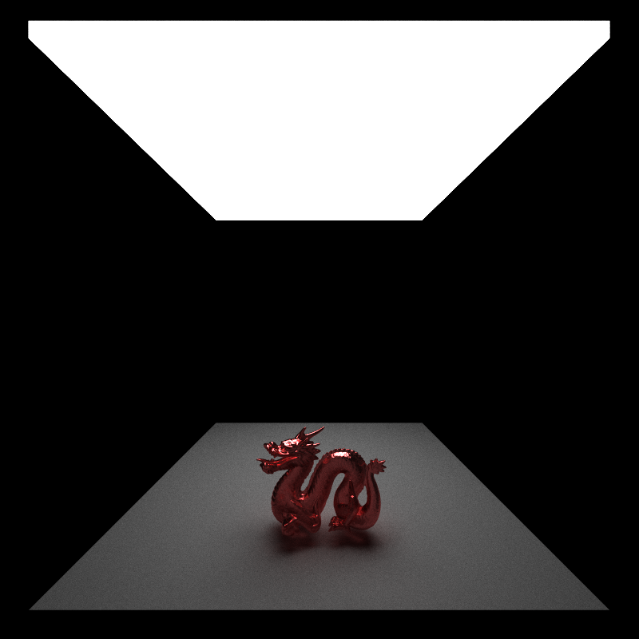

### Debugging Normal view

In order to debug the mesh normals, I ended up implementing a simple normal view mode. In this mode, each surface is colored by the absolute value of their normal. Thus, if the surface is a roof (or floor), it will have a normal in the y axis (0, 1, 0) and thus be colored in green  (RGB coloring). below is a sample image of a cube (made of triangles) with the faces colored using the normals.

## Optimizations

### Stream Compaction

One of the first optimizations was to stop bouncing terminated rays. This reduces the number of threads we need to spawn each bounce (after each bounce, rays terminate by hitting either a light source or into the void). To do this, I used thrust::partition to split the array by their completion state (completed rays are moved to the end). Then the number of rays to bounce is reduces and the main bounce loop is run again. Once the entire process has finished, we just need to reset the number of rays (so that everything is used to create the final image). The performance improvement is shown below:

### Material Sorting

The idea of material sorting is to reduce warp divergence. To implement this, I decided to go with thrust::sort_by_key, where the key is the material type. The results of this are shown below, but the key point is that it performs worse that not doing it. This could be because warp divergence occurs in my implementation (because of the probabilistic reflection refraction) and the small cases where it does actually reduce divergence doesn't justify added overhead of sorting the rays (and intersections).

### Caching first bounce

First bounce caching is the idea to not recomputing the first bounce every time we start a new iteration, because the initial rays will always start from the same place (not true after 1 bounce). Some important things to note, this optimization cannot be used with the Anti Aliasing technique implemented here because that would jitter the initial ray, thus changing its first bounce location. This optimization also cannot be used with motion blur, because the object changes its position after every frame rendered (making the previously cached bounce incorrect). Both these cases are asserted in the code to prevent them from happening.

### Bounding box ray culling

The final optimization is for collision detection with meshes. Each of the meshes loaded had a LOT of polygons, and checking each ray with each polygon would quickly become impossible to run in any reasonable time. As a first optimization, a bounding box around the mesh is created during the time of loading. Then this bounding box is used as a first check for collision. This allows a significant number of rays to be discarded (only if the object is small).

## Other cool results

### Re computing normals makes it more jagged

Normals are assigned to each of the vertices of the polygon in a mesh (not to the face itself). Then to find the normal of a point on the face, we can interpolate the normal using the barycentric coordinates. This results in a smoother look to the edges.

 While loading a *.obj* model, not all of them come with the normals precomputed, so to solve this, I included a simple normal calculation mode. Though it works, it isn't really idea because while calculating the normals for the vertices, I only use the 3 edges/vertices of that face (and take the cross product) and set all the 3 vertex normals to this same value.

The issue is that the resultant model will be jagged at the internal edges. Below is a comparison of using the normals created using a program (CAD Exchanger) vs calculating them myself (It looks kinda cool actually). The solution would be to find all the faces attached to a vertex and then compute the normal using a mean of all the faces, but this has been left for the future. 

This is only noticeable for low polycount objects. For the dragon shown above, I had to compute the normals using my approximation and I couldn't tell the difference.

| Existing normals                                | Own approximation of normals                   |
| ----------------------------------------------- | ---------------------------------------------- |
| 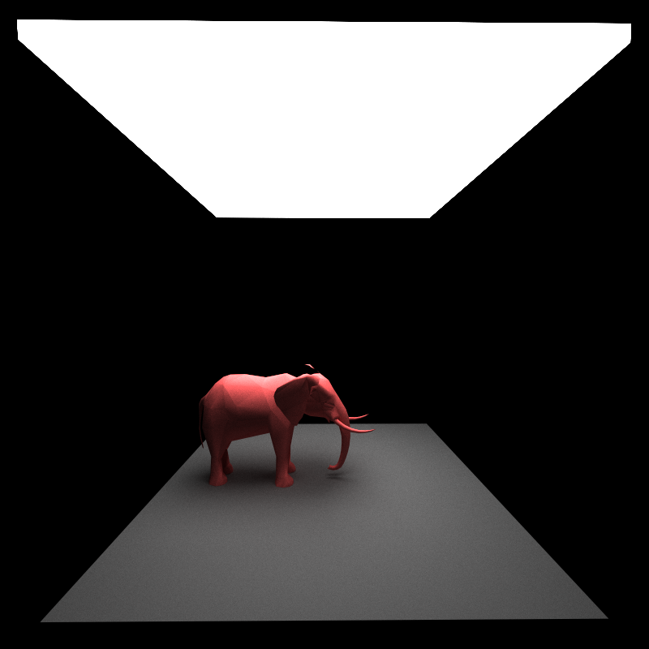 | 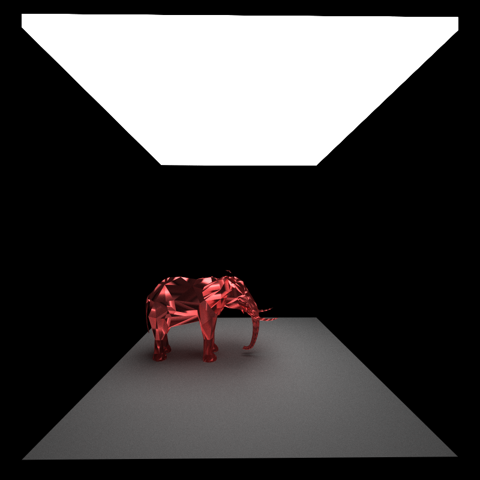 |

### Effect of depth on render

To show the effect of depth on the render, I have included an image which is a composite of 8 images (All 8 are individually present in /img/depth).

### Effect of iterations on render

## Observations

### Material sorting is slow

I mentioned this before, but sorting is slow! Maybe using my own radix implementation (which seemed to outperform thrusts implementation by a lot) could overcome this

### Creating meshes with normals  helps

Finding meshes with normals or creating them using CAD Exchanger really saved time during the initial phases.

## Bloopers

## Useful links

[3D obj files with normals](https://casual-effects.com/data/)

[Fresnel's law](https://blog.demofox.org/2017/01/09/raytracing-reflection-refraction-fresnel-total-internal-reflection-and-beers-law/)

[Easier 3D obj files](https://graphics.cmlab.csie.ntu.edu.tw/~robin/courses/cg04/model/index.html)