CUDA Path Tracer
================

* **University of Pennsylvania, CIS 565: GPU Programming and Architecture, Project 2**

  - #### Author information

    - Tianming Xu (Mark)
      - www.linkedin.com/in/tianming-xu-8bb81816a (LinkedIn)
    - Tested on: Windows 10, i7-8700 @ 3.20GHz 16GB, GTX 2080 8192MB (my personal desktop)

### Output Screenshots

###### Mirror World

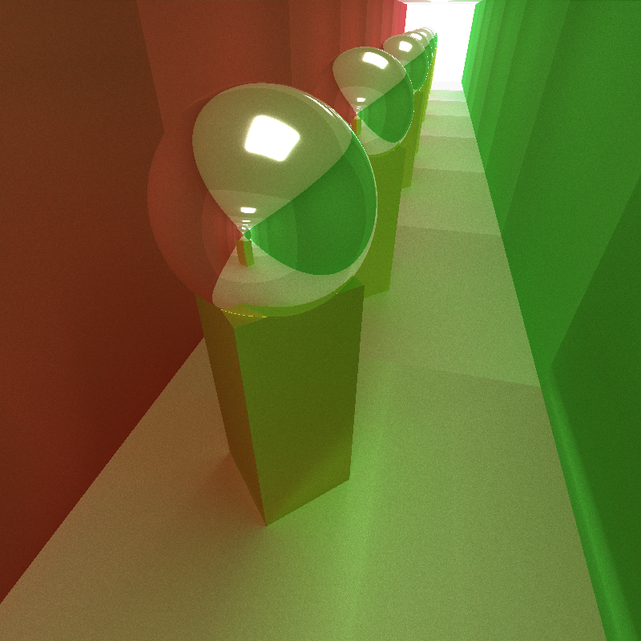

### General overview

Path tracing is a rendering algorithm such that stimulates how lights bounce around in the real-world scenario.  In every path tracing image, we have a scene containing all the topological information of all objects in the picture. We render every pixel of the image based on the amount of light hitting on the object on that pixel and the material color and attributes of that object. Therefore, the image generated by it is based on the physical rule of the real-world and looks very "realistic". 

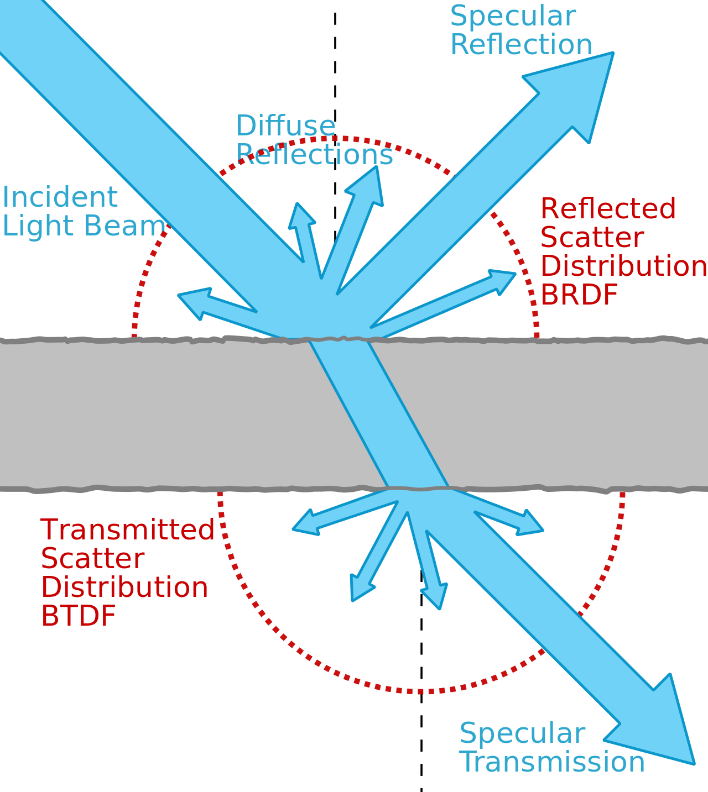

​						(https://en.wikipedia.org/wiki/Bidirectional_scattering_distribution_function)

​									The three fundamental ways light translate in the scene

However, there is a fundamental difference between the path tracing and real-world light: the light in path tracing starts from the eye, or usually said as camera, and try to reach the light source, while in the real-world, the light comes from light source to the eye. Therefore, that is why path tracing is also said "backward tracing".

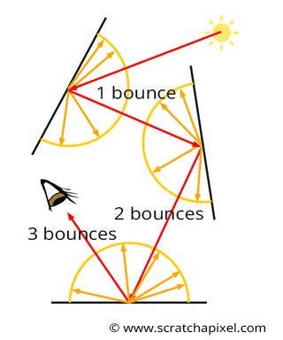

​												This is how light bounces in the real-world

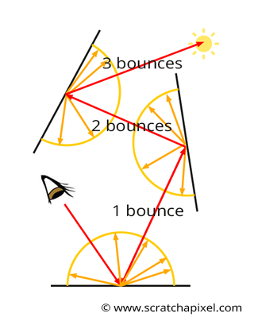

​													This is how light works in the path tracer

 In this project, we not only implement a path tracer, but also use GPU CUDA cores to accelerate the rendering process significantly. 

### Features 

#### Overview

- Shading kernel with BSDF features: diffuse, reflective and refractive with Fresnel law
- Kernel optimization: terminating path using stream compaction
- Kernel optimization: sorting material in global memory
- Kernel optimization: caching the first layer path and their intersections for the rest iterations
- Stochastic sampled antialiasing
- Motion blur

#### Details

###### basic scene

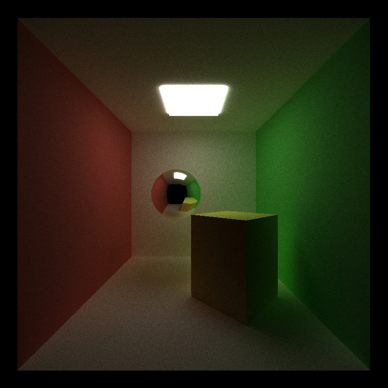

###### three materials

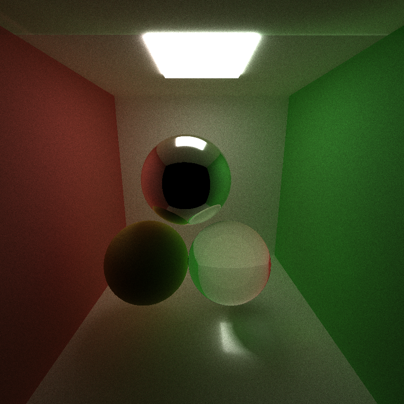

Three materials

top mid: reflective

botom right: refractive with IOR 1.55

bottom left: diffuse yellow

###### Stochastic sampled antialiasing

With Antialiasing

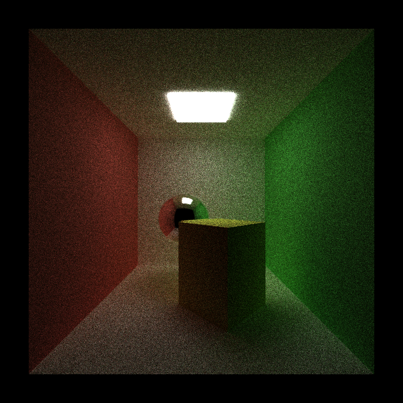

Without antialiasing

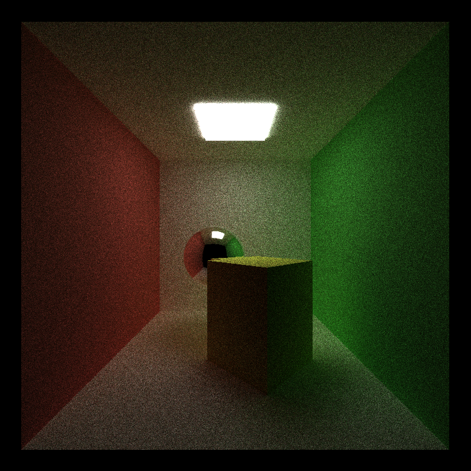

The idea of antialiasing is fairly simple: in each iteration we generate the initial ray with a little bit offset within a certain range. As more iterations have been rendered, the color of the pixel will be blend with its surrounding pixel and form a very natural transition especially on the boundary of object.

It is not very obvious in the large screenshot, so I enlarge the picture to see it more closely to show the effect.

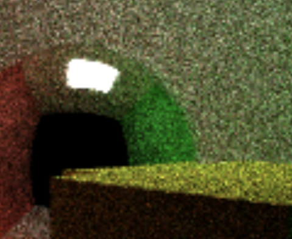

​							The boundary of cube is more like a straight line when AA is on

​							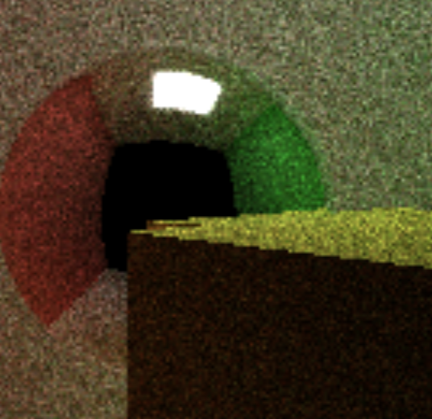

​							     Notice the boundary of cube is very serrated when AA is not on

###### Motion Blur

Motion blur is a very cool effect. The basic idea behind it is that. We add a velocity to the object, and for each iteration, we slowly but continuously update the position of the object. The updated position will also be shaded as the object's color while blurring with its previous color, causing such effect.

I made a funny mistake when I update the position of object too fast, which makes my object fly out of scene after several iteration. 

### Performance Analysis

We use our basic scene, which doesn't have anti-aliasing, stream compaction, first ray cache and sorting materials, as the benchmark to compare with the three optimizations we do on our CUDA code.

###### Stream compaction

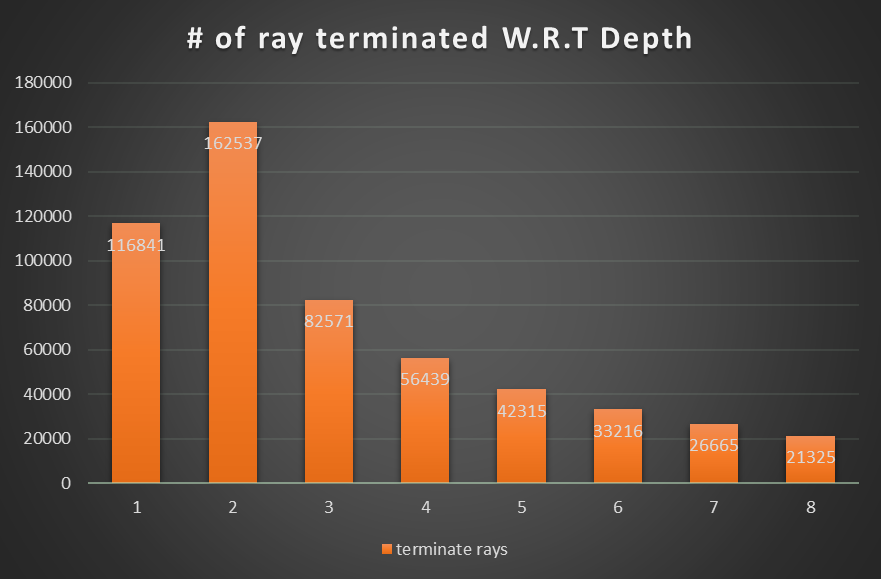

The idea of stream compaction is that, as the ray terminates in some reasons( hits on light source or doesn't hit anything in the scene), we don't actually need it in the next several bounces. Hence, we should remove them from our ray pools to reduce the number of thread required in the next bounce, accelerating the speed.

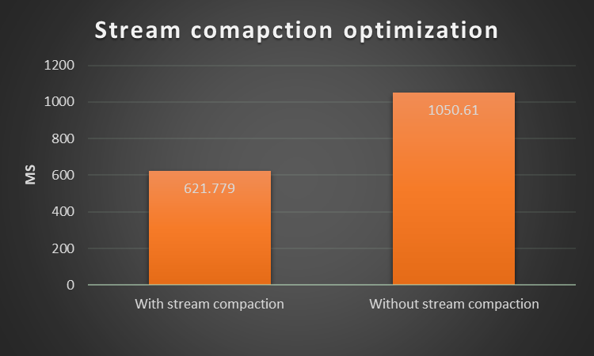

In this figure, we can clearly see the improvement of applying stream compaction algorithm in our CUDA code. The threads saved from terminated ray can be allocated to compute the remaining ray instead of being idle for the rest of time.

###### Sorting by materials

Sorting by materials seems to be unnecessary if we implement a normal CPU path tracer. However, it is an optimization in GPU version because the bottleneck of the efficiency in GPU is not computation, but memory I/O. Therefore, sorting rays by materials can maximize the utilization of locality for getting data from global memory, which significantly improve the performance.

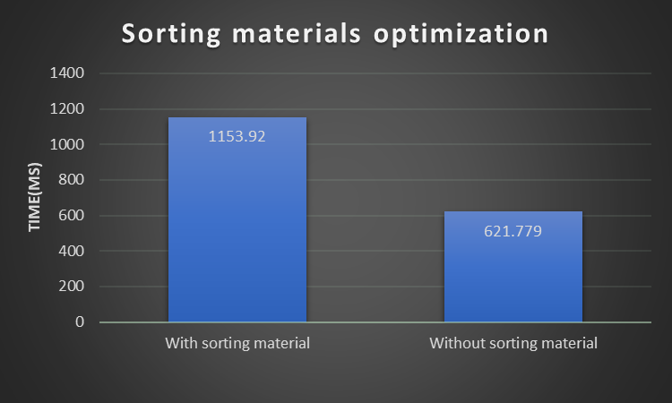

However, we don't see the improvement as we expected. Instead, the time for each iteration raises significantly comparing to the program without using this technique. The possible reason I guess, is that the number of materials in my benchmark scene(very basic) is too small to make this technique show its efficiency. Sorting is a time consuming algorithm, so if the number of materials is not very large, the sorting time can outweighs the time we saved from utilizing locality. When we render a complex scene, this technique might perform better I guess.

###### Cache first ray and intersection

Because the initial rays generated from camera(eye)  are fixed, and we have many iterations to render a picture. It is natural to think of a way to cache the fixed data and use them later. The performance of this technique shows up after the first iteration, as we still need to generate rays in the first iteration. Hence, I only compare the performance after the first iteration.

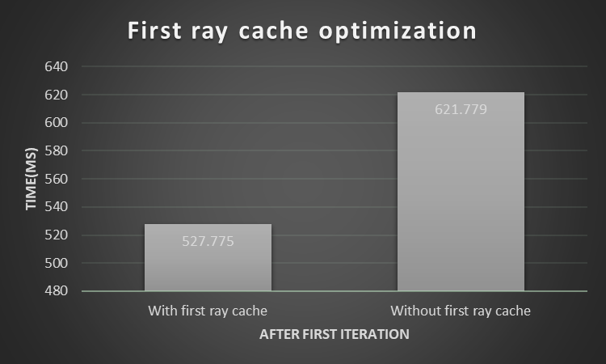

The improvement on the performance is exactly what we expected.

### Acknowledgements

- Motion blur
  - http://www.cemyuksel.com/research/papers/time_interval_ray_tracing_for_motion_blur-high.pdf
  - Yue Li
- Jie Meng and Hannah for helping me solve the sorting by materials optimization
- Jiangping Xu for helping me stream compaction part and refractive material in Fresnel law
  - also the Schlick's approximation formula in https://en.wikipedia.org/wiki/Schlick's_approximation

### Comments and Future work

There are some issues when I try to run the path tracer in Release mode, so I use Debug mode to collect data. Therefore, the performance of the program is significantly slower, but the relative efficiency comparison should still be valid. I will work on fixing the issues and update the chart later.