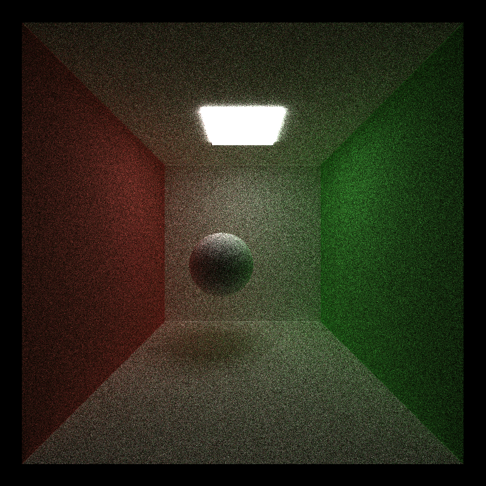

CUDA Path Tracer
================

**University of Pennsylvania, CIS 565: GPU Programming and Architecture, Project 3**

* SOMANSHU AGARWAL
  * [LinkedIn](https://www.linkedin.com/in/somanshu25)
* Tested on: Windows 10, i7-6700 @ 3.4GHz 16GB, Quadro P1000 4GB (Moore 100B Lab)

### What is Path Tracer and how it is different from Ray Tracing?

Path tracing is a realistic lighting algorithm that simulates light bouncing around a scene. it is based on Monte-Carlo based sampling technique and simulate realistic images through rendering. The path tracer is continually rendering, so the scene will start off grainy and become smoother over time. The side by side comparision below shows the importance of rendering the scene in iterations which removed the blurring of the image and noise.

    After 200 iterations            |           After 1500 iterations

  
   

     

The following features are enabled in the path tracer:

* Basic Features:
  * BSDF evaluation for Diffusion and Perfectly Specular Surfaces
  * Sort the rays after intersection with material ID type it intersected
  * Stream Compaction using Thrust
  * Cache First Bounce
  
* Adanced Features:
  * BSDF evaluation including Refraction, Fresnel Effect using Schlick's approximation
  * BSDF evaluation for Different Percentage Comnibations for Refraction and Reflection
  * Anit-aliasing
  * Work-Efficient Stream Compaction using Shared Memory
  * Motion Blur (attempted)

### BSDF Evaluation for Perfectly Specular, Diffusion Sufraces and Refraction Surfaces: 
BSDF evaluation has been done for perfectly specular, diffusion and refractive surfaces. The evaluation was also done for specular surfaces where random combinations of reflection and refraction takes place. For reflection, I have used `glm::reflect` while for refraction, I have calculated the the value of index of refraction by assuming that one of the two medium will be air, caclulating the normal and using `glm::refract` function for caclulating the refracted ray. I'm also taking care of total internal reflection scenario. Also, the Fresnel effect is added into the shading using [Schlick's approximation](https://en.wikipedia.org/wiki/Schlick%27s_approximation). 

For diffusing, I have used the already defined cosign weighted distribution function for evaluating the new ray, which is the ransom permutation of the hemisphere. The images showing the effects of all these are:

For different combinations of relective and refractive probabilies, here are the effects shown in the images:

### Sorting the rays by material ID

The rays after bouncing from the objects are sprted on the basis of the material ID, sicne, there is high chance that all these rays might strike the same object again and we have the rays at contigous memeory allocation in the memory which would quicken up the effect. In our cornell scene, we mostly observe that the sorting does not improve the performance that greatly because of lack of different materials in the scenes.

### Stream Compaction by using Thrust Library and Work Efficient using Shared memory

The stream compaction has benn done in the path tracer using Thrust library initially so that the basic working of the path tracer could be verified. After designing the basic path tracer, I worked on performing Stream Compaction using Shared Memory. The algorithm uses two stages of scanning where the first scanning happens using Shared Memory. The performace as shown in the graphs below. After performing the Work Efficient usign Shared memory algorithm across the blocks, we are getting the last element of each of the block and adding the last element in the original array in the block and performing again scan operation on the new array. 

### Caching the First Bounce

For each iteration, the rays are generated from the camera are likely to hit the same intersection material. Thus, computing the intersections every iteration would be costly and we can preserve that time by caching the first bounces that takes place in the first iteration and then later on just load those intersections for next iterations and prcess for the shading. The performance analysis for the caching and non-cahing as the function of depth in the first and second iteration is given below:

### Anti-Aliasing

Anti-aliasing is the way of remove the jaggering happening during the rendering by sending out the rays from the camera and adding on the noise a little bit so that the smoothning effect could be seen the image. The effect of the anti-aliasing could be seen at the interections of the wall and the floor where the lines are more smoother as compared to the normal ones. The comparision of the effect is shown below:

### Motion Blur

I have attemmpted to do motion blur n the path tracer and was going through lot of issues as the image is getting dark and lot of other stuff. 

### Bloopers

Some of the bloopers across all the experiments and features:

