CUDA Path Tracer
================

**University of Pennsylvania, CIS 565: GPU Programming and Architecture, Project 3**

* Dewang Sultania
  * [LinkedIn](https://www.linkedin.com/in/dewang-sultania/)
* Tested on: Windows 10, Intel Xeon E-2176M @ 2.70GHz 16GB, Quadro P2000 4GB (Personal Computer)


### Table of Contents

1.	 [Overview](#overview)
2.	 [Graphics Features](#graphics)
		1.	 [Diffusion](#diffusion)
        2.	 [Reflection](#reflection)
        3.	 [Refraction with Fresnel effects using Schlick's approximation](#refraction)
        4.	 [Anti Aliasing](#anti-alias)
        5.	 [Motion Blur](#motion-blur)
        6.	 [Open Image AI Denoiser](#denoiser)
3.	 [Optimization Features](#optimization)
	 	1.	 [Stream Compaction](#stream)
        2.	 [Material Sorting](#material-sort)
        3.	 [Cache First Bounce](#cache)
4.	 [References](#references)

<a name = "overview"/>

## Overview

This repository contains code for GPU implementation of a Monte-Carlo Path Tracer. It is a rendering technique for generating an image by tracing the path of light as pixel in an image plane and simulating the effects of its encounters with virtual objects. The technique is capable of producing a very high degree of visual realism, usually higher than that of typical scanline rendering methods, but at a greater computational cost. This makes ray tracing best suited for applications where taking a relatively long time to render a frame can be tolerated, such as in still images and film and television visual effects, and more poorly suited for real-time applications such as video games where speed is critical. Ray tracing is capable of simulating a wide variety of optical effects, such as reflection and refraction, scattering, and dispersion phenomena (such as chromatic aberration).

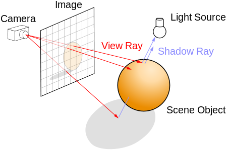

<a name = "graphics"/>

## Graphics Features

This section contains description and results of the graphics features that were implemented.

<a name = "diffusion"/>

#### Diffusion

Diffuse Shading is obtained using a cosine-weighted sampling function. It basically means that the incident light is uniformly scattered in all directions.

<a name = "reflection"/>

#### Reflection

Reflection is implemented using glm::reflect.

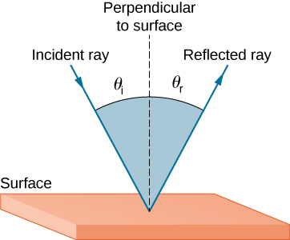

<a name = "refraction"/>

#### Refraction with Fresnel effects using Schlick's approximation


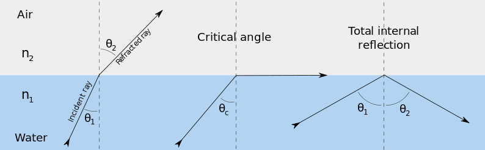

Refraction was implemented using glm::refract and there is also a toggle for if we want to use Schlick's approximation. Special Case of total internal reflection was also handled.

Without Schlick's approximation       |  With  Schlick's approximation 
:-------------------------:|:-------------------------:
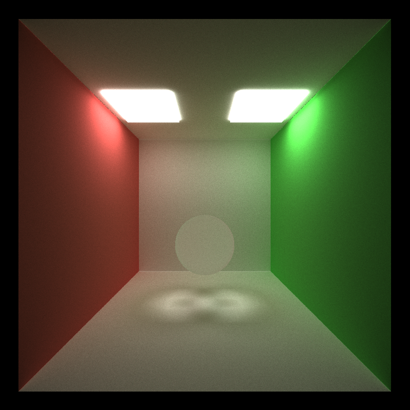 | 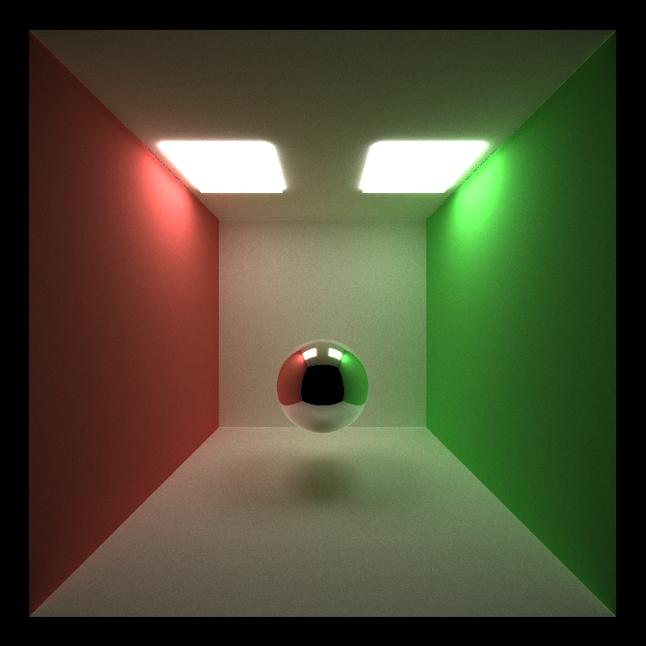

<a name = "anti-alias"/>

#### Anti Aliasing

Anti aliasing is achieved by jittering the origin of a ray sent out from each pixel using unifrom sampling.

With Anti Aliasing       |  Without Anti Aliasing
:-------------------------:|:-------------------------:
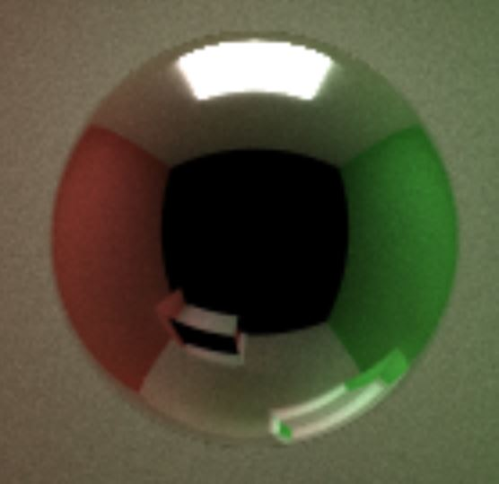 | 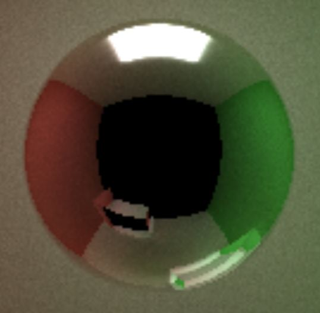

<a name = "motion-blur"/>

#### Motion Blur
Motion blur is the averaging of multiple shots in a motion.
 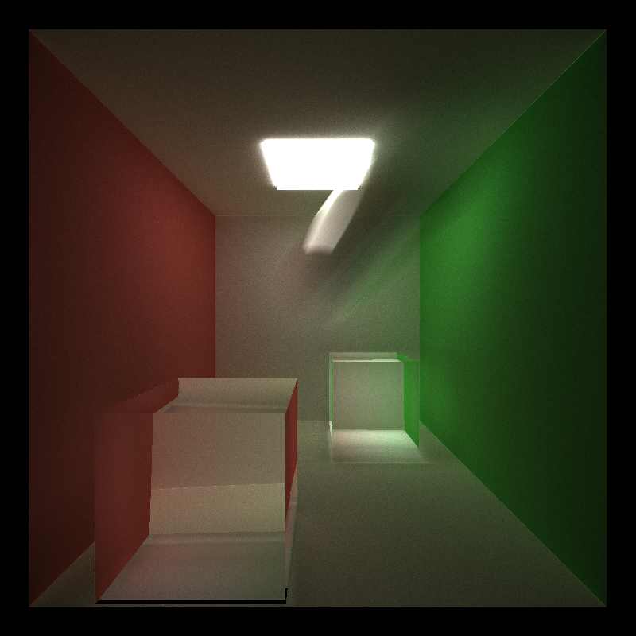

<a name = "denoiser"/>

#### Open Image AI Denoiser
I was able to get the denoiser kind of working and all credits to Intel's out of the world documentation (Really only aliens can understand it). Here is my blooper reel from that. 

Blooper 1       |  Blooper 2 | Blooper 3 | Blooper 4
:-------------------------:|:-------------------------:|:-------------------------:|:-------------------------:
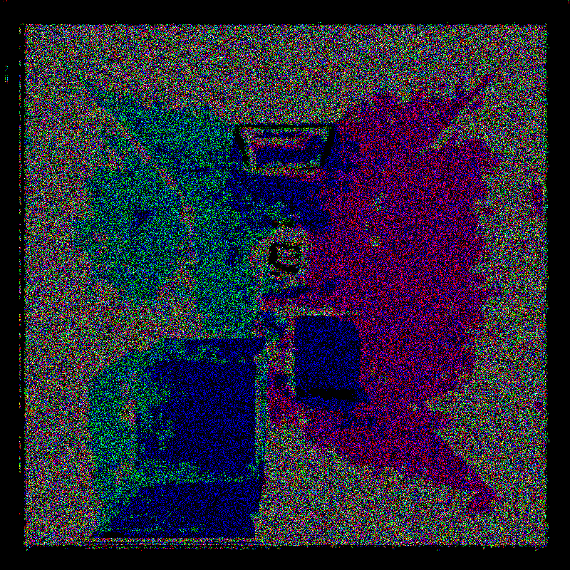 | 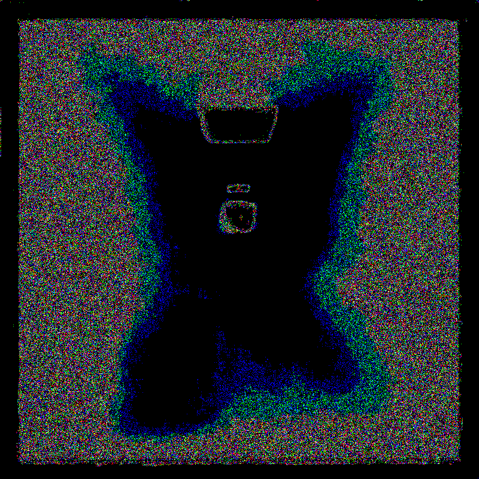|  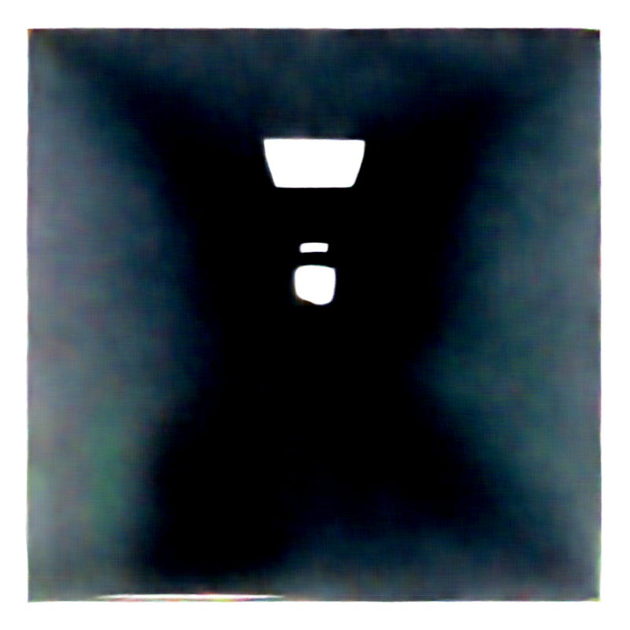 |  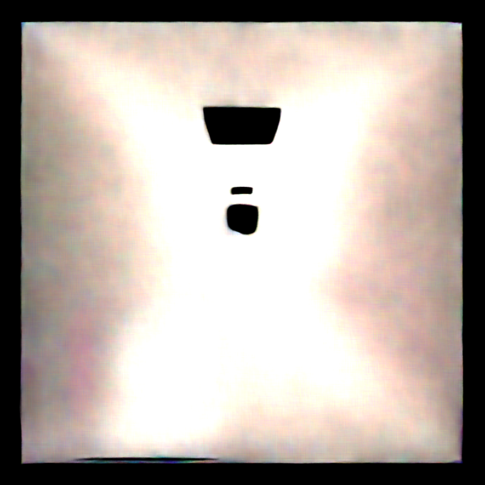

Finally after fixing my issues I was able to get it working:

Original      |  Denoised
:-------------------------:|:-------------------------:
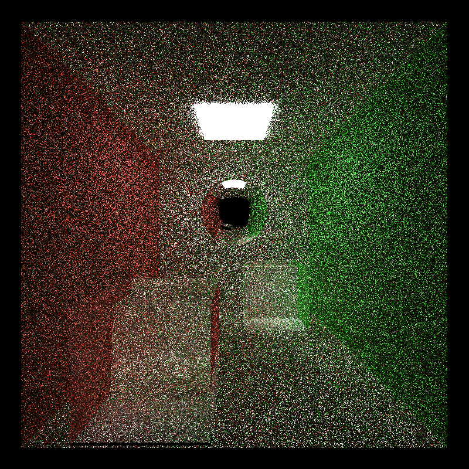 | 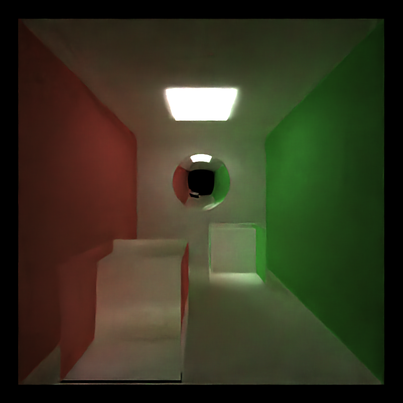

The library expects the pixel values to be in little endian format according to the documentation, so I had written a ReverseFloat function to convert big-endian to little endian, but doing so resulted in the blooper reel, when I did not use that function, I got this result for output after 5 iterations.

It was a hard task to set it up and build it. I have listed down the steps I had to take here and I think this can serve as an easy documentation of how to set it up and get it running because the existing one is simply great!!

* Install tbb from here: https://github.com/intel/tbb/releases
* Then run this command : ```git clone --recursive https://github.com/OpenImageDenoise/oidn.git```
* Then copy the oidn folder into your Path Tracer folder
* Now in your CMakeLists.txt add the lines ```add_subdirectory(oidn)``` and add ```OpenImageDenoise``` to target_link_libraries
* Then run ```cmake-gui ..```  and add the following four entries before clicking configure:

  * ```TBB_ROOT``` which is equal to something like ```C:/Users/dewan/Desktop/tbb2019_20190605oss_win/tbb2019_20190605oss```
* ```TBB_INCLUDE_DIR``` which is something like ```C:\Users\dewan\Desktop\tbb2019_20190605oss_win\tbb2019_20190605oss\include```
  *  ```TBB_LIBRARY``` which is something like ```C:\Users\dewan\Desktop\tbb2019_20190605oss_win\tbb2019_20190605oss\lib\intel64\vc14\tbb_debug.lib```
  *  ```TBB_LIBRARY_MALLOC``` which is something like ```C:\Users\dewan\Desktop\tbb2019_20190605oss_win\tbb2019_20190605oss\lib\intel64\vc14\tbbmalloc_debug.lib```
* Now install oidn from here ```https://github.com/OpenImageDenoise/oidn/releases``` and copy ```OpenImageDenoise.dll, tbb.dll, tbbmalloc.dll``` from the bin folder to your System32 windows folder.

The code should build now, atleast it did for me, but I make no guarantees as these steps were results of solving all the error messages that were thrown at me when trying to run this.


<a name = "optimization"/>

## Optimization Features

<a name = "stream"/>

#### Stream Compaction

After each bounce, some rays would hit the light source and terminate.  We can stop the threads that are assigned to these rays or equivalently run less threads in the next one. Using thrust::partition function all the active rays are kept together after every iteration and then only those need to be started. 

<a name = "material-sort"/>

#### Material Sort

This idea is based on the fact that if neighboring threads are executing same material type, they will run the same instructions which will result in less warp divergence. 

<a name = "cache"/>

#### Cache First Bounce
The rays always start at the pixel they belong to and shoot out at the same location. So we can cache the first bounce in the first iteration and we won't need to recalculate their intersections again.


A performance comparison of these optimizations can be seen below:

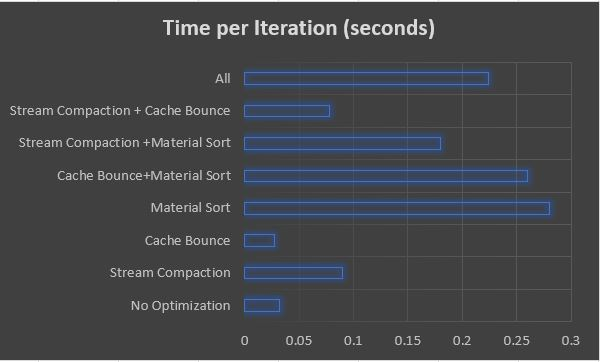 


<a name = "references"/>

## References

1. https://en.wikipedia.org/wiki/Ray_tracing_(graphics)
2. https://en.wikipedia.org/wiki/Schlick%27s_approximation
3. http://viclw17.github.io/2018/07/17/raytracing-camera-and-msaa/
4. https://www.andrew.cmu.edu/user/hgifford/projects/msaa.pdf
5. https://github.com/RayTracing/InOneWeekend
