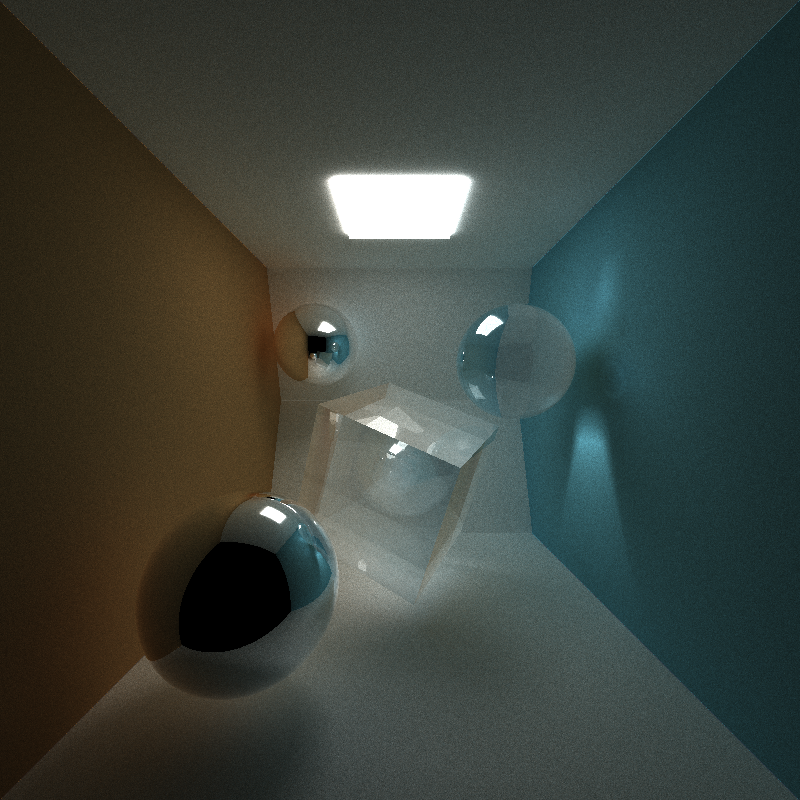
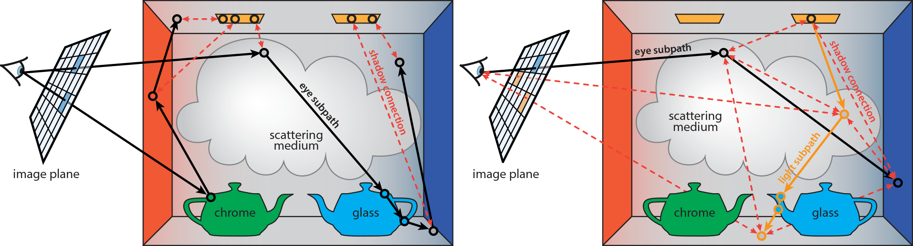
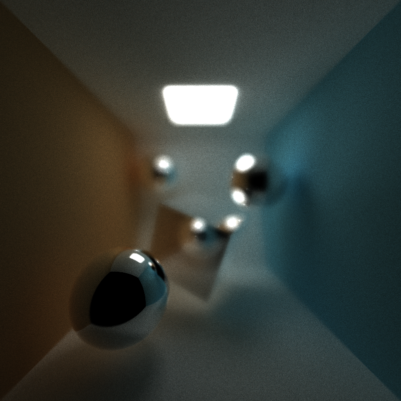
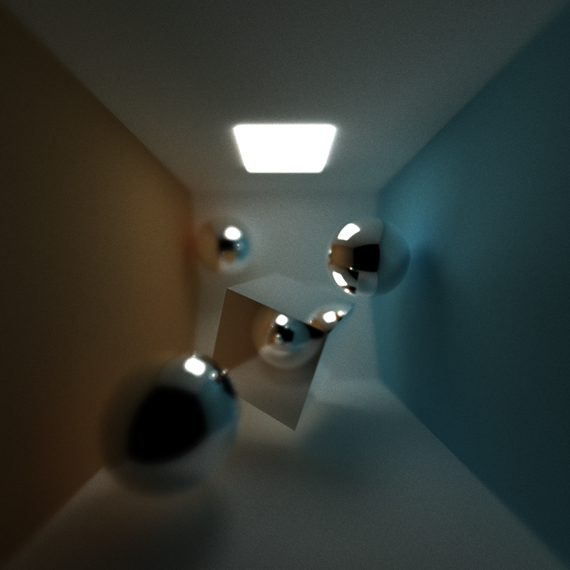
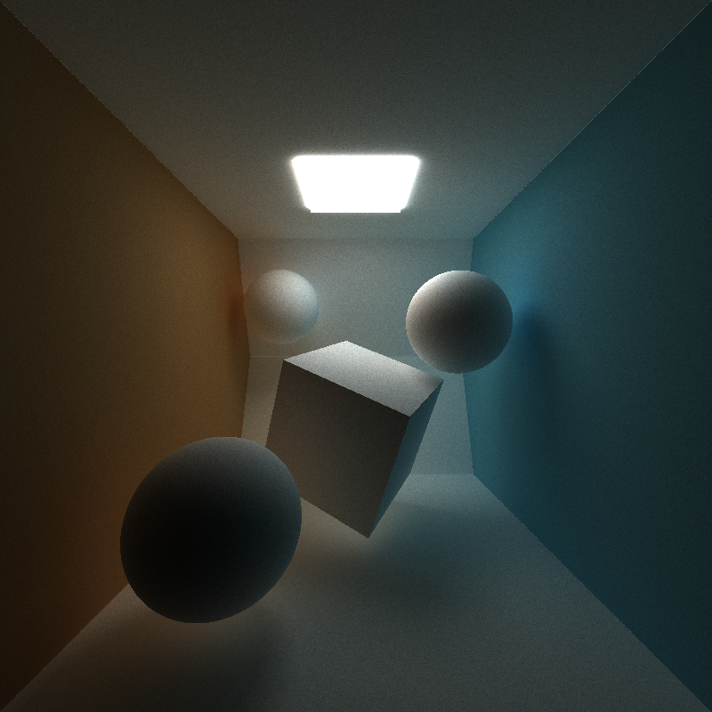
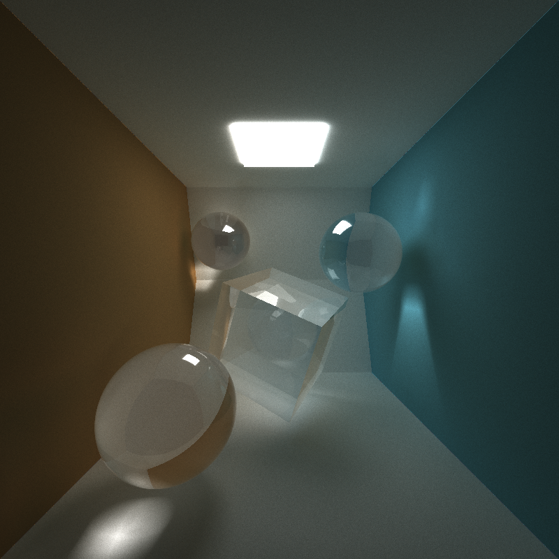
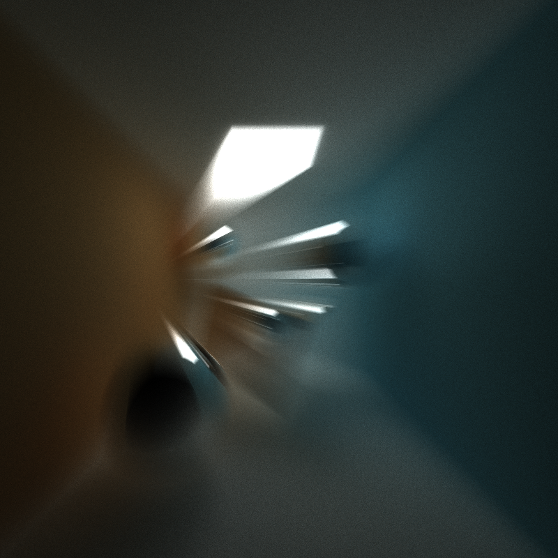
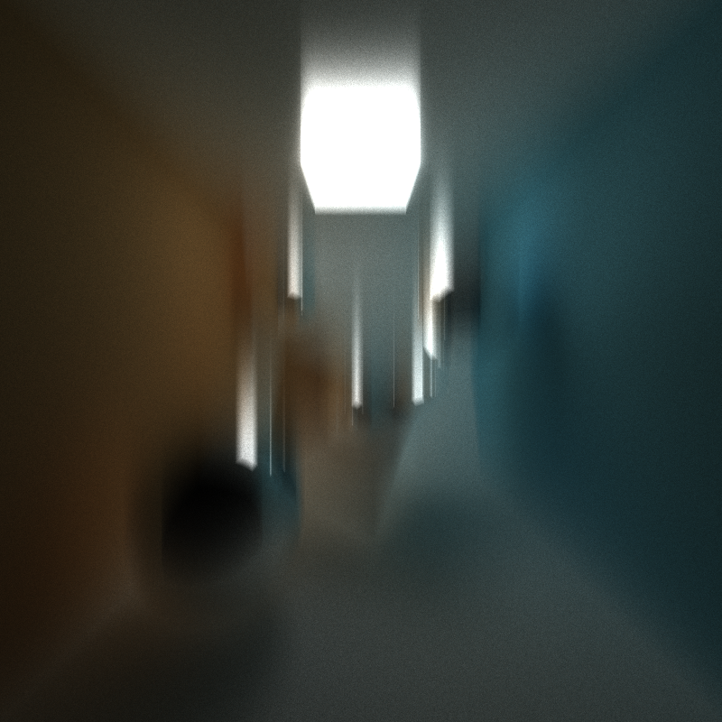

# CUDA Path Tracer
================

**University of Pennsylvania, CIS 565: GPU Programming and Architecture, Project 3**

* Weiqi Chen
  * [LinkedIn](https://www.linkedin.com/in/weiqi-ricky-chen-2b04b2ab/)
* Tested on: Windows 10, i7-8750H @ 2.20GHz 2.21GHz, 16GB, GTX 1050 2GB

## Project Description
In this project we aim to render globally illuminated images using CUDA based-path tracer.
Path tracer is a realistic lighting algorithm that simulates light bouncing around a given scene. We shoot out rays from each pixel for many times and each time they may bounce towards different directions depending on the properties of the materials they hit. We accumulate the effects for each pixel and average them over the number of iterations.

## Features

### Depth of Field
Depth of field is the distance between the nearest and the farthest objects that are in acceptably sharp focus in an image. We create blurry scenes by simulating a camera lens.

*FD = focal distance, LR = lens radius*

| Normal | Depth of Field (FD = 6, LR = 0.5) | Depth of Field (FD = 9, LR = 0.5)|
| -- | -- | -- |
|  |  |  |

### Diffusion, Reflection and Refraction
My path tracer is able to render diffusion, specular reflection and refraction with Frensel effects using Schlick's approximation.

| Diffusion |  |
| -- | -- |
| Reflection |  |
| Refraction |  |

### Motion Blur
Motion blur is achieved by randomly jittering the camera position and therefore jittering the outgoing rays using a Gaussian distribution.

| Normal  | MB in -x -z direction | MB in -y direction |
| -- | -- | -- |
|  |  |  |

## Performance Analysis
Using path tracer to render images are computationally expensive. Each ray may bounce for an uncertain number of times and hit various objects along the path. Computing intersections with them is also time-consuming. A few optimization methods are utilized here to speed up the rendering process.

### Stream Compaction
Stream compaction becomes very useful to remove early terminated ray paths (hit a light source or hit nothing). We keep track of only the rays which are still traveling and we can launch fewer threads after each bounces. This can reduce warp divergence. Below is a plot of active threads vs number of bounces in one iteration for the cornell box scene.

However, using stream compaction in closed scenes is not very helpful. In open scenes rays can be removed if they hit nothing, while in closed scenes ray will keep bouncing until they reach the maximum number of allowed bounces. Below is a plot of active threads vs number of bounces in one iteration for a closed scenes.

### Caching First Bounces
Rays shot out from the camera always hit the same object along the same paths in this project and they may go towards different directions in different iterations. Therefore we can cache the first bounces, recording what object is hit from what angle, and reuse this data in subsequent iterations.

This is not compatible if motion blur and depth of field features are toggled on, which requires jittering rays in time and jittering rays within a lens respectively.

### Sorting by Materials

Each ray may hit a different object, and the time of computing the intersection and shading are different for different types of materials. To reduce warp divergence, rays interacting with the same materials are sorted to be contiguous in memory before shading.

