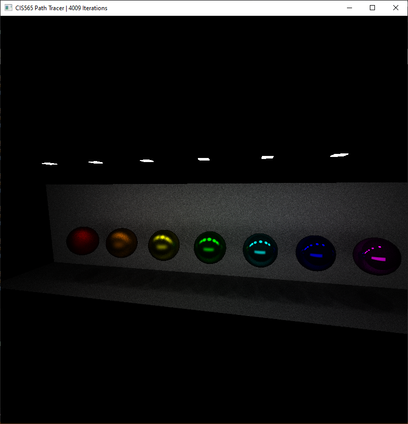
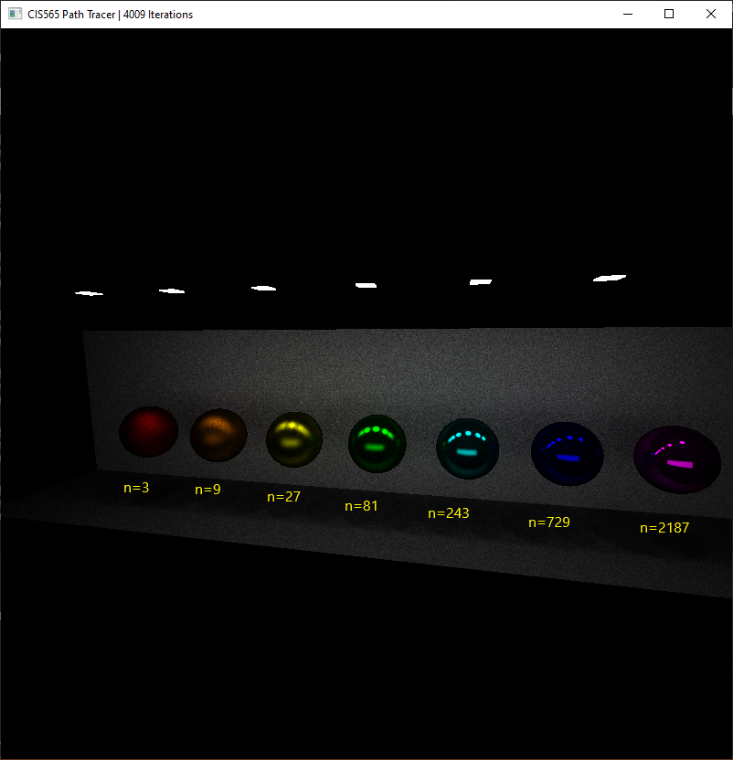

CUDA Path Tracer
================

**University of Pennsylvania, CIS 565: GPU Programming and Architecture, Project 3**

* Taylor Nelms
  * [LinkedIn](https://www.linkedin.com/in/taylor-k-7b2110191/), [twitter](https://twitter.com/nelms_taylor), etc.
* Tested on: Windows 10, Intel i3 Coffee Lake 4-core 3.6GHz processor, 16GB RAM, NVidia GeForce GTX1650 4GB

## Path Tracer

This is where I would write about my path tracer... IF I HAD ONE

### Object loading

TODO: describe how to describe in scene file

#### Bounding Volume

Simple axis-aligned bounding box for each Shape object in the mesh

#### TODO: parallel triangle ingestion

Spin up kernels to move/copy the memory around, compute the triangle normals

#### TODO: textures? (Maybe)

### Specular Sampling with Exponent

Implemented specular reflections with configurable exponent. Pictured below is a comparison of various exponential values for specularity. Notice that the very high value is effectively mirror-like; with such a highly specular object, the slight variations we get off the "mirror" direction are small enough to, effectively, not alter the ray at all. In this fashion, if we wished, we could eliminate the idea of "reflectivity" from our material description altogether.

### TODO: refraction

### TODO: subsurface scattering

## Configuration Notes

### CMakeLists changes

I put the `tinyobjloader` library contents into the `external` folder, so I had to include the relevant header and source file in the project, as well as mark their locations to be included and linked.

Additionally, I decided to compile this all with `C++17`, in case I decided to make use of the `std::filesystem` library (a slight quality of life fix over just calling it via `std::experimental::filesystem`)

## Sources

### OBJ Files
* Models downloaded from Morgan McGuire's [Computer Graphics Archive](https://casual-effects.com/data)
    * Bunny, Dragon, Teapot, Tree, Fireplace Room
* Turbosquid
    * [Wine Glass](https://www.turbosquid.com/FullPreview/Index.cfm/ID/667624) by OmniStorm
    * [Secondary Wine Glass](https://www.turbosquid.com/FullPreview/Index.cfm/ID/932821) by Mig91
* Sketchfab
    * [Fountain](https://sketchfab.com/3d-models/fountain-07b16f0c118d4073a81522a526183c11) by Eugen Shuklin
    * [Altar](https://sketchfab.com/3d-models/altar-9b20f669e75441bcb34476255d248564) by William Chang
    * [Zelda](https://sketchfab.com/3d-models/ssbb-zelda-6612b024962b4141b1f867babe0f0e6c) by ThatOneGuyWhoDoesThings
    * [Sheik](https://sketchfab.com/3d-models/ssbb-sheik-4916d918d2c44f6bb984b59f082fc48c) by ThatOneGuyWhoDoesThings

### Other Code
* Used [TinyObjLoader](https://github.com/syoyo/tinyobjloader) library for loading `*.obj` files
* Used [TinyGltf](https://github.com/syoyo/tinygltf) library for loading `*.gltf` files
* Formerly: Ray-triangle intersection algorithm stolen from the Wikipedia article for the [Moller-Trumbore Intersection Algorithm](https://en.wikipedia.org/wiki/M%C3%B6ller%E2%80%93Trumbore_intersection_algorithm). Now, using glm.
   
