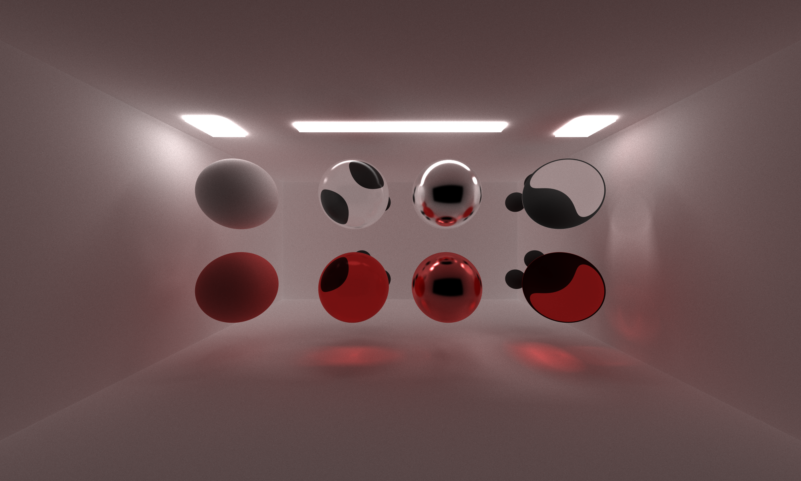
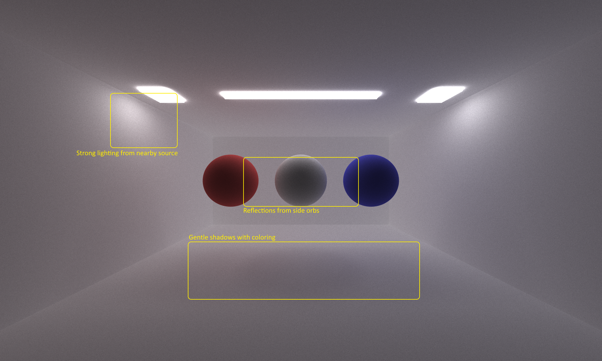
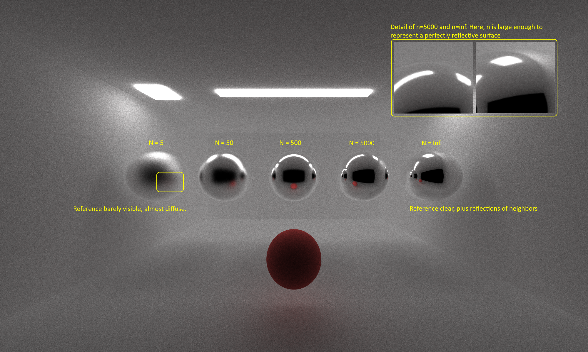
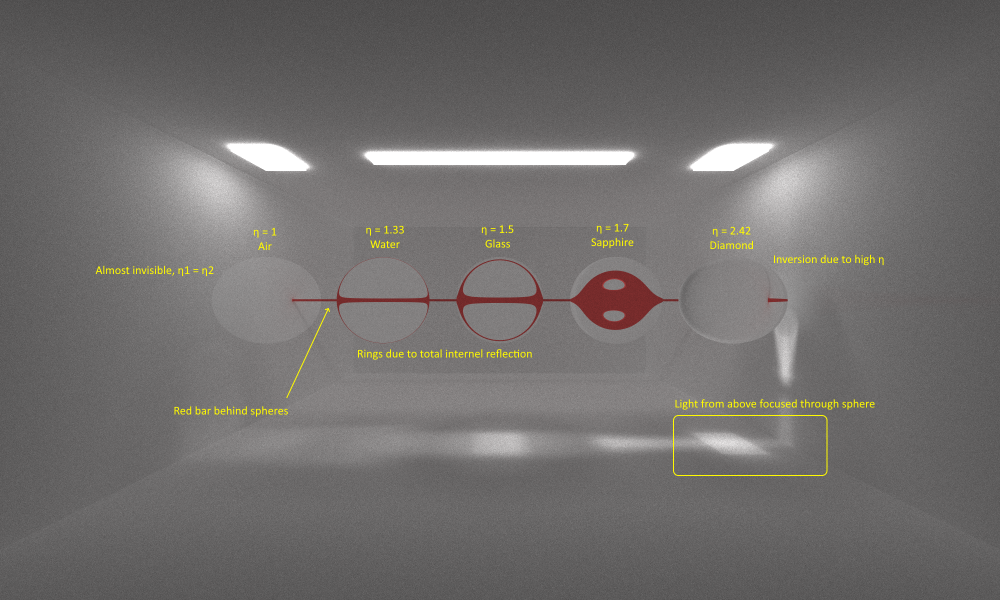
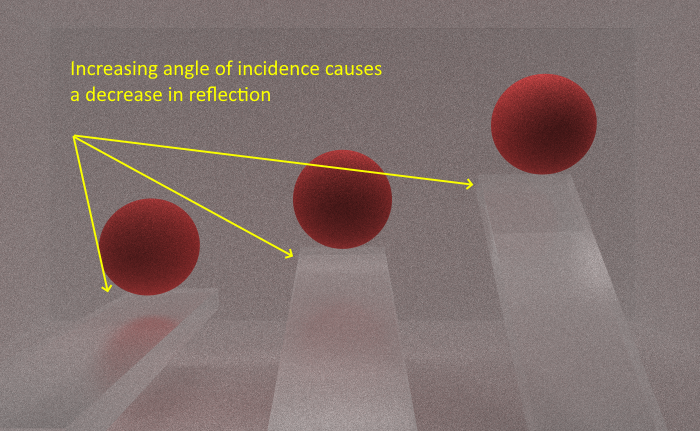
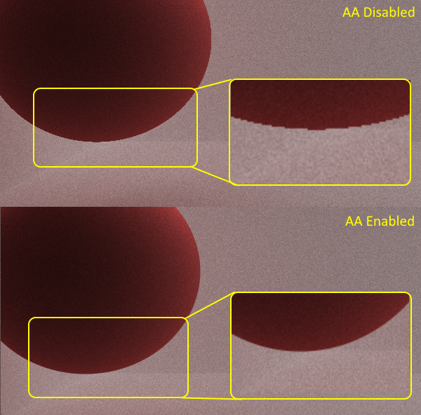
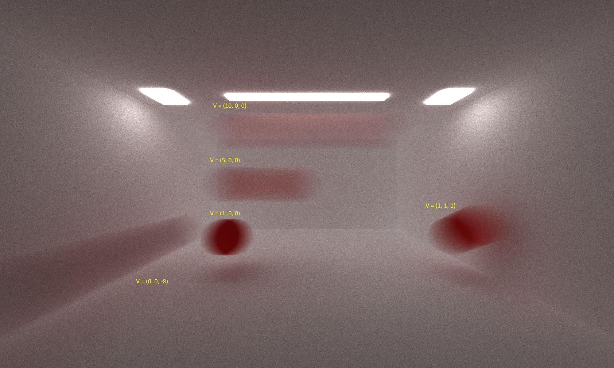

CUDA Path Tracer
================

**University of Pennsylvania, CIS 565: GPU Programming and Architecture, Project 3**

* John Marcao
  * [LinkedIn](https://www.linkedin.com/in/jmarcao/)
  * [Personal Website](https://jmarcao.github.io)
* Tested on: Windows 10, i5-4690K @ 3.50GHz, 8GB DDR3, RTX 2080 TI 3071MB (Personal)

This report is brought to you by Grace Potter's "Back To Me", which I listened to roughly 325 times while working on this pathtracer.

# Contents
[Introduction to Pathtracing](#intro)

# Introduction to Pathtracing
Starting this project, I had minimal knowledge of pathtracing. All I knew is that it was somewhat related to raytracing and I knew it was a Big Deal for games. If you're familiar with pathtracing/raytracing, feel free to skip ahead to my project details. Otherwise I'll talk a bit about pathtracing and how it works in general.

Rendering is hard. There are a lot of materials in the world. Creating a realistic representation through traditional rendering (rasterization) can be tedious and, in the end, doesn't look that great. PPathtracing provides a more realistic rendered image by simulating the laws of physics. Simply, a number of rays are generated on a point representing our camera. Each ray is then sent out in in each direction from the point. For each ray, the patracer calculates where it will intersect from its current position and direction and then calculates where its going next. This is done with the help of our shaders. The shaders determine not only the color of the bounced ray, but in what direction it is going. This is where the physical properties of the marterial come into play.

Each object in the scene can be Reflective, Refractive, Diffuse, or proportion of the three. The ratios and properties of each marterial are used when rendering to more accuretly simulate the light-material interactions we would see in the real world. When light interacts witha diffuse object (think chalkboard) it can bounce in any direction. This creates a rough, plain looking surface. Reflective materials (think a mirror or a chrome fender) bounce rays in a generally consistent direction. Perfectly reflective materials are more likely to bounce it in a particular direction, while less relfective materials will have a bit more divergence. Refractive materials (think water) will allow most light to pass through, but the path of the light will change. I talk more about the physics of each further down.

The pathtrace looks at each intersection between a ray and a material and picks one of the properties to apply, and if enough rays are used enough times, this averages out to look pretty realistic. The pathtracer will generate rays from a camera, bounce them around the scene a couple times, and then repeat this process. Over many samples, the image starts to converge and look good. There are some problems with sampling this way, but as we'll see in a bit the pathtracer can add noise to each sample to create small differences in the initial rays for each sample. This creates a smoother image and tries to hide some of the imperfections of digital rendering.

# Pathtracer Implementation
The base pathtracer given to me had functions to read in scene descriptions, fire off rays, and do minimal shading. I implemented additional shaders and features to improve the quality and capabilities of the renderer. I've split this into two groups, visual improvements and perfromance improvements.

### Visual Improvements
* Ideal Diffuse Scattering Function
* Imperfect Specular Reflective Scattering Function
* Refractive Transmission Scattering Function using Fresnel Effects and Shlick's Approximation
* Antialiasing with Stochastic Sampling
* Depth of Field
* Motion Blur Effects
* Loading of glTF Object Files (Partial)

## Performance Improvements
* Compation of Terminated Rays
* First-Bounce Cacheing
* Material Sorting for Memory coherence

In the following sections I'll discuss each objects implementation and its effects.

# Ideal Diffuse Scattering Function
This was mostly a freebie so I will not go into it in too much detail. When a ray intersects a non-specular object, it will bounce the incoming ray in a random direction in a hemisphere about the normal. This is done by taking a random &theta; and &psi; around the normal and mapping it to cartesian coordinates.

# Imperfect Specular Reflective Scattering Function
Reflective materials have a 'shininess' property that changes how reflective they are. A mirror, for example, is nearly perfectly refelective. A chrome bumper on a car may be less reflective, and a small marbles even less so. This is represented in the pathtrace by using importance sampling. A perfectly reflective object (shininess &rarr; &infin;) will always bounce a ray at &theta;i = &theta;o. However, for smaller shininess values, the ray will bounce in some distribution centered on the perfectly reflected ray. My renderer detremines this by taking n = shininess, R = &Uscr;[0,1), and &psi;o = acos(R1 / n + 1) and &theta;o = 2&pi;R. I then take these values, transform them to the proper coordinates, and then transform it to be centered on the normal. Observe that for infinite n, &psi;o will be 0o, so there would be no change from the perfectly reflected angle.

# Refractive Transmission Scattering Function
Refraction is a bit trickier from the above two because of a couple of unique properties. First of all, there is the case of total internal reflection. After a certain critical angle &theta;c, the ray will not transmit through the material and it will simply reflect off of the surface (internal or external). This can be seen in the real world by looking out on the ocean during a sunset. Light from the sun will mostly bounce off the surface of the water to your eyes. High indicies of refraction &eta; will lead to greater distortion of the rays moving through the medium.

# Fresnel Effect
Additionally, we must take Fresnel Effects into consideration. On a reflective/refractive surface, fresnel effects will cause reflections to appear stronger at narrower &theta; and weaker at wider &theta;. I use Shlick's Approximation to produce a good-enough estimation on when a ray will reflect back and when it will transmit through. Note this is a different check than the critical angle.

# Antialiasing
Because the camera generates sample points in a regular pattern, rays will always strike the center of each pixel on the first bounce. This can lead to jagged edges on objects since the pixel is not entirely one color, but the point sampled is just one color. I implement anti-aliasing by applying a &PlusMinus;0.5f jitter to each ray when it is generated at the camera. This will allow our samples to randomly hit a position in the first pixel, and then these random points are samples over many iterations to produce an average of the colors in that pixel. This random sampling to produce a better average is known as stochastic sampling.

# Depth of Field
In the base pathetracer, the amera is treated as a pinhole-camera. That is, all the rays begin at the same point, minus some small jitter from the Antialiasing if enabled. In a realk world camera, there is a lens and a focal distance included. I simulate this in my pathtracer by projecting each sample onto a small cocentric disk with lens radius r a focal distance &fpartint; from the camera. This creates a depth-of-filed effect that can be controlled by modifying the two variables. Increasing the lens radius increases the blurring effect seen as objects move out of focus. Increasing the focal distance moves the focal plane back, increasing the depth of focus.

| &fpartint; = 5, r = 0.01 | &fpartint; = 15, r = 0.01
| --- | --- |
|  |  |

| &fpartint; = 5, r = 0.05 | &fpartint; = 15, r = 0.5
| --- | --- |
|  |  |

# Motion Blur
A normal camera has a shutter open and a shutter close time. The final image from the camera naturally integrates over that time frame, but my renderer does not take time into account. If an object was moving in the scene, the movement would not be perceptible. I added a motion blur feature to account for this. Each object can be defined with a velocity vector in the scene description file. Each ray is then assigned a random point in time from 0 to 1. When intersections are tested, the render transforms each object by adding the displacement caused by the object velocity at that point in time.  This creates a nice blurring effect, amplified by the velocity of the object.

# glTF Objects
I implemented the tools needed to load glTF files and conmvert them into the objects used by my renderer. However, I stopped short at implementing just the physical geometries of the object and not the textures. My renderer also has lots of trouble with any complicated geometry, likely due to my iontersection test having no current methods of culling objects. Overall it allows for some uninteresting objects to load. Future work would include loading textures and adding performance optimizations to allow for more interesting objects to be loaded.

# Compaction of Terminated Rays
The pathtracer will fire off one ray per pixel at first, but many of those rays will terminate by falling off the scene or hitting a light source. Computing on these rays is wasteful and would lead to wasted threads in our warps and blocks. After each shading step, the device data containing all arrays is partitioned into an alive side and a terminated side. The ray buffer length is then adjusted so subsequent kernels will only operate on the living rays. This reduces the number of wasted threads per loop.

# First-Bounce Cacheing
The camera generates rays in every direction on the first iteration, and many rays terminate after the first iteration. This leads to a very expesnive first iteration normally. To help reduce the cost of this first iteration, the first set of bounces and shaders are cached by the renderer so that subsequent samples can reuse the cached first iteration data. This does not help when antialiasinfg is used since each first iteration is jittered randomly. Therefore, when antialiasing is enabled, the first iteration cache is disabled.

# Material Sorting
To improve kernel performance, I sort the arrays used for intersections by the material ID. This helps by reducing the largest divergence split in the shaders. When the shader starts, it looks at the properties of the material and then choses a distibution function based on that. If a diffuse material, refelctive material, and refractive material are all in the same warp, this leads to horrendous performance. Each kernel will diverge in the early stages of the shader and each will have to perform serially. By grouping materials together, divergence is limited to instances where the angle of incidence causes some unique behavior in each kernel.

# Acknoweldgements
[Physically Based Rendering, Third Edition: From Theory To Implementation](http://www.pbr-book.org/)

PBRT3 was seriously the most useful resource I found. Many of my implementation details came from this work.

[GPU Gems 3](https://developer.nvidia.com/gpugems/GPUGems3/gpugems3_pref01.html)

Another excellent resource, especially for understanding some of the complicated math behind these functions.

[tinygltf](https://github.com/syoyo/tinygltf)

Library used for loading gltf files into my renderer. Also used some example code to speed up implementation.

