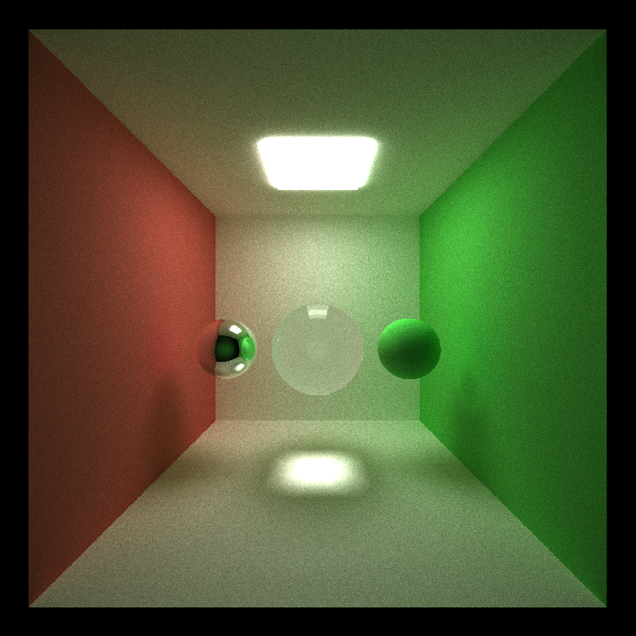
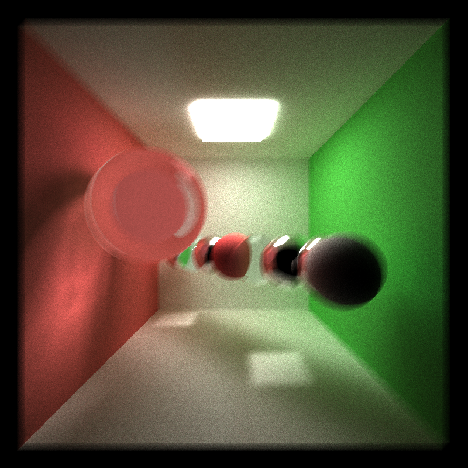
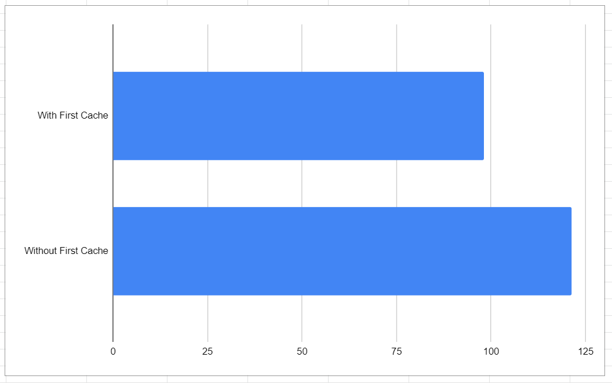
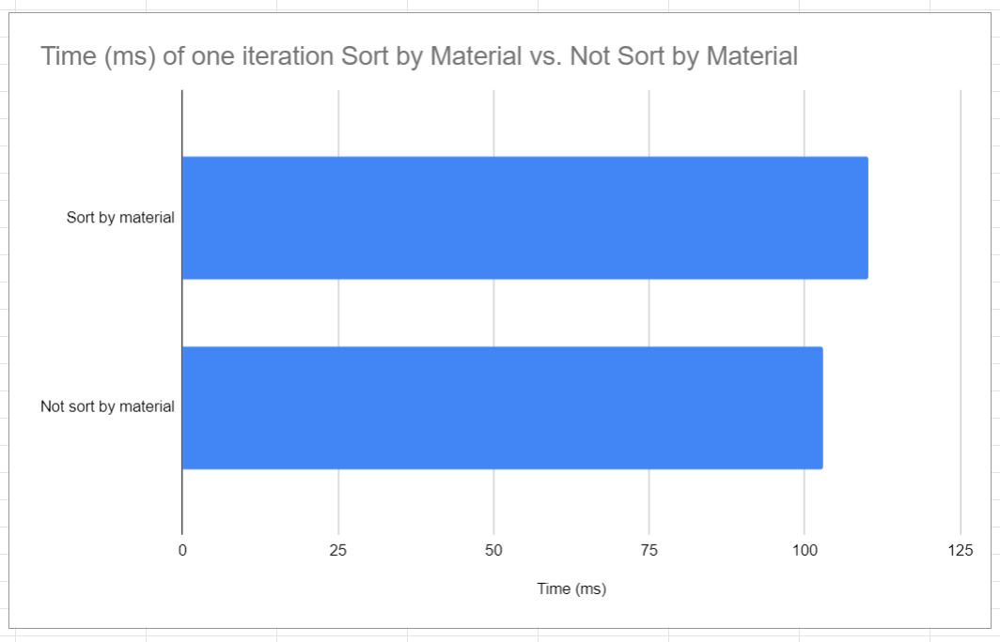
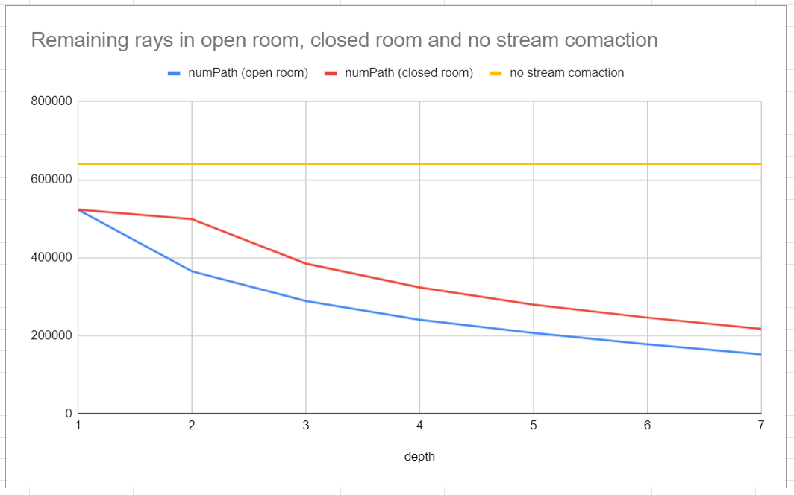

CUDA Path Tracer
================

**University of Pennsylvania, CIS 565: GPU Programming and Architecture, Project 3**

* Gangzheng Tong
* Tested on: Windows 10, i7-8750H @ 2.20GHz 16GB, RTX 2070 8GB (personal laptop)

### Overview

**Path tracing** is a [computer graphics](https://en.wikipedia.org/wiki/Computer_graphics "Computer graphics")  [Monte Carlo method](https://en.wikipedia.org/wiki/Monte_Carlo_method "Monte Carlo method") of [rendering](https://en.wikipedia.org/wiki/Rendering_(computer_graphics) "Rendering (computer graphics)") images of three-dimensional scenes such that the [global illumination](https://en.wikipedia.org/wiki/Global_illumination "Global illumination") is faithful to reality [Widipediea] 
In this project I implemented the basic path tracing algorithm with C++ and Cuda, taking advantage of the highly parallelial nature of GPU and achieved an interactive renderer. 

The general idea is to shoot a large number of rays from the camera, compute the intersections with the objects in the scene, and scatter more rays from the intersection point based on the material properties such as glassy or matte. If after a few bounces the scattered ray reaches a light source, we can shade the path segment based on the   light color and emittance,  

### Features
3 Different materials: 
* Diffuse
* Perfectly Specular
* Refraction with Frensel effects using [Schlick's approximation]([https://en.wikipedia.org/wiki/Schlick%27s_approximation](https://en.wikipedia.org/wiki/Schlick%27s_approximation))

**Other features:**
* Direct Light
* Sort by Material
* First Bounce Cache
* Stream Compaction for Removing Terminated Rays

### Performance Analysis
* First Bounce Cache. By cache the first intersection data in the first iteration, we are essentially save one ComputeIntersection() for all subsequent iterations. Given that our path tracer has 8 bounces limit, we are saving up to 1/8 GPU time theoretically. 

* Sort by Material
Before launch the shading kernel, we first sort the path segments (rays) by the material id first. By doing this the rays with the same material tend to by processed in the same blocks, so as minimizing the time divergence brought by the different material shading algorithm. For example, if a material requires complicated computation and takes significant longer time than the sample material, ideally we want to group than separately so as to avoid threads in the same warp finish at the different time. 
However, with my implementation, due to all materials are relatively simple and does not differ too much in terms of kernel execution time, the result is not optimal. It's not even compensate the overhead introduce by the sorting operation. 

* Stream Compaction - remove the terminated rays.
During the rays bounce in the scene, it's often the case that a ray will be terminated before the bouncing limit, either because it hits the light source, or it does not hit anything. It makes sense to remove these rays before launch the shading kernel to reduce the threads numbers. The effect is especially obvious after a few bounces when very few rays remaining. It's help even more when the scene is an open environment because more rays will hit nothing in the first few bounces.

### References
* [PBRT online edition](http://www.pbr-book.org/)
* [Schlick's approximation - Wikipedia](https://en.wikipedia.org/wiki/Schlick%27s_approximation)
* [Thrust :: CUDA Toolkit Documentation - Nvidia's GPU](http://docs.nvidia.com/cuda/thrust/index.html)
* Thanks Mark Xu for explaining the Stream Compaction 
