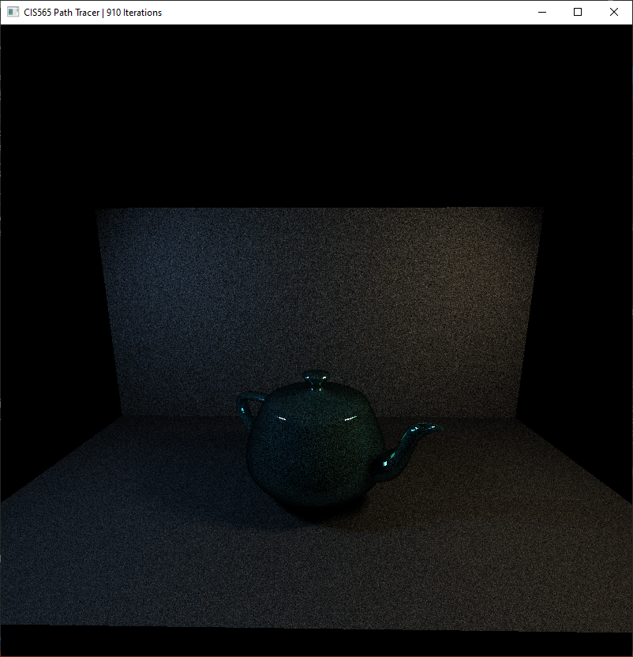
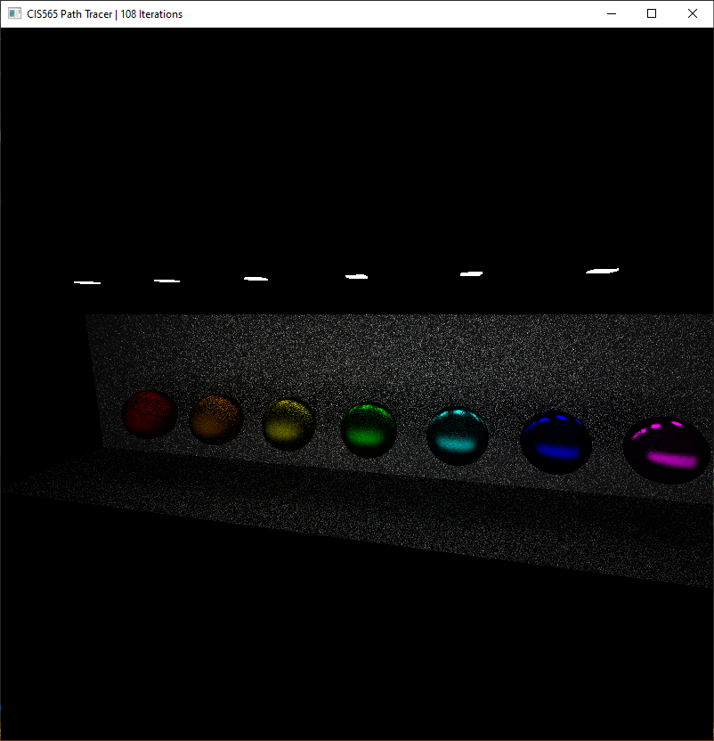

CUDA Path Tracer
================

**University of Pennsylvania, CIS 565: GPU Programming and Architecture, Project 3**

* Taylor Nelms
  * [LinkedIn](https://www.linkedin.com/in/taylor-k-7b2110191/), [twitter](https://twitter.com/nelms_taylor), etc.
* Tested on: Windows 10, Intel i3 Coffee Lake 4-core 3.6GHz processor, 16GB RAM, NVidia GeForce GTX1650 4GB

## Path Tracer

This is where I would write about my path tracer... IF I HAD ONE

## Configuration Notes

### CMakeLists changes

I put the `tinyobjloader` library contents into the `external` folder, so I had to include the relevant header and source file in the project, as well as mark their locations to be included and linked.

Additionally, I decided to compile this all with `C++17`, in case I decided to make use of the `std::filesystem` library (a slight quality of life fix over just calling it via `std::experimental::filesystem`)

## Sources

### OBJ Files
* Models downloaded from Morgan McGuire's [Computer Graphics Archive](https://casual-effects.com/data)
    * Bunny, Dragon, Teapot, Tree, Breakfast Room, Fireplace Room

### Other Code
* Used [TinyObjLoader](https://github.com/syoyo/tinyobjloader) library for loading `*.obj` files
* Formerly: Ray-triangle intersection algorithm stolen from the Wikipedia article for the [Moller-Trumbore Intersection Algorithm](https://en.wikipedia.org/wiki/M%C3%B6ller%E2%80%93Trumbore_intersection_algorithm). Now, using glm.
   
