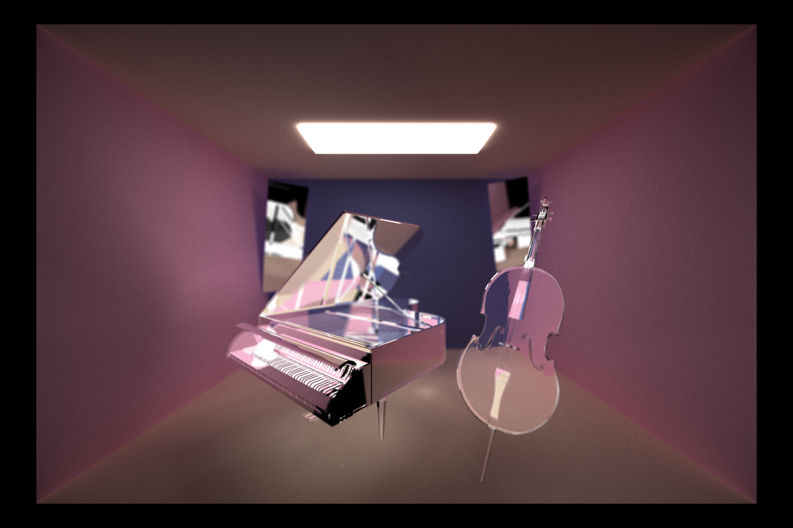

CUDA Path Tracer
================

**University of Pennsylvania, CIS 565: GPU Programming and Architecture, Project 3**

* Grace Gilbert
  * https://www.linkedin.com/in/grace-gilbert-2493a0156, http://gracelgilbert.com
* Tested on: Windows 10, i9-9900K @ 3.60GHz 64GB, GeForce RTX 2080 40860MB (Personal Laptop)

  Glass Instruments  
  5000 Samples, Refractive material with IOR 1.52, Lens Radius 0.75, Focal Length 6

## Overview
## Features
### Materials
#### Diffuse
#### Perfect Specular
#### Refractive
### OBJ Loading
### Camera
#### Depth of Field
#### Anti-Aliasing
### Optimizations
#### Stream Compaction
#### Material Sorting
#### First Bounce Cache
### Bloopers
#### OBJ Intersection
#### First Bounce Cache
#### Anti-Aliasing
#### Depth of Field
