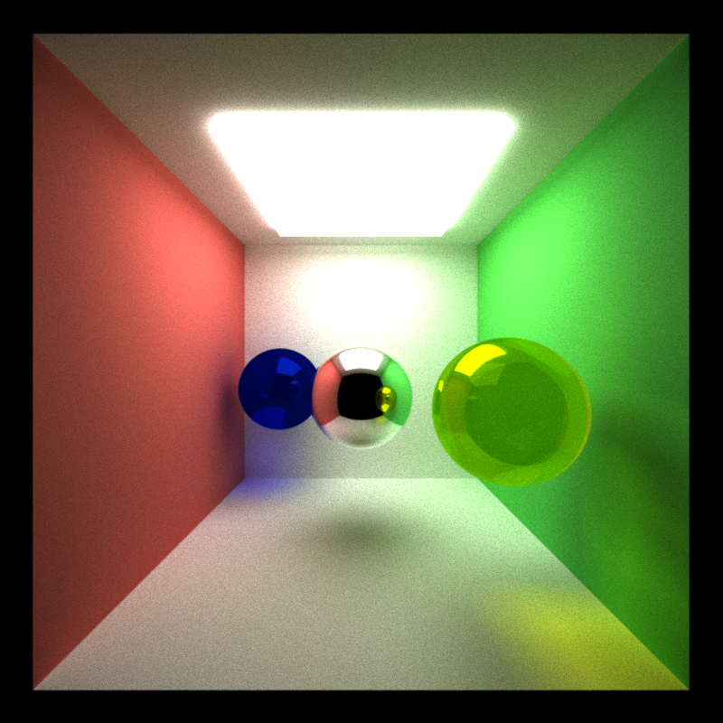
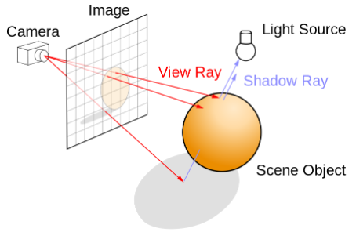
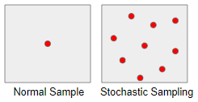
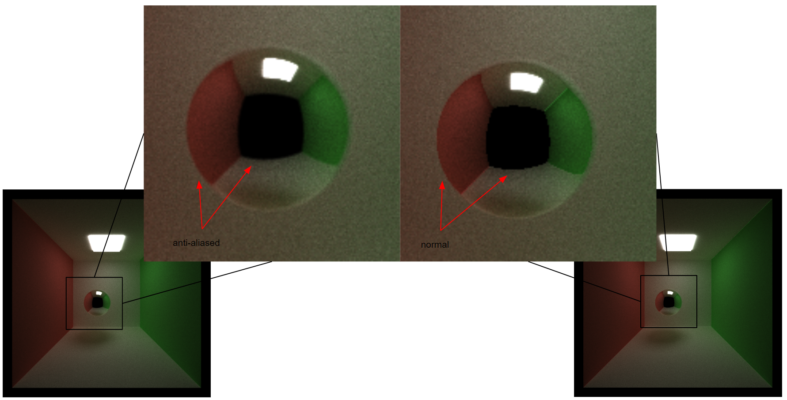
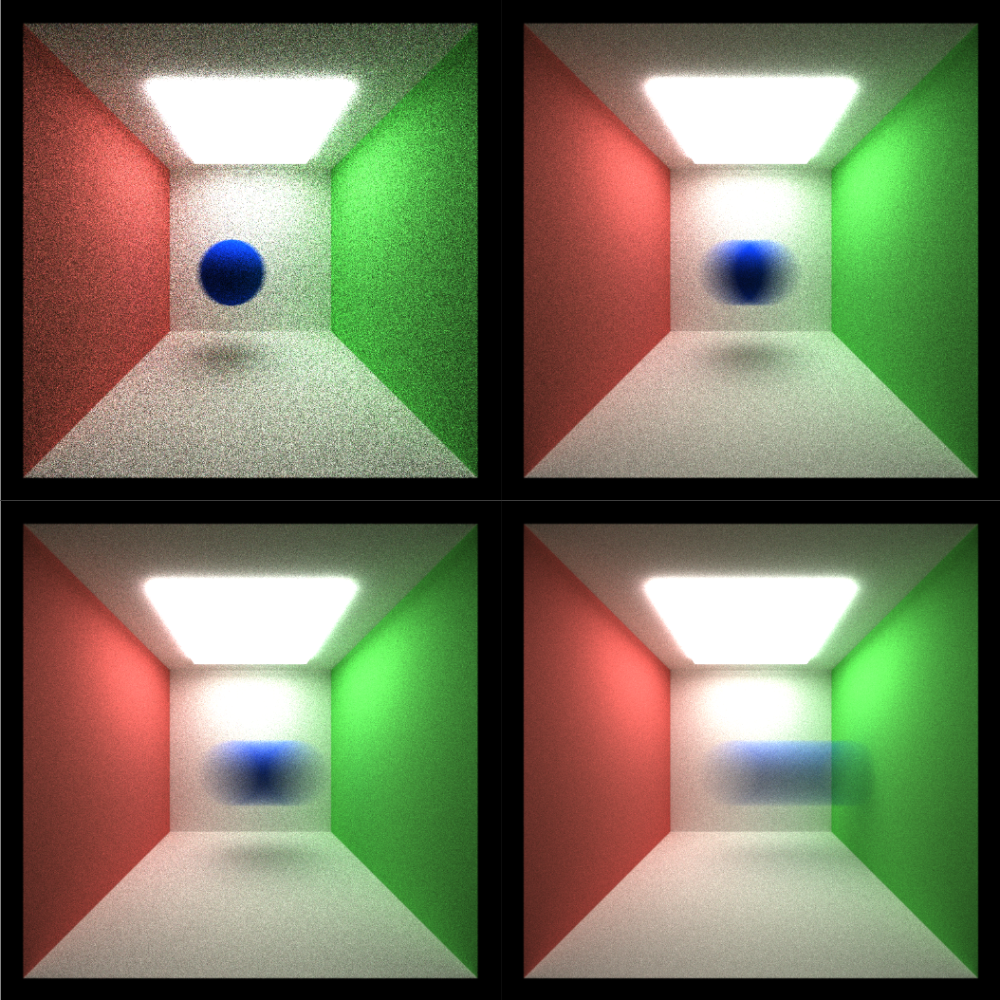
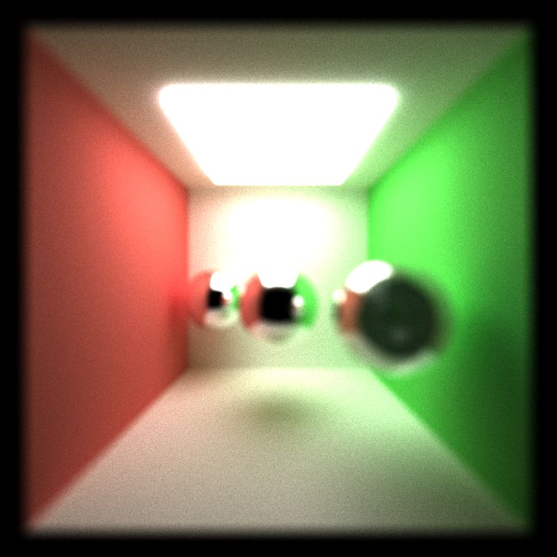
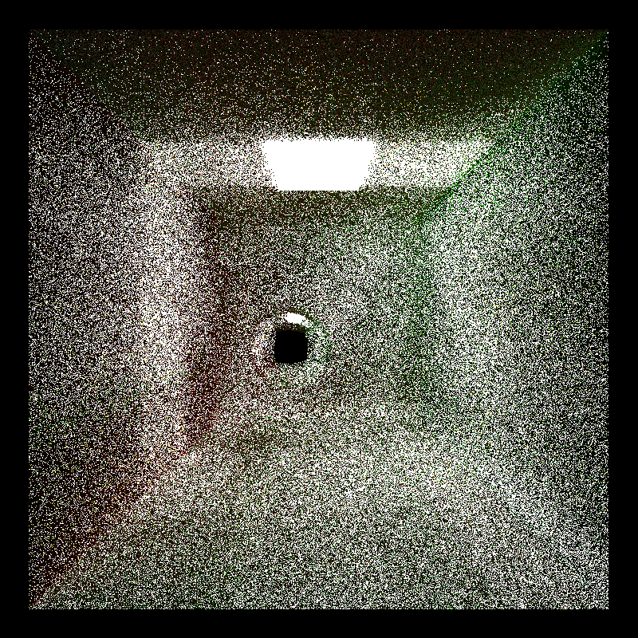
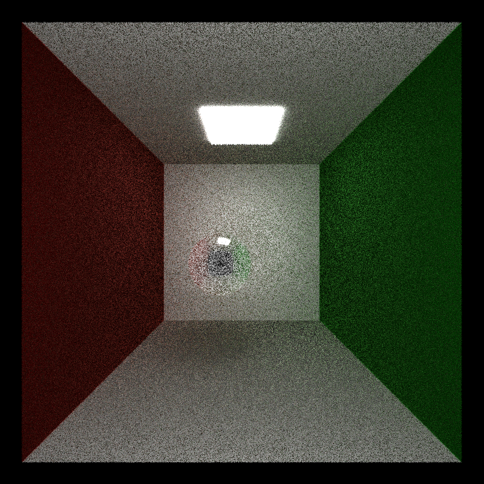
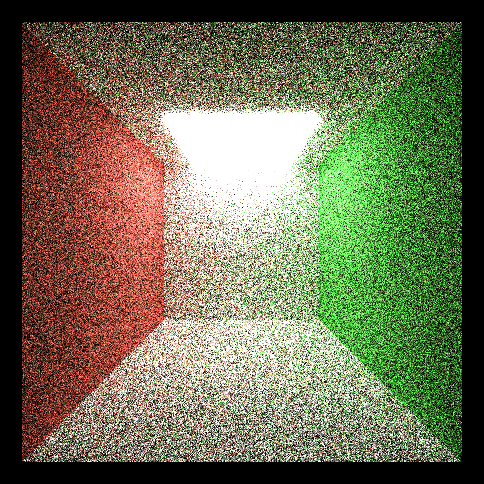

CUDA Path Tracer
================

**University of Pennsylvania, CIS 565: GPU Programming and Architecture, Project 3**

* Klayton Wittler
    * [LinkedIn](https://www.linkedin.com/in/klayton-wittler/)
* Tested on: Windows 10 Pro, i7-7700K @ 4.20GHz 16.0GB, GTX 1070 8.192GB (my PC)

## Sections

* [Introduction](#introduction)
* [Features](#features)
    * [Anti-aliasing](#santi-aliasing)
    * [Motion Blur](#motion-blur)
    * [Depth of Field](#depth-of-field)
    * [Frensel Effects](#frensel-effects)
* [Performance Analaysis](#performance-analysis)
    * [Stream Compaction](#stream-compaction)
    * [Material Sort](#material-sort)
    * [Cache First Bounce](#cache-first-bounce)
* [Bloopers](#bloopers)

# Introduction
This project implements a path tracer using CUDA to render scenes. 

A path tracer works by shooting rays at each pixel from the camera. On collision the rays bounce according to the material properties of the object. Rays are terminated after a certain number of bounces or after it hits a light, and accumulates color as it bounces off objects.

# Features
## Anti-aliasing
Anti-aliasing occurs when continuous signals are discretely sampled. In computer graphics this leads to step like artefacts at boundaries. One way to deal with this is to randomly perturb the ray in order to sample around boundaries and achieve a smoothing affect. 

We can see the effects in the scene around the edges of the sphere and in the reflection of the sphere.

## Motion Blur
Motion blur happens when an object moves faster than the 'frame rate' can capture. We can simulate this by moving the object between iterations faster than the rays can converge.

## Depth of Field
Depth of field works similar to anti-aliasing in that it randomly perturbs the rays. However the difference is that its now done within an aperture, which will leave a certian area in the image still in focus and everything else will be blury.

## Frensel Effects
To capture refractive and transmissive surface effects we can use Schlick's approximation of the reflection coefficient in determining how a ray bounces. We can see the scatter of blue and yellow light through the blue and yellow sphere respectively.

# Performance Analaysis
The benefit of utilizing a parallel algorithms on a GPU is that we can simulate the pixels simulanteously. However, path tracing is still computationally expensive which is where optimizations such as stream compaction, sorting by material, and caching the first bounce can help.
## Stream Compaction
Iterations can be sped up by getting rid of terminated rays. Rays can be terminated when they reach the limit of bounces, hit a light source, or doesn't hit anything.
## Material Sort
Sorting by materials can be used to optimize run time because similar materials will be contiguous in memory. This helps because similar materials will be likely to have similar run times, which leads to less thread divergence.
## Cache First Bounce
Since the same rays are generated in each iteration, the intersections can be cached so they don't need to be recalculated. However this optimization breaks down in using random sampling techniques like anti-aliasing, and also causing problems in motion blur since the object is moviing and intersecton will change.

# Bloopers

Ray termination | Caching with anti-aliasing | Motion blur with caching
:-------------------------:|:-------------------------:|:-------------------------:
| | 

