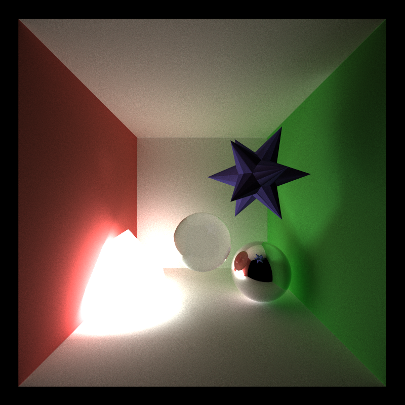

CUDA Path Tracer
================

**University of Pennsylvania, CIS 565: GPU Programming and Architecture, Project 3**

* Name: Vaibhav Arcot
  - [LinkedIn](https://www.linkedin.com/in/vaibhav-arcot-129829167/)
* Tested on: Windows 10, i7-7700HQ @ 2.8GHz (3.8 Boost) 32GB, External GTX 1080Ti, 11G (My personal laptop)

## Path Tracing overview

This repo is a path tracer written entirely in C++ and CUDA accelerated.

All images shown were created by running 5000 iterations, and all scene files and meshes are provided

### Dependencies

* CUDA 10+
* [tinyobjloader][https://github.com/syoyo/tinyobjloader] (Included in repo)

### Features
* Reflective and diffused materials
* Stream compaction
* Material sorting
* Caching first bounce
* Refractive materials using Schlack's approximation of Fresnel's law
* Motion blur
* Anti Aliasing
* Normal debugging view
* Loading arbitrary meshes and ray culling
## Cornell Box

The Cornell box is a simple stage, consisting of 5 diffusive walls (1 red, 1 green and the other 3 white). In the above sample, a diffusive sphere.

## Different Materials

Below is an image with the 4 types of materials inside a Cornell box.

## Effects

### Motion blur

### Anti Aliasing

To perform anti aliasing, I decided to use the simple approach of jittering the ray within the pixel every time we generate the rays for that scene. This prevent the ray from having the same first bounce, which can otherwise make the edges of objects appear jagged (aliasing, shown in the zoomed versions below).

| 
 <b>Anti Aliasing Off </b>
 | 
 <b>Anti Aliasing On </b>
|
| ---- | ---- |
|   |      |
| 

 | 

 |

### Fresnel's Effect

### Meshes

Mesh loading is supported in this path tracer with the help of tinyobjloader. The implementation allows for a mesh to have a rotation, translation and scale added to it, and also allows the importing of mesh files that have or lack normals defined inside them. Currently, only triangular meshes are supported, but the code should be easy to extend to higher order polygons.

#### Great Dodecicosacron

This mesh is one of the first meshes I was able to load and render (Besides a debugging square). This mesh has 360 vertices and 120 faces, with material used was a reflective dark blue color with a refractive index of 1.33. As mentioned previously, all scene files are present in the scenes/Scenes folder.

#### Elephant

Below is a mesh of an elephant with a diffused red surface (and diffused white ground). This mesh has 623 vertices and 1148 faces.

#### Stanford bunny

In the aim of pushing the system to its limits, I decided to load up the Stanford bunny. The material is a dark refractive material (It has a metallic quality only because it is hard to figure out if you are seeing a reflection or refraction which I like). This model has 34,817 vertices and 69,630 faces.

#### Stanford dragon

Finally, I decided to load the Stanford dragon mesh. This mesh has a staggering (for me) 435,545vertices and  871,306 faces, and the material was dark red, transparent and had a red specular color. 

### Debugging Normal view

## Optimizations

### Stream Compaction

### Material Sorting

### Caching first bounce

* Can only be done in certain circumstance

### Bounding box ray culling

## Other cool results

### Re computing normals makes it more jagged

### Effect of depth on render

### Effect of iterations on render

## Observations

### Material sorting is slow!!!

### Creating meshes with normals  helps

Useful links

[3D obj files with normals][https://casual-effects.com/data/]

[Fresnel's law][https://blog.demofox.org/2017/01/09/raytracing-reflection-refraction-fresnel-total-internal-reflection-and-beers-law/]

[Easier 3D obj files][https://graphics.cmlab.csie.ntu.edu.tw/~robin/courses/cg04/model/index.html]