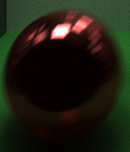
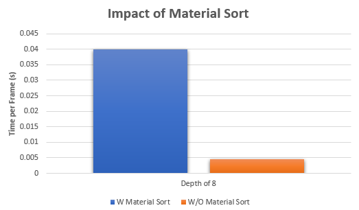

CUDA Path Tracer
================

**University of Pennsylvania, CIS 565: GPU Programming and Architecture, Project 3**

Peyman Norouzi
* [LinkedIn](https://www.linkedin.com/in/peymannorouzi)
* Tested on: Windows 10, i7-6700 @ 3.40GHz 16GB, Quadro P1000 4096MB (Moore 100B Lab)

## CUDA Path Tracer:

In computer graphics, ray tracing is a rendering technique for generating photo realistic images. In this approach, we trace paths of light as they leave from a camera as pixels in an image plane and simulating the effects of them encountering with virtual objects. 

## Table of Contents:

- [CUDA Path Tracing Implementation](#cuda-path-tracing-implementation)
  * [Core Implementation](#core-implementation)
  * [Core Implementation + Anti-Aliasing](#core-implementation-+-anti-aliasing)
  * [Core Implementation + Anti-Aliasing + Motion Blur](#core-implementation-+-anti-aliasing-+-motion-blur)
- [Perfomance Implementation and Analysis](#perfomance-implementation-and-analysis)
  * [Stream Compaction](#stream-compaction)
  * [First bounce intersections Caching](#first-bounce-intersections-caching)
  * [Material Sort](#material-sort)
- [Cool Renders](#cool-renders)
- [Bloopers](#bloopers)

## CUDA Path Tracing Implementation:

I am implementing ray tracing on CUDA capable of rendering globally-illuminated images very quickly. The basic idea of the implementation can be seen below:

When a ray leaves the camera (pixel), it can hit the objects in the environment and bounce, change direction or get diffused. So it is important to implement the rules that govern the behavior/interactions between rays and materials and objects in the environment. A ray hitting an object can have the following behavior and outcomes: 

The behavior rules can be found below: 

### Core Implementation:

In our core implementation we will model refraction, reflection and difusion behavior of material/ray interaction. For the refraction/reflection implemnetation I will be using Snell's law with Frensel effects using [Schlick's approximation](https://en.wikipedia.org/wiki/Schlick's_approximation). In this implementation, the ray that gets fired from the camera bouces for a maximum of 8 time (Depth of 8) unless it gets diffused or hits the light source. The walls in this rednder only diffuse and the sphere in the enviroment both reflects and refracts. The result of the render is as follows:

Now let's make the left and right walls into the same material as the sphere. The result looks pretty cool:

let's have two objects now! let's make it red so that the whole render get a red hue! it is starting to look like a Salvador Dali painting!

### Core Implementation + Anti-Aliasing:

we can use Stochastic Sampled Antialiasing method and add some noise to the position of our rays when they get fired from the camera. This would help us greatly for rendering edges of the objects. The result speaks for themselves:

| Without Anti-Aliasing | With Anti-Aliasing |
| ------------- | ----------- |
|   |  |
| ----------------><---------------- | ----------------><----------------|

As you can see we were able to greatly improve our rendering performance!

### Core Implementation + Anti-Aliasing + Motion Blur:

In this implementation we try to move objects in the image slowly as we are creating the render. As the objects moves, we can average samples(frames) at different times in the animation. The results look super cool:

| Without Motion Blur | With Motion Blur |
| ------------- | ----------- |
|   |  |
| ----------------><---------------- | ----------------><----------------|

## Perfomance Implementation and Analysis:

In the naive approach, we track each rays motion and bounce, throughout its journey until our depth requirement is met. But this is not the best and most efficient way to approach this since many rays will be terminating their journey earlier by either hitting the light source or a diffusing surface.

### Stream Compaction: 

Stream compaction would allow us to get rid of rays that have already terminated by hitting the light source or a diffusing surface. This way we can exit earlier in each iteration thus improving our performance. This is especially useful when our depth is a larger number such as 64. We can see the performance improved significantly as follows (the depth is 8):

As you can see the time it takes for each depth decreases as we bounce further and further which is as predicted. This is due to having less and less active rays to track as we bounce further and further. The performance improvement is especially significant when we have an open environment (no surrounding walls) which makes sense since a lot more rays would get eliminated because of space being open. Overall if we have a high depth(32 and above) stream compaction can improve the performance significantly. 

### First bounce intersections Caching:

The first bounce (rays leaving the camera) is the same for each frame iteration so we are technically able to calculate the first bounce intersection and cache it in our memory and use it for future frame iteration which can help further improve the performance of the implementation which can be seen in the plot below: 

  

### Material Sort:

Not every material in the environment is going to be the same when it comes to computational complexity. Some materials (reflective/refractive) have more bounces and thus require more computation when it comes to it. Thus in theory, if we sort our materials by the type of material they are, we can improve the performance even further. But in reality, the material sort seems not to be affecting our performance in the predicted way. There may be two reasons for this: 1. There are not enough materials in the environment for the sort to make a difference, meaning that if there were a lot more materials we could see possible improvements. 2. The time it takes to sort the materials is longer than the possible benefit we get by sorting. 

  

## Cool Renders:

These are my Salvador Dali style masterpieces:

## Bloopers:

Here are some bloopers showing that everyone can and will make mistakes along the way. :)

  
