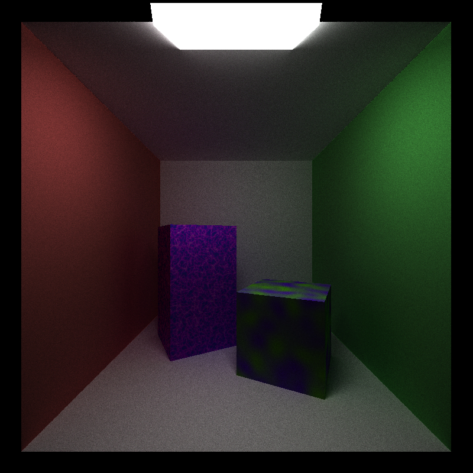

CUDA Path Tracer
================

**University of Pennsylvania, CIS 565: GPU Programming and Architecture, Project 3**

* Alexis Ward
  * [LinkedIn](https://www.linkedin.com/in/alexis-ward47/), [personal website](https://www.alexis-ward.tech/)
* Tested on: Windows 10, i7-8750H CPU @ 2.20GHz 16GB, GTX 1050 Ti 

# README

Path tracing is one of the most integral and commonly used methods for rendering 3D scenes. It allows a realistic portrayal of how light bounces through a scene. For each pixel of an image, we cast a ray from our camera into the scene, collide with an object and keep bouncing until we find a light source, stop intersection objects, or reach maximum bounce-depth, compiling color data along the way.

&#x1F537; There are many different features that are toggleable through the code; for all the options, read below!

## PART 1: Path Tracer Set-Up: Naive Shader, Basic Materials, and Memory Management 

`shadeNaive()`: I first created a "naive" implementation of a path tracer, dubbed as such because ray bounces for diffuse materials are purely random, and it contains no optimizations to converge the scene faster (like multiple importance sampling or any weighted random values). This shader is how the program runs on default. My kernel is based on the base code's `shadeFakeMaterial()` function, and the main difference comes in the `scatterRay()` function call and the ability to track `remainingBounces` of the currently processed path.

### Reflective Materials

The aforementioned `scatterRay()` function handles the direction of the next bounce and the properties of the current colors, both based on the given intersection's material. Perfectly specular (reflective) materials return a bounced ray based on the angle of the incoming ray, and their colors are heavily based on reflections rather than it's own inherant color (which can tint the reflections).

### Diffuse Materials

Perfectly diffuse materials can reflect light from any direction, and so the next direction for a ray bouncing off a diffuse surface is chosen at random. This random direction is sampled from a hemisphere surrounding the intersection, and the sampling method can change the output result (see cosine weighted hemisphere below).

### Stream Compaction, Partitioning by Material, and Cacheing for Speed

  |  

&#x1F537; **Toggleable options** in `pathtrace.cu`: 
* Line 21, set `TOGGLESTREAM = true` for Stream Compaction
* Line 22, set `TOGGLESORT = true` to sort paths by Material
* Line 23, set `TOGGLECACHE = true` to cache the first bounce intersections

All three methods added here decrease the runtime for more complex scenes.

Stream Compaction, as we know from my previous repository, culls current paths that don't fit a certain criteria. In this case, we look to see if a bath is complete (`remaininBounces==0`), and if so we remove it from the list. Because of this, we don't have to uselessly call `shadeNaive()` on our completed paths.

Organizing our paths based on intersection materials minimizes the chances of divergent warps; every path completing the same tasks (since many are based on material, see `scatterRay()`)

Measurements were taken on the scene pictured at left, (but for 1000 samples rather than 5000).
Diffuse Cornell, Diffuse and Specular Cornell (specular sphere), My Cornell (diffuse walls and box, two transmissive and one reflective spheres)
under each: No optimization, Stream compaction, partitioning, cache, all three

## PART 2: More Surfaces and Shapes

### Transmissive Surfaces

I implemented a perfectly transmissive surface that uses indices of refraction. This was slightly more challenging than reflection, because we need to keep in mind whether a ray is entering or exiting the surface, or whether the angle of the ray causes total internal reflection (in which case we reflect). I base my implementation off for this and many of the following features on [Physically Based Rendering](http://www.pbr-book.org).

The image above includes a sphere with an internal index of refraction of water, 1.33 (with external, air, being 1.00029). The image below contains all materials made so far; one sphere with IOR 1.33 and one with 1.6. Both are at 5000 samples per pixel

### Depth of Field

&#x1F537; **Toggleable option:** Line 26 of `pathtrace.cu`, set `DEPTHOFFIELD` to `true` if you desire this effect, `false` if you do not

 **Important** *You must turn off the first bounce-caching, because this method relies on having slightly random rays coming from the camera. This is controlled by `TOGGLECACHE`*

In the function, `generateRayFromCamera()`, where we initialize all of our path segments, I have added code that mimmics a thin lens camera. This assumes the camera has a set focal distance and lens radius. To get this "focus" effect in each path, we take a vec3 filled with random values and shift the percieved camera position by these values, and we alter the current ray direction based on this new position and the plane of focus. This thus jitters all intersections except those on / near the plane of focus.

**Different Planes of Focus and Lens Radius examples:**

POF 6.82, LR 0.25            |  POF 6.82, LR 0.25
:-------------------------:|:-------------------------:
  |  

POF 6.82, LR 1           |  POF 6.82, LR 2
:-------------------------:|:-------------------------:
  |  

POF 11.543, LR 0.5            |  POF 8.32, LR 1
:-------------------------:|:-------------------------:
  |  

All pictures at 5000 samples per pixel.

### Procedural Surfaces

  |  

For these shapes I used the formulas for implicit surfaces, as taught by IQ on his website. These mathematical formulas tell you how far a given ray is from a surface, and by combining different primitive formulas, you can get very complex shapes, like Cappy from Super Mario Odyssey and some Duck.

The larger pictures are both at 5000 samples, while the smaller are 1000 samples.

### Procedural Textures

 

I used two implementations of a noise function (my favorite that I have used for years :D) to get these two different procedural textures. One call to this function makes use of `glm::abs` to get such vivid lines, while the other is at a greater scale and more smoothely blended, to almost look like spots.

## BONUS: Direct Lighting and Hemisphere Sampling

### Direct Lighting

To get a much faster converging image, many path tracers utilize multiple importance sampling. At each bounce this casts both naively bouncing random rays, and light-wards aimed rays, weighs the two, and combines the resulting color. However, I did not implement this: I took a more simplistic approach. As the instructions suggested, I can take a final ray directly to a random point on an emissive object acting as a light source, and so I run most bounces as normal, until I hit the second to last bounce. This bounce alters the outgoing ray value to point to a light's surface. (The random position is chosen by taking a random (x, y) vector and projecting it onto a plane with the object's transformations. For simplicity's sake, this works best with cube and planar light sources.) The following and final bounce processes if that new ray indeed hits the light, and if so adds light to the path's current color. Because we directly hit a light at the end of most paths, and we don't utilize a PDF, the direct-lighting-influenced pictures tended to be brighter.

As you can see below, the Direct Lighting converges faster.

**Direct** 1 sample           |  **Naive** 1 sample
:-------------------------:|:-------------------------:
  |  

10 samples           |  10 samples
:-------------------------:|:-------------------------:

  |  
50 samples           |  50 samples
:-------------------------:|:-------------------------:
  |  

### "Cosine Weighted" Hemisphere Sampling

Left is using the given sampling, right is using my own.

Hemisphere sampling, used in this project to determine the direction of an outgoing ray after bouncing on a diffuse surface, has many different varieties. In my implementation, I ensure that there is a higher density of outgoing rays that are more orthogonal to the surface. Due to lambert's law, rays more tangent o a surface deposit less light, and so the more tangential rays are less relevant to our pathtracing computation. I accomplish this by taking two random `float`s from [0, 1] (using these as (x, y) positions creates a 2D square of random points) and converting them onto a disk in 3D space. I then project this disk onto 

Illustrated below, without jittering the random values, we have the initial square of points, the disk form, and then the cosine weighted hemisphere form.

 
