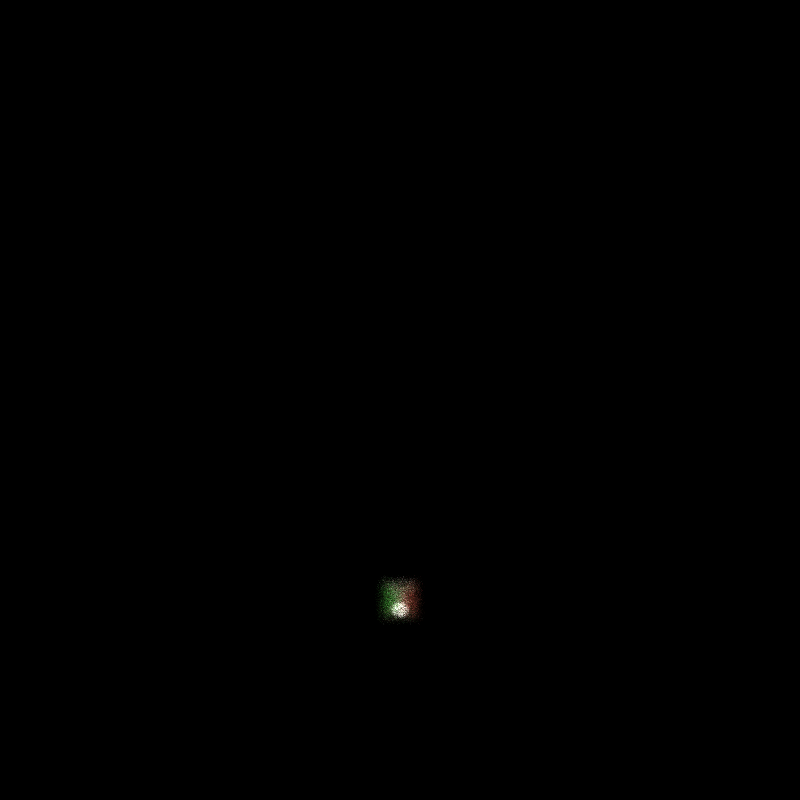

CUDA Path Tracer
================

**University of Pennsylvania, CIS 565: GPU Programming and Architecture, Project 3**

* Grace Gilbert
  * https://www.linkedin.com/in/grace-gilbert-2493a0156, http://gracelgilbert.com
* Tested on: Windows 10, i9-9900K @ 3.60GHz 64GB, GeForce RTX 2080 40860MB


<p align="center">
  Glass Instruments <br>
  5000 Samples, Refractive material with IOR 1.52, Lens Radius 0.75, Focal Length 6
</p>

### Resources
- Piano, cello, and alpaca OBJs downloaded from [TurboSquid](https://www.turbosquid.com/)
- Physically Based Rendering: From Theory to Implementation (PBRT)

## Overview
For this project I implemented a path tracer that runs on the GPU. Path tracing takes a picture of a 3D scene by casting rays from a camera through each pixel into the scene and tracing them as they bounce around the scene until they terminate. Rays terminate when they hit light, obtaining energy to display color, or when they hit nothing, absorbing no color to hit the camera. The material of the objects that the ray hits in the scene determine the direction of its next bounce. After many iterations of bouncing the rays through the scene, the colors returned to the camera's eye at each pixel gradually converge, creating a realistic image of the scene. 

I implemented various features of a path tracer, such as different materials, camera effects, geometry, and optimizations.  These features are described in detail below.

## Amy Lou the Alpaca
Perfect Specular           |  Refractive               | Diffuse
:-------------------------:|:-------------------------:|:-------------------------:
|  |

## Features
### Materials
The material of an object in the scene determines which direction a ray will bounce after hitting an interesction with that object. The material also affects what color the ray will absorb from the object when it hits it. 

Certain materials may have multiple material properties. To account for this, we probabilistically choose the material we will use to bounce our ray at each iteration.  If an object is 50% diffuse and 50% specular, we will choose either a diffuse or specular bounce distribution with a probability of 0.5 each. To account for the fact that we don't represent the entire set of material properties at each bounce, we scale up the contribution of each bounce proportionatly.  So in the given example, we would scale up both the specular and diffuse color values by 2. 
#### Diffuse
A diffuse material will bounce the ray in any direction, evenly distributed in a hemisphere about the intersection point with the diffuse object. This creates a soft, flat appearance on the surface. The process for determining the new direction of a ray after intresecting with a diffuse object is the following:
```
newDirection = normalize(calculateRandomDirectionInHemisphere(intersectionNormal, randomNumberGenerator))
```
We also offset the origin of the new ray a little bit along the interesction normal to make sure that it is outside of the intersected geometry.  Otherwise, the new ray might fall just inside the object and get trapped inside.
```
newOrigin = intersectionPoint + EPSILON * intersectionNormal
```
Finally, the ray incorporates the color of the material it just hit:
```
pathColor *= materialColor
```
Diffuse Sphere             |  Diffuse Cube          
:-------------------------:|:-------------------------:
| 

#### Perfect Specular
A pure specular material will reflect the ray along the reverse of its incoming angle, creating a mirror effect. Unlike in diffuse, there is no distribution involved in this bounce. A ray incoming at a certain angle will deterministically bounce in a single direction.
```
newDirection = normalize(reflect(originalDirection, intersectionNormal))
```
Just like with diffuse, we offset the new origin so that it will not be inside the hit object. For the color, we now take into account the specular color of the material, as a material can have a different specular color from its diffuse albedo:
```
pathColor *= materialSpecularColor
```
Specular Sphere            |  Specular Cube          
:-------------------------:|:-------------------------:
| 

Blue Specular Sphere       |  Blue Specular Cube          
:-------------------------:|:-------------------------:
| 

#### Refractive
A refractive material will bounce the ray through the material at a certain angle depending on the index of refraction (IOR). The refection will change if the ray is outside entering the geometry or inside exiting, as the index of refraction is inverted. Refraction also has a property called total internal reflection.  This means that if the incoming ray hits an object at a grazing angle, it will reflect off the object rather than refracting through it. This may also occur while the ray is inside of the object, reflecting interally. 

For refraction, I ended up using the eta property of the material, which is simply 1/IOR:
```
eta = 1 /  materialIOR
if insideLeaving:
    theta = acos(dot(normal, originalDirection))
    criticalAngle = asin(1/eta)
    refractedDirection = normalize(refract(originalDirection, -normal, eta))
    if (1/eta < 1 and theta > criticalAngle):
        refractedDirection - normalize(reflect(originalDirection, -normal))
if outsideEntering:
    theta = acos(dot(normal, -originalDirection))
    criticalAngle = asin(eta)
    refractedDirection = normalize(refract(originalDirection, normal, eta))
    if (eta < 1 and theta > criticalAngle):
        refractedDirection = normalize(reflect(originalDirection, -normal))
```
Note that my implementation of refraction does not update the color of the path, as the light just passes through the material and gets bent, but does not pick up color from the material itself.

Refractive Sphere (IOR = 1.52) |  Refractive Cube (IOR = 1.52)  
:-------------------------:|:-------------------------:
| 


<p align="center">
  Glass Torus with Caustics <br>
  5000 Samples, Refractive material with IOR 1.52
</p>

IOR 1.2           |  IOR 1.52               | IOR 1.7
:-------------------------:|:-------------------------:|:-------------------------:
|  |

### OBJ Loading
In order to render a piece of geometry, there must be a way to find a ray's intersection with that geometry. Basic shapes, such as spheres and boxes, can be described by simple intersection equations, but arbitrary meshes are more complex. To render these, I implemented an OBJ loader that reads in mesh data from and OBJ file using the TinyObj loader. The mesh geometry consists of a list of triangles that make up the form. Triangles have a simple intersection function, so to intersect with the mesh, we can iterate over all triangles in that mesh. 

To intersect with a triangle, we first intersect the ray with the plane of the triangle.  We then use a barycentric model to check if that point is inside the trianlge by summing up the areas fo the point with each triangle edge and making sure they sum to the area of the whole triangle:
```
transform the ray origin and direction to object space
t = dot(trianglePlaneNormal, (trianglePoint1 - rayOrigin)) / dot(trianglePlaneNormal, rayDirection)
if t < 0: 
    return no intersection
pointOnPlane = rayOrigin + t * rayDirection

S = triangleArea
s1 = area(pointOnPlane, trianglePoint2, trianglePoint3) / S
s2 = area(pointOnPlane, trianglePoint1, trianglePoint3) / S
s3 = area(pointOnPlane, trianglePoint1, trianglePoint2) / S

if all si's are between 0 and 1 and they sum to 1:
    transform the intersection point back to world space
    use triangle normal and ray direction to determine if hit inside or outside the mesh
    return length(rayOrigin - worldSpaceIntersectionPoint)
```
When iterating through the triangles in a mesh, a single ray might intersect with more than one triangle, as a triangle may be further behind in the mesh but still along the ray direction.  To account for this, I ensure that the intersection found is always the closest one in front of the camera.  

In order to store the triangle mesh data, I added a MESH type to the geom struct, as well as a first triangle index and a last triangle index.  The scene class contains a list of all of the triangles in the scene, which gets passed to the GPU as a buffer. When iterating over all geometry in the scene, if it is a mesh, the mesh then knows which triangles belong to it by indexing into the triangle buffer.  It iterates over the triangle buffer from its first triangle index, inclusive, to its last triangle index, exclusive. 


<p align="center">
  Glass Instruments (2 mesh objects)<br>
  5000 Samples, Refractive material with IOR 1.52, Lens Radius 0.75, Focal Length 6
</p>


<p align="center">
  Reflective Dragon <br>
  1091 Samples, 10000 Triangles
</p>

### Camera
Adjusting the direction in which we cast rays into the scene can create various camera effects.  I used this technique to implement depth of field and anti-aliasing.
#### Depth of Field
Depth of field is achieved by implementing a thin-lens camera model. Instead of shooting rays straight from the camera eye into the scene, the rays get spread out onto a disk lens and then focused onto a focal point a certain distance away. To spread the rays out onto a disk, I took a 2D random number (2 random numbers), and warped them to a disk shape scaled by the desired lens radius, creating a random distribution over a disk. I offset the lens origin by this disk distribution, creating the effect of the rays being spread over the disk.  I then use the original ray direction and the desired focal length to calculate the focal point, and adjust the ray direction to be the direction from the new offset origin to the focal point. 

The diagram below illustrates the concept of the rays distributing over a lens and focusing at a certain distance z:


Lens Radius 2 |  Lens Radius 1   
:-------------------------:|:-------------------------:
| 

Lens Radius 0.4 |  Lens Radius 0   
:-------------------------:|:-------------------------:
| 

#### Anti-Aliasing
Anti-aliasing is inteded to smooth out sharp borders in the render that come from discretizing the scene into individual pixels. Without anti-aliasing, we sample the pixel at its top left value, meaning we cast a ray through the top left corner of each pixel at every iteration. However, a straight edge might cut through an individual pixel, creating two contrasting colors within a single pixel. By just sampling one point in the pixel, we will only get one of the colors. This will ultimately result in a step ladder effect. However, if we distribute our samples over the entire pixel, we can get an average of the color within that pixel, softening the shart, stepped edges. 

To accomplish this, I adjusted the ray direction calculation when casting rays from the camera into the scene:
```
offsetx = 0
offsety = 0
if antialiasing:
    offsetx = rand(0, 1)
    offsety = rand(0, 1)
rayDirection = normalize(camView
                         - camRight * camPixelLength.x * (x - camResolution * 0.5 + offsetx) 
                         - campUp * campPixelLength.y * (y - camResolution * 0.5 + offsety)
```

Anti-Aliasing Off |  Anti-Aliasing On   
:-------------------------:|:-------------------------:
| 

Anti-Aliasing Off |  Anti-Aliasing On   
:-------------------------:|:-------------------------:
| 


### Optimizations
#### Stream Compaction
For each iteration of bouncing rays throughout the scene, we parallelize all of the rays. There are as many rays cast into the scene as their are pixels on the screen, all being run in parallel. The rays bounce around the scene collecting light, but eventually terminate, either after bouncing a certain maximum number of times, hitting a light, or hitting nothing in the scene. Not all of the rays will terminate after the same number of iterations.  Some might hit a light right away, some might hit nothing right away, and some might bounce until their max depth is exceeded and be forced to terminate. Rather than wasting threads on the rays that have terminated early, we use stream compaction to avoid putting in unnecessary work on these terminated rays.

Each ray path has a number of remaining bounces. If this reaches 0, the ray is terminated. After each intersection calculation and shading step, which is one cycle of a ray bounce, I partition the ray paths, putting the ones that have 0 remaining bounces at the end of the buffer of ray paths. I then update the number of paths remaining, subtracting away the terminated rays. Now, when performing the remaining intersection tests and shading operations, we will only operate on the number of remaining paths, saving threads from wasting time on terminated paths. 
#### Material Sorting
The time taken to calculate the scattered direction after an intersection depends on the material hit. Each material has different calculations to determine the new ray direction, some longer than others. If we perform the shading operations in any arbitrary order, we may have warps of threads in which some have to perform a specular reflection calculation, some diffuse, and some refraction.  This causes high branch divergence, which results in latency, as the diffuse material threads will be waiting for the refractive material threads to finish before being able to move on to a new intersection. 

To optimize this, after we find our next set of intersections, we sort the intersections and ray paths according to the material hit. This groups the paths by material, so all of the refractive threads will be adjacent to each other, reducing branch divergence and therefore latency. 
#### First Bounce Cache
If we are not using depth of field or anti-aliasing, in each iteration, every first bounce of the ray from the camera will intersect the same spot in the scene. Each time we cast a ray from the camera, we cast it through the top left corner of the pixel, which is the same direction in each iteration. Because we are casting the ray from the same origin in the same direction, it will hit the scene in the same place every time. Therefore, we can take advantage of this and cache that initial intersection, reusing it on the first bounce of each iteration rather than recalculating that intersection. 

Note that caching cannot be done in conjunction with anti-aliasing and depth of field. These two features vary the initial ray cast each iteration to acheive some blurring of the pixels, either blurring between pixels to smooth out sharp lines, or blurring at certain distances to create depth of field. Therefore, we must recalculate the first intersections each iteration, as they will not be the same as previous iterations.

#### Performance Stats
The following charts compare the timer per iteration for each of the optimizations on their own, and all together. I tested this with different scene complexities, first with one diffuse sphere, so all the materials except the light are diffuse, next with one specular sphere, so an extra material. Then with one specular and one refractive, so all 4 types of materials in the scene (including light). 


Based on the above stats, the optimizations actually tend to slow down the rendering for simpler scenes. This may be because the overhead of sorting and performing stream compaction is not worth the benefits, as the scene is so simple that it is fast without any modifications.  Caching first does speed things up a little bit, but this feature is only usable without depth of field and anti-aliasing.  Interestingly, with just stream compaction turned on, the specular and refractive materials were noticably faster than the diffuse material.  Perhaps these materials were more likely to hit light or nothing and terminate quickly, making the stream compaction more worthwhile, as there were more paths being terminated.  

I also compared performance with a reflective dragon in the scene, which has 10000 triangles in the mesh:


This data does indicate an improvement with the optimizations. Stream compaction and material sorting significantly decrease the time per iteration.  Caching also decreases this time, but only slightly.  This indicates that the reason why the optimizations were not helping above was because of scene complexity, but when the scene is very complex, the overhead of sorting and stream compacting pays off overall.  Caching does not speed up the rendering any more than it did for the simpler scenes because it still only applies to one step of each iteration, whereas the other optimizations apply to every step.  

To collect this data, I put a cuda event timer surrounding the call to the pathtrace function and took an average over the elapsed time of 4 iterations.  

## Bloopers
### OBJ Intersection
When implementing OBJ intersection, I initially was not sorting triangle intersections by which was closest to camera, so if a triangle came after a triangle in front of it, the triangle in front did not render. In trying to fix this, I ended up with some interessting renders:

 

### First Bounce Cache
When working on setting up the first bounce caching, I remembered to turn off anti-aliasing, but I was testing with depth of field on, which created this render:


### Anti-Aliasing
Before I figured out the correct way to add the randomized offset to the pixels for anti-aliasing, I had one attempt that ended up warping my scene in a cool way:


I also tried one version that extremely over-blurred the scene:


### Depth of Field
Before I got the thin lens camera properties setup correctly, the ray jittering had fun effects on the renders, including a very out of focus render, and a very tiny cornell box:

![] (img/DOVBlooper.png) 
