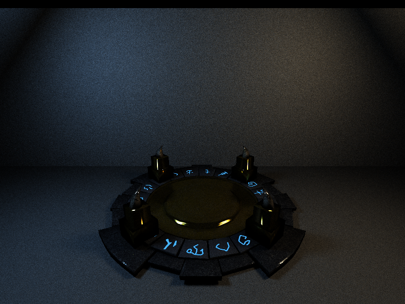

CUDA Path Tracer
================

**University of Pennsylvania, CIS 565: GPU Programming and Architecture, Project 3**

* Taylor Nelms
  * [LinkedIn](https://www.linkedin.com/in/taylor-k-7b2110191/), [twitter](https://twitter.com/nelms_taylor), etc.
* Tested on: Windows 10, Intel i3 Coffee Lake 4-core 3.6GHz processor, 16GB RAM, NVidia GeForce GTX1650 4GB

## Path Tracer

A Path Tracer is a method of rendering virtual geometry onto the screen. Notably, they do so by simulating how light moves around a scene. This is in contrast to traditional rendering methods, which transform the geometry more directly from world-space to screen-space. While path tracers are slower than traditional renderers, they are able to natively perform much more impressive feats overall.

For example, features such as *caustics* (the more intense light on the floor at the bottom-left of the image), or complex reflections and re-reflections, are easier to get with path-tracing than other methods.

This particular implementation is running on the GPU (graphics processing unit) via the CUDA framework, which allows us to parallelize the rigorous task of doing all our calculations for each pixel one at a time. This allows for significant speed-ups over CPU path tracers.

## Features

### Arbitary Mesh Loading

For an Object file in the scene description, it may be given the type “mesh.” Their transformation parameters act the same way, but you may also specify a “FILE” string. This can be the path to an `.obj` file, or a `.gltf` file (the latter of which must be in the same place as its assets).

*classic Bunny obj file*

This loads all the file’s triangles into our data structures, and can then be rendered sensibly. As of now, no material characteristics are loaded in; however, textures are recognized for `.gltf` files, across a few metric types. All of my gltf files came from Sketchfab's automated conversion system, so certain conventions may have become baked into the code.

#### Bounding Volume

I implemented a simple axis-aligned bounding volume for my loaded meshes. That is to say, I constructed a "box" around each based on the maximum and minimum `x`, `y`, and `z` values for all of my triangle vertices, and did ray intersection tests on the box before attempting to intersect with each triangle in the mesh.

##### Performance

The image of the three guns was a good testbed for bounding box testing; the scene had a lot of triangles, but they were very densely localized. As such, cutting out a significant number of the triangle intersections was relevant.

I saw, with bounding-box culling, a time of `144s` to reach 500 iterations. Without, the same scene took `236s`. This, additionally, gives evidence that one of the more time-consuming parts of the path-tracer is intersecting each ray with the scene geometry; taking out roughly 2/3 of the intersections tests produced a 61% speedup.

#### Textures

Using the CUDA texture memory, I was able to hook up `.gltf` files with their textures within the ray tracer. I worked almost entirely from files downloaded from [Sketchfab](https://sketchfab.com/), so their naming conventions may have ended up baked in to my implementation. (Specifically, the file naming for their texture image files is how I distinguish between different types of texture mappings.)

Notably, these assets provide a few different attributes. In addition to base color, some models have normal (bump) maps, textures for metallic roughness, or emissivity. An example of an asset displaying both base color texture and emissivity textures is here:

Here is a series of images of the same scene, with differing level of textures applied to them.

<figure>

 <figcaption>No Textures</figcaption>
</figure>
 
<figure>

 <figcaption>Color Texture</figcaption>
</figure>

<figure>

 <figcaption>Color and Emissivity Textures</figcaption>
</figure>

<figure>

 <figcaption>Color, Emissivity, and Metallic Textures</figcaption>
</figure>

<figure>

 <figcaption>Color, Emissivity, Metallic, and Normal Textures</figcaption>
</figure>

##### Performance

TODO: Performance analysis

I also implemented a *very* simple procedural texture for use on my cube primitives (though, in theory, it could be applied to the triangle meshes as well without too much issue).

However, all it did was fill in texture memory in the same way that the loaded textures did; given that the GPU accesses both in the same way, there was no noticeable performance difference.

### Specular Sampling with Exponent

Implemented specular reflections with configurable exponent. Pictured below is a comparison of various exponential values for specularity. Notice that the very high value is effectively mirror-like; with such a highly specular object, the slight variations we get off the "mirror" direction are small enough to, effectively, not alter the ray at all. In this fashion, if we wished, we could eliminate the idea of "reflectivity" from our material description altogether.

Note: I used powers of three solely because they created a reasonable range of shininess across 7 samples; I have no idea if there was any computational speedup or slowdown because of this.

### Refraction

Refraction turned out to be trickier than I anticipated. Notably, it made triangle intersection tests more difficult, because I now had to check my meshes for backface triangles. (A smarter implementation than mine might only do so if the material for the mesh as a whole were refractive.) However, allowing for refraction on more complex models meant that I could display much more interesting results.

You can see some of the other objects in the scene through Zelda's dress in this image; in particular, the shadow of the ball behind her.

Of course, it's also better with a more interesting background:

Here, you see the emissive materials behind her come through, distorted but still clear. The "candle" light through her hand is also visible.

### Material Sorting

In order to attempt to reduce warp divergence, and better make use of the GPU resources, I implemented a pass to allow for material sorting between computing intersections and shading the materials.

For a simple scene, such as `scenes/checkersdemo.txt`, I was able to get 200 iterations deep in `20s` without material sorting. With sorting, it took `50s`.

Now, that was with only a dozen or so primitives; surely, when dealing with hundreds or thousands of triangles, the performance will be improved!

For a more complex scene, such as `scenes/teapotdemo.txt` (containing some 16,000 triangles), without sorting the materials, it took `75s` to get to 200 iterations; with sorting, it took `79s` to get to 200 iterations. Still not a performance boost, but better nonetheless.

When working with a significantly complex scene, such as `scenes/bunnydemo.txt` (containing 144,000 triangles), it took `184s` to get to just 50 iterations (pardon my impatience); with material sorting, it took `186s` total.

I can honestly conclude that it did not make much of a difference in my application; I suspect that what warp divergence I encountered came from the randomness involved in the ray-scattering function, which happened after the material sorting. Additionally, many of the objects in my scenes were spatially very localized as well, which probably cut down on the unsorted divergence.

### Open Image Denoiser

The [OpenImageDenoiser](https://github.com/OpenImageDenoise/oidn) was a particularly interesting (albeit late) addition. It uses machine learning (read: magic) to take some of the gritty noise out of a ray-traced image, and construct it as if it were closer to being converged.

I elected to only feed the image in at the very end of a run, so as to not sully the process of accumulating light up to that point. Notably, running an image for longer improves the final image, but I was able to get smoother images from the beginning than I would have anticipated, feeding just the initial normal and albedo maps into the program. See the following comparison of image qualities of the same scene after a different number of iterations through the path tracer:

<figure>

 <figcaption>50 iterations, not filtered</figcaption>
</figure>
 
<figure>

 <figcaption>50 iterations, filtered</figcaption>
</figure>

<figure>

 <figcaption>200 iterations, not filtered</figcaption>
</figure>

<figure>

 <figcaption>200 iterations, filtered</figcaption>
</figure>

<figure>

 <figcaption>2000 iterations, not filtered</figcaption>
</figure>

<figure>

 <figcaption>2000 iterations, filtered</figcaption>
</figure>

## Configuration Notes

### CMakeLists changes

I put the `tinyobjloader` library contents into the `external` folder, so I had to include the relevant header and source file in the project, as well as mark their locations to be included and linked.

I added the [OpenImageDenoiser](https://github.com/OpenImageDenoise/oidn) library to the `external` folder, and so added the line `include_directories(external/oidn/include)` so that the headers could be read sensibly. Additionally, I added the subdirectory `external/oidn`, and linked the `OpenImageDenoise` library to the `target_link_libraries` function. This did not end up doing all the necessary linking (see below), but it helped.

Notably, this required having Intels `tbb` installed; I acheived this by signing up for, and subsequently installing, [Intel Parallel Studio](https://software.intel.com/en-us/parallel-studio-xe). Time will tell if I made the right decision.

Additionally, I decided to compile this all with `C++17`, in case I decided to make use of the `std::filesystem` library (a slight quality of life fix over just calling it via `std::experimental::filesystem`). I admittedly am not sure whether this change actually took.

#### Moving DLLs

Look, I don't like what I did either.

I manually copied the `OpenImageDenoise.dll` and `tbb.dll` from their rightful homes to the directory where my built `Release` executable was, so that it might run.

Certainly, CMake has a way to do this, but as somebody who is not a CMake wizard at this point, this will have to do.

## Sources

### 3D Models
* Models downloaded from Morgan McGuire's [Computer Graphics Archive](https://casual-effects.com/data)
    * Bunny, Dragon, Teapot, Tree, Fireplace Room
* Turbosquid
    * [Wine Glass](https://www.turbosquid.com/FullPreview/Index.cfm/ID/667624) by OmniStorm
    * [Secondary Wine Glass](https://www.turbosquid.com/FullPreview/Index.cfm/ID/932821) by Mig91
* Sketchfab
    * [Fountain](https://sketchfab.com/3d-models/fountain-07b16f0c118d4073a81522a526183c11) by Eugen Shuklin
    * [Altar](https://sketchfab.com/3d-models/altar-9b20f669e75441bcb34476255d248564) by William Chang
    * [Zelda](https://sketchfab.com/3d-models/ssbb-zelda-6612b024962b4141b1f867babe0f0e6c) by ThatOneGuyWhoDoesThings
    * [Sheik](https://sketchfab.com/3d-models/ssbb-sheik-4916d918d2c44f6bb984b59f082fc48c) by ThatOneGuyWhoDoesThings
    * [Hunter Rifle](https://sketchfab.com/3d-models/hunter-rifle-wip-ae83df4cc35c4eff89b34f266de9af3c) by cotman sam
    * [Textured Cube](https://sketchfab.com/3d-models/textured-cube-a883bf6dfd144419929067067c7f6dff) by Stakler (used for development)
    * [Sci-fi blaster](https://sketchfab.com/3d-models/sci-fi-assault-rifle-laser-blaster-f730872e1ee843e9a3934e9e3f6719c0) by Artem Goyko
    * [Plasma gun](https://sketchfab.com/3d-models/avas-ai-plasma-gun-a23c67a856dc43b1a7f34aacede9f183) by alx_flameniro

### Other Code
* Used [TinyObjLoader](https://github.com/syoyo/tinyobjloader) library for loading `*.obj` files
* Used [TinyGltf](https://github.com/syoyo/tinygltf) library for loading `*.gltf` files
    * I also lifted their `gltf_loader` files from their raytrace examples. I did not use any other code from the example folder.
* [OpenImageDenoiser](https://github.com/OpenImageDenoise/oidn) for post-processing
* Formerly: Ray-triangle intersection algorithm stolen from the Wikipedia article for the [Moller-Trumbore Intersection Algorithm](https://en.wikipedia.org/wiki/M%C3%B6ller%E2%80%93Trumbore_intersection_algorithm). Now, using glm.
   
