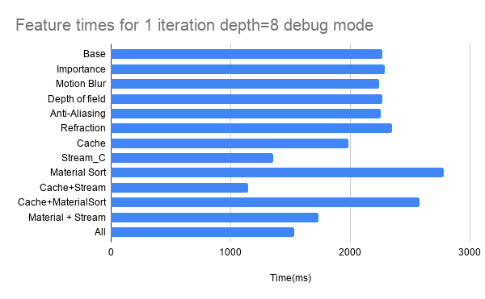
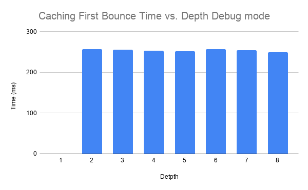
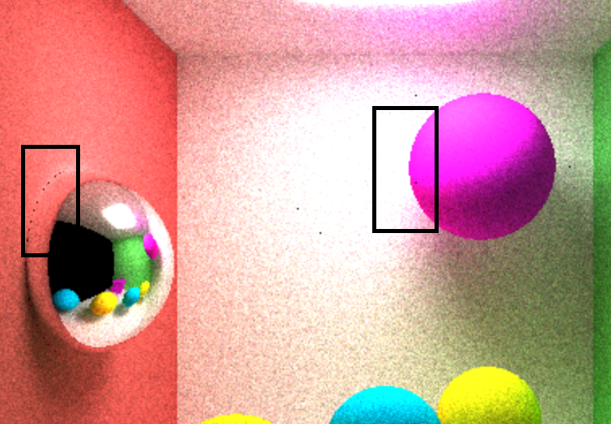
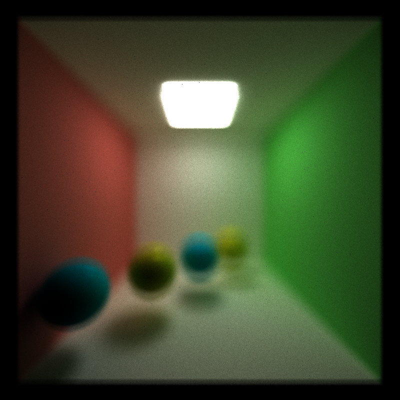

CUDA Path Tracer
================

**University of Pennsylvania, CIS 565: GPU Programming and Architecture, Project 3**

* Eric Micallef
  * https://www.linkedin.com/in/eric-micallef-99291714b/
  
* Tested on: Windows 10, i5, Nvidia GTX1660 (Personal)

## Some nicer renders

## Performance Analysis

The below charts are gathered from the scene shown above. In this scene we have 4 small spheres with some reflection but are mostly diffuse. 

The above chart shows the speed up or slow down associated with eneabling each algorithm. We see that in general material sorting adds too much overhead to see any benefits. Wee see caching helps improve performance as we get to make one less call to our function compute intersections and we see that stream compaction helps improve performance by quite a bit because we get to remove some dead rays from the scene and do less work each depth calculation.

more information below for each algorithm in the algorithm analysis 

## Algorith Analysis

### Material Sorting

The idea behind material sorting is that we sort our rays by material. So that all rays with Material ID 1 are next to each other and so on. This is to help reduce thread divergence. If all threads in a warp are computing based off a certain material we would expect that they would mostly behave the same way. For example, all threads with a specular material are all going to reflect. 

In my runs there was not any speedup seen from this. I tried several other runs with more materials and objects in the scene to see if my scene was not complex enough but again saw no real advatnage.

I suspect if I added texture mapping or more complex materials the algorithms and branch divergence would be more severe and this is when I would see a benefit.

The chart above shows us how long it takes to actually sort our material. So, each run we add about 100ms to our computation time but do not see a benefit of greater than 100ms. So our material sorting overhead does not outweigh any beneifts that we may see from creating contiguous material memory.

### First Bounce Caching

The idea behind first bounce caching is to reduce repetitive computations. Our compute intersections call takes around 250ms and for larger more complex scenes could take longer. Caching allows us to skip the first one.

Every sample, rays are generated from the camera and enter the scene. for the first sample the rays will go to the same spot. Instead of computing this every time we can cache it on our cpu and just reuse it for the next iterations. thereby we get a savings of depth-1.

As we allow more bounces or depth to the scene the benefit of this technique will diminish.

The chart above shows us that with a depth of 1 we do not spend any time computing intersections since we just reuse. The time to copy from this information from CPU to GPU was about .25ms compared to computing the intersection which costed us around 250ms

### Stream Compaction 

The idea behind stream compaction is to remove dead rays ( rays that are no longer bouncing ) from the scene. Dead rays are either rays that have hit a light object, have exited the scene or make no contribution to the scene. 

In our naive path tracer our kernel launches a thread per ray. After the first bounce some rays exit and after more bounces more rays will exit. Yet we will launch a thread for this ray. 

To remedy this we use stream compaction. After every bounce we can remove the rays that are no longer bouncing. Thus, launching less kernels, thus less work to be done.

This technique sees a small speedup in performance. My guess is that if I had a more complex scene where rays had to do more computational work then this speed up would be more significant.

My guess is although we may not see a speed up in run time we may see a pretty significant reduction in power from the GPU. 

The above chart shows us the time spent doing our sorting we can see almost an exponential decay in time spent as depth increases.

### Anti-aliasing

The idea behind anti aliasing is to add some jitter or randomness to the camera rays. Instead of having the rays shoot out the same direction every time we add a slight random offset. This has the rays bounce in different possibly more interesting directions to accumlate color. What we see with the anti aliasing is edges become a bit smoother. This technique is essentially free because all we are doing is adding some randomness to the input rays. 

Unfortunately if we use anti aliasing we can not use the First Bounce Cache technique. This is because we are manipulating our first rays just a bit. So the first computation will not always be the same.

We could possibly use both techniques if we made the "random-ness" of anti aliasing more deterministic. For example, we adjust the camera jitter based off of our sample number. IF we did this though we would have to have cache more elements meaning more memory useage.

The left image spehere is a render with anti aliasing. You will notice that the edges are much smoother. 

On the right is a render with no aliasing. You will notice the edges are more abrupt and jagged. 

Both of these images are at the same sample point. 

Below is the full image render even from afar the jagged edges are noticeable!

No Alias

 
Anti Aliasing

No Alias

Anti Aliasing

## depth of field

From our chart we see depth of field did not add much, if any overhead to the system.
Similar to anti-aliasing this technique is done once per iteration and makes adjustments to the camera. the compute time for this is pretty minimal there by it is masked away by the heavier functions. 

Similar to anti aliasing we can not emply our caching speed up when do depth of field. This is so because we are manipulating the camera differently each iteration to get that blur effect.

Below is a render of what you would see if you have perfect vision (no depth of field)

Below is what you would see if you had decent eye sight or over the age of 60 

And finally, this is what I see without my contacts

## Refraction

From our results above we see that refracion addded a bit of overhead but not too much. This is expected as adding refraction adds a bit more branch divergence. But the time spent computing refraction is not significantly more than computing a reflective or diffuse object so we only see a slight slow down.

Below is a render with my attempt to simulate refractive water. To do this I just added a thin blue refractive material. It is not the prettiest render but it shows refraction.

From the image above we can see the distortion on the walls and slight distortion of the tower.

In real life, water and other refractive materials have some reflection to them. When you look into a lake if it is calm enough you can see a reflection. This is where Fresnels Number can create a more realistic render. 

In the below image we add some reflective and refractive properties to the "water" and we can see how the middle area has a little glean to it.

### Pictures

### References

Physically Based Rendering second and third edition
	Used this books algorithms to employ Depth of field
	Used book for refraction
	Used book for fresnels

https://www.scratchapixel.com/lessons/3d-basic-rendering/introduction-to-shading/reflection-refraction-fresnel
	in help with refraction

https://en.wikipedia.org/wiki/Snell%27s_law
	more help with refraction and fresnels

https://computergraphics.stackexchange.com/questions/2482/choosing-reflection-or-refraction-in-path-tracing
	for help with fresnels

https://github.com/ssloy/tinyraytracer/wiki/Part-1:-understandable-raytracing
	in general helped with the basics of fresnels, reflection, refraction

