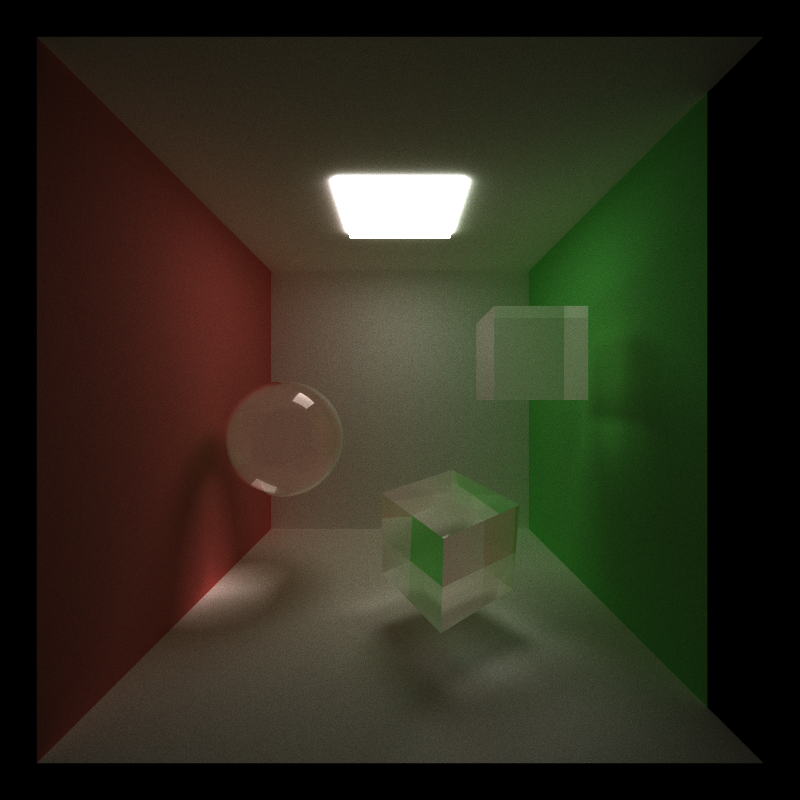

# CUDA Path Tracer
**University of Pennsylvania, CIS 565: GPU Programming and Architecture,
Project 3 - Path Tracer**

Caroline Lachanski: [LinkedIn](https://www.linkedin.com/in/caroline-lachanski/), [personal website](http://carolinelachanski.com/)

Tested on: Windows 10, i5-6500 @ 3.20GHz 16GB, GTX 1660 (personal computer)

 

## Project Description

The purpose of this project was to create a GPU-parallelized path tracer using CUDA.

 

Note: Rather than putting one large performance analysis section at the end of this readme, analysis will be done per feature if applicable.

## Features

### Ray Termination via Stream Compaction

Each ray shot out from the camera will continue to bounce around a scene, accumulating color, until it terminates for any number of reasons, including hitting a light source, hitting no geometry, and reaching the maximum number of bounces. To avoid warp divergence by continuing to process rays that are terminated, stream compaction (using the thrust partition function) is used to reorganize all of the rays by whether they are terminated or not. Thus, following kernels can be called on only the yet unterminated rays. The graph below shows the number of rays to be processed at a given depth when stream compaction is used (if stream compaction were not used, the number of rays would be constant for every depth):

We can see the number of rays to be processed decreases substantially on each bounce, thus freeing up threads (and decreasing warp divergence). 

The effect of stream compaction can also be seen when we compare the performance on a scene that is closed (bounded by geometry on all sides, a closed cornell box) vs. a scene that is open (not bounded on all sides). A closed scene should take longer to render since no matter where a ray bounces, it will always intersect geometry, as opposed to an open scene in which many rays terminate by not hitting any geometry.

### First Bounce Caching

Another potential optimization is first bounce caching. This means that on the first iteration (first sample per pixel), we cache the intersections found on the first bounce in the scene, and on subsequent iterations, reuse those first intersections. The graph below shows the effects of first bounce caching on the runtime of the second iteration (i.e. the first iteration that would use the cached bounce if applicable): 

Caching the first bounce generally seems to have a positive, if relatively small, effect on performance. It is unclear why at a max depth of 11, caching would make performance worse, however.

### Material Sorting

Each piece of geometry has a material ID corresponding to its material, and materials can be reused across different geometry. Since each material potentially follows a different code path when evaluated for color and next ray direction, we can attempt to avoid warp divergence by sorting rays/intersections by their material ID. 

Unfortunately, it seems like material sorting did not improve performance for the scenes on which it was tested. This is perhaps due to the large overhead created simply by running the sort not making up for the increased performance from avoiding warp divergence. Perhaps in a scene with many objects and many different materials, we would see a performance improvement.

### glTF Mesh Loading (with Bounding Box)

This path tracer also supports the rendering of arbitrary meshes using the glTF format, with help from [tiny glTF](https://github.com/syoyo/tinygltf). 

One toggleable performance optimization is the use of a bounding box for each mesh (which is made easy to calculate since the glTF format already stores the per-component min and max positions). Rather than attempting to find an intersection with a mesh by immediately checking an intersection with its potentially many triangles, we first check if a ray intersects the mesh's bounding box, and return false if it does not.

The graph below shows the effect of using a bounding box on the runtime of a single iteration (i.e. 1 spp):

As expected, the use of a bounding box decreases the time it takes to run a single iteration, and this difference in time gets larger as the number of triangles to intersection-test each iteration increases.

### Depth of Field

We can create a physically-based depth of field effect in our renders using a thin lens approximation. Rather than the typical pinhole camera model, which has a lens with a radius of zero, we use a thin lens camera, which has a neglibile thickness but a non-zero radius. Rather than each ray from the camera starting from the same place, we jitter the ray's starting place to be somewhere on the camera lens. You can see an example of this effect in the render at the very top of this readme.

### Bokeh

A fun consequence of the thin lens approximation is the creation of [bokeh](https://en.wikipedia.org/wiki/Bokeh), "blur produced in the out-of-focus parts of an image produced by a lens." The thin lens approximation typically features a circular lens, creating circular bokeh, but one can create other shapes by sampling points from a shape other than a disk. This projects supports bokeh in the shape of circles, squares, diamonds (rotated squares), and triangles.

| Circle | Diamond | Triangle |
| ------------- | ----------- | ----------- |
|  |  |  |

### Various Materials

This project features diffuse reflection, perfectly specular reflection, transmission, and specular refraction using the Fresnel coefficient.

| Diffuse Reflection | Perfect Specular Reflection | Transmission | Specular Refraction |
| ------------- | ----------- | ----------- | ----------- |
|  |  |  |  | 

### Anti-Aliasing

The anti-aliasing used in this project is an easy-to-implement way to improve visual quality with little to no effect on performance. When shooting a ray from the camera, we jitter its starting position slightly, resulting in less jaggies. See an example below, each with 5000 spp.

| No AA | With AA |
| ------------- | ----------- |
|  |  | 

## Next Steps

The next steps for this path tracer would be supporting textures, including normal maps, as this would allow for much greater visual detail without adding any new geometry. A second major feature to add is a bounding volume hierachy, such as a k-d tree or octtree as rendering meshes with hundreds of thousands of triangles can still be quite slow.

## Bloopers

| Me trying some wild things with refraction | Never did figure out what happened here |
| ------------- | ----------- |
|  |  | 
