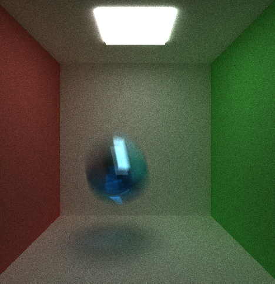
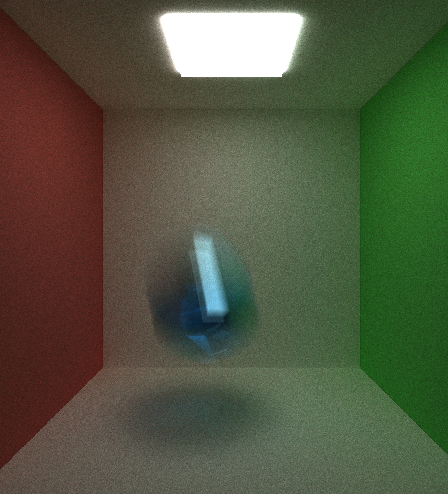

CUDA Path Tracer
================

**University of Pennsylvania, CIS 565: GPU Programming and Architecture, Project 3**

* Author: Chhavi Sharma ([LinkedIn](https://www.linkedin.com/in/chhavi275/))
* Tested on: Windows 10, Intel Core(R) Core(TM) i7-6700 CPU @ 3.40GHz 16GB, 
             NVIDIA Quadro P1000 4GB (MOORE100B-06)

 

  

### Index

- [Introduction](  )
- [Implementation Details]( )
- [Features]( )
- [Description]( )
- [Analysis]( )
- [Some Results and Bloopers]( )

### Introduction 

Path tracing is a computer graphics method of rendering digital 3D images such that the global illumination is as close as possible to reality. Path Tracing is similar to ray tracing in which rays are cast from a virtual camera and traced through a simulated scene by random sampling to incrementally compute a final image. The random sampling process makes it possible to render some complex phenomena which are not handled in regular ray tracing such as multiple reflections. 

### Implementation Details
We implement an estimation of the Bidirectional Scattering Distribution Function to compute the an estimated illumination per pixel in the image over several iterations. In reality: Rays leave light sources -> bounce around a scene and change color/intensity based on the scene’s materials -> some hit pixels in a camera/ our eyes. Our implementation simulations this phenomnenon in reverse where a ray is launched from our camera thorugh each pixel of the image, and it's subequent intersections and bounces in the scene are traced upto a certain depth to compute the final color of the pixel. 
This is implemented by computing a single bounce at each time-step for all the rays in the image parallely to get maximum throughput.  

The ray starts with an identity color which is modified multiplicatively as it hits differnet materials in the scene.
The bounce direction and colour intensity depend on various material properties and the angle of incidence. We simulate four types of materials i.e. Emissive, Diffused, Reflective, Refractive and their combinations.

### Features

#### Basic Features
   - [x] BSDF Shading (Diffused, Reflective, Emissive)
   - [x] Basic Stream Compaction to remove dead rays 
   - [x] Material type sort 
   - [x] First bounce intersection caching 
#### Advance Features
   - [x] BSDF Shading (Refractive, Percentage Combinations)
   - [x] Stochasitc Sampled Anti Aliasing
   - [x] Work Efficient Stream Compaction usnig Shared Memory 
   - [x] Motion Blur (somewhat)
   - [ ] Depth of Field
   - [ ] Loading OBJ files

Most features have been implemented with toggleable options.

### Description

1. Shading using [BSDF](https://en.wikipedia.org/wiki/Bidirectional_scattering_distribution_function)
      - Diffuse Reflection: Reflects all rays randomly in the normal facing semi-sphere.
      - Specular Reflection: Reflects the incoming ray about the normal where angle of incidence is equal to the angle of relection (mirror like behaviour).
      - Refraction: Allows ray to pass through the media based on the ratio of the refractive index of the two mediums [snell's law](https://en.wikipedia.org/wiki/Snell%27s_law)

      

        
        
           
      
      

      - Emissive Media: Rays in our computation terminate at these materials since they emit light.
      - Percentage combinations/Probabiltiy splits between properties.   

      

        
        
        
      
 

2. Stream Compaction: We reorganise the rays that have terminated, either by hitting a source of light, or reaching maximum depth, by using stream compaction so that more cuda aprs can exit early when they find all theri theireads terminated. This reduces unnecessary compute per bounce operation and in turn speeds up the rendering. 
3. We also sort the rays by material type in order to allow continous memory access.
4. First Bounce Intersection caching speeds up each iteration trememdously. Since there is no uncertanility in the first ray intersection computation we can cache the intersections at the begining of the first iteration and use it for all successive iterations. The first iteration als has the maximum number of rays therefore caching then at iter 0 shows drastic speedup for the rest of the iterations.
  

        
  

4. AntiALiasing: We use anti-aliasing, a technique used to add greater realism to a digital image by smoothing jagged edges on curved lines and diagonals. We do this by randomly dhifting the ray location per pixel instead of the center.

  

        
  

5. Motion Blur: We implemtned motion blur by adding a veolity to an object of choice. As a result at each iteration, the object was rendered at a slightly translated location appearing giving the motion blur effect. 

Motion Blur Screen Captures 
  

    
     
  
    
  

    
    
  
    

 

        
        
 

 

### Analysis

- Stream compaction helps most after a few bounces. We show the contrast in runtime and number ofrays processed with and without stream comapction in the following figures. These clearly show that stream comapction speeds up the rendering. 

 

        
 

- Opening up the scene by removing two walls allows more light to escape. Stream compaction in a closed scene senario would not help much if there aren't many premature terminated rays. In case of more open scenes, stream comaption allows more warps of threads to exit and not idle.

 

        
 

 

      
      
 

### Bloopers

1. Incorrect Motion Blur

  

        
  

    

        
  

  

        
  

2. Incorrect new-direction Update 
    

        
  

