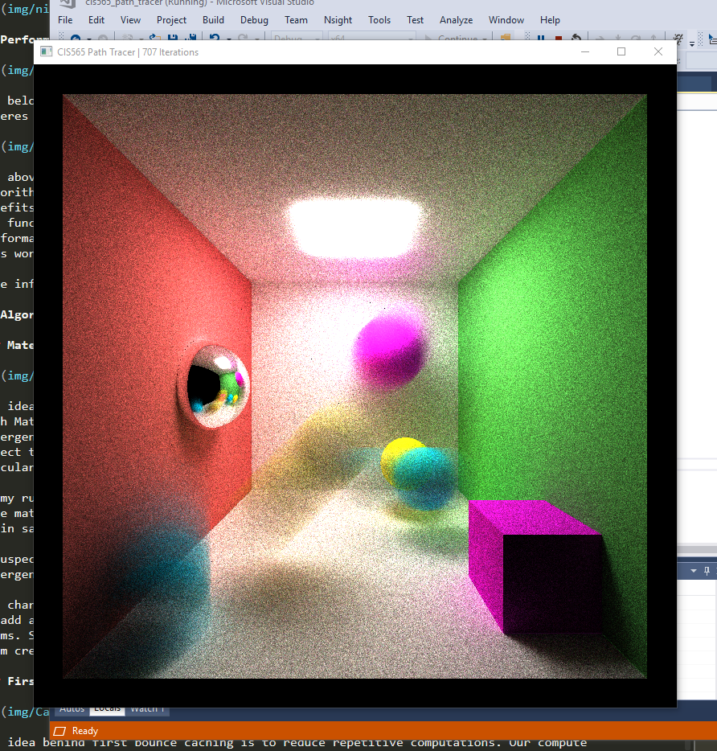

CUDA PATH TRACER
==================================================================

**University of Pennsylvania, CIS 565: GPU Programming and Architecture**

Dhruv Karthik: [LinkedIn](https://www.linkedin.com/in/dhruv_karthik/)

Tested on: Windows 10 Home, Intel(R) Core(TM) i7-8700 CPU @ 3.20GHz, 16GM, GTX 2070 - Compute Capability 7.5
____________________________________________________________________________________
   
____________________________________________________________________________________
<p align="center">
  
</p>

Table of contents
=================
   * [What is Path Tracing]
   * [Features Overview]
      * [BSDF Scattering: Diffuse, Specular-Reflective, Specular Transmissive]
      * [Procedural Shapes]
      * [Stochastic Sampled Anti Aliasing]
      * [Motion Blur]
  * [Optimizations ]
    * [Stream compaction to remove terminated rays]
    * [First bounce caching]
    * [Sort by Material]
   * [Questions]
   * [Performance Analysis]
   * [Credits & Acknowledgments]

# What is path tracing?
Path tracing refers to a set of techniques to virtually render images by emulating certain physical properties of light. In real life, Rays of light leave light sources, bounce around the world, and hit pixels in the camera. Path traces simulates this effect by firing 'rays' out of the camera pixels, and considering those that hit a light source. 
<p align="center">

</p>

# Features Overview
## BSDF Scattering
A combination of ***reflection*** and ***transmission*** functions that describe how rays must bounce once they intersect an object. For transmissive and refractive objects, I used schlicks approximation to calculate the probability of the refractive surface being reflective at high incidence angles. The following illustrates BSDF on three material properties:

| Diffuse | Reflective | Refractive |
| ------------- | ----------- |----------- |
|   |  |  |

## Procedural Shapes
I created procedural shapes via a variation of ***Constructive Solid Geometry*** ray tracing. Using the provided primitives, I modified in the code in ```intersection.h``` to generate three different constructive of the original primitive geometry that used portions of the original geometry and negated others:

| 1 | 2 | 3 |
| ------------- | ----------- |----------- |
|   |  |  |

## Stochastic Sampled Anti Aliasing
Implementing this simply required that randomly I nudge the ray direction by epsilon in the x & and y axis. Notice how the pre-AA image has jagged edges where the yellow light reflects off it. Notice how this issue dissappears post AA!

| Pre AA | Post AA |
| ------------- | ----------- |
|   |  | 

## Motion Blur
I created a kernel function ```blurGeom``` that allows users to specify a ``glm::vec3 offset`` so they could direct the blur towards their desired position. I implemented motion blur by targeting a subset of  ``geom`` objects to respond to changes in ``dt = epsilon * iter``. The second run illustrates motion blur with first bounce cache on - This is not the right thing to do, but resulted in a cool image.

| 1 | 2 | 3 |
| ------------- | ----------- | ----------- |
|   |  |  |

# Optimizations 
## Stream Compaction to Remove Terminated Rays
CUDA can only launch a fininite number of blocks at a time. As a result, if some threads are tracing more bounces, and some are tracing a few, we can end up with a lot of idling threads. One solution to this is to stream compact away idling threads. This means terminated threads are removed at the every kernel's launch, so that running threads are grouped together. 
## First Bounce Caching
This is a clever optimization to avoid recomputing the first bounce for depth=0. This is because this bounce stays the same regardless of iterations, so we precompute this in the first bounce and reload it whenvever depth=0.
## Sort By Material
Divergence is a seriously perfomance killer in CUDA, as if different threads in a warp diverge then the benefits of parralelilzation begin to dissapear. This would most likely happen in a path tracing scenario when materials that reflect differently run at the same time. To avoid warp divergence while the kernel is running, I sorted by material to ensure that similar materials most likley get placed in the same warp as they are contiguous in memory. 

# Performance Analysis
I proceeded to remove walls from my cornell scene and to printed out the decrease in number of elements left in the array post stream compaction. Removing walls exposed more black space and thereby would result in a more rapid decrease of elements in the compacted array.   

# Questions 

**Compare scenes which are open (like the given cornell box) and closed (i.e. no light can escape the scene). Again, compare the performance effects of stream compaction! Remember, stream compaction only affects rays which terminate, so what might you expect?**
If no light can escape the scene, then the benefits of stream compaction are nullified as rays only terminate when they reach the end of their depth. As a result, the presence of stream compaction had no effect on the closed box scene. 


