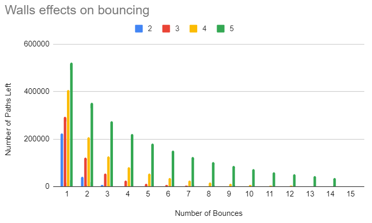

CUDA Path Tracer
================

**University of Pennsylvania, CIS 565: GPU Programming and Architecture, Project 3**

* Yan Dong
  - [LinkedIn](https://www.linkedin.com/in/yan-dong-572b1113b/)
  - [personal website](www.coffeier.com)
  - [github](https://github.com/coffeiersama)
* Tested on: Windows 10, i7-8750 @ 2.22GHz  (12CPUs)  16GB, GTX 1060 14202MB (OMEN 15-dc0xxx)

## How to implement?

Based on [PBRT](http://www.pbr-book.org/) book！It is really nice.

## Features

#### Core Feature

- Ray sorting by material
- Ideal Diffuse Shading & Bounce
- Perfect Specular Reflection
- Using Stream Compaction to terminal rays
- Cache first bounce

#### Unique Part

- Depth-of-Field

- Frensel Refraction

- Stochastic Anti-Aliasing

- Direct Lighting Shading

  

###### Depth-of-Field

###### Fresnel Refraction and reflection

###### Direct light result

depth_max, 8 800 * 800, area light

###### Stochastic Anti-Aliasing Comparation

iteration: 500  800*800  depth_max: 8

To be honest, it's hard to say what the difference is without carefully looking... I think this is because the iteration number is enough for this image and both of the picture goes into the slow converging region.

Look at the bottom green part of the 2 picture, I can say that the anti one is more soft than the other. It is really detailed.

## Performance Analysis

###### The benefits of Stream Compaction:

With the stream compaction, we check and get the rays which are out of bounce or hit the light, then we terminal them. So the rest of active ray will continue get bouncing in the next depth.

The benefit of doing this is to reduce the lazy ray in the case that some rays need to bounce 5 times, others need only 3.

The second benefit is when we implement in this project, we always keep the index of the active ray continue in memory. This helps easy to use the cuda block to run the path tracing steps.

###### The time costing of each part

In this chart, we can see that in my implement, scan part takes the most time.  Shader kernel do not take much as I expected. Although I optimize the index part of efficient scan, I still need to implement dynamic memory to accelerate it, it's still a little bit slow.

###### cache first bounce

Without first bounce cause more time using, this is easy to come up with, since it takes one more time to calculate intersection.

By adding the depth limit consideration, we can see that, using cache first bounce have a better performance in various depth limitation case. It maybe hard to see from the chart, but as for data, less max depth can have more benefit. 

###### sort by material

Well....It is surprised for me to see that without sorting the material we have better performance,  sorting gives more convenience to our GPU, but the use of thrust library and memory I/O may cause the extra time.

###### Open scene and Closed scene

In the open scene, there will be a large amount of terminal rays even in the first bounce (they don't hit anything since the scene is open!)

In the closed scene, the rays are locked in a limited space, it is expected that rays will keep bouncing until they hit light or out of the limitation of depth, and the time to converge will be longer.

I use almost same scene to test. Same camera view, objects in the space. As we can see, in scale of depth limit, the open scene have more terminal rays.

## Debug Scene

It is weird since the purple one is expected to be btdf and brdf material. 

After changing some parameters,  I guess that this effect is , first, because of the shape of the object. It is oval not a sphere. For the ellipse shape, it is hard to converge to the transmissive effect. Second, it is far from the light and other 2 sphere, so there is not enough reflection. 

## Thanks

Thanks Tianming Xu, helped with concept ides of cache the first bounce of path and how to use the time performance tester.

Thanks to my time performance ,I don't know what's going on but it suddenly work well!!!  Thank you my codes.