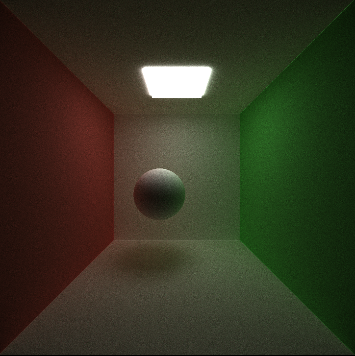
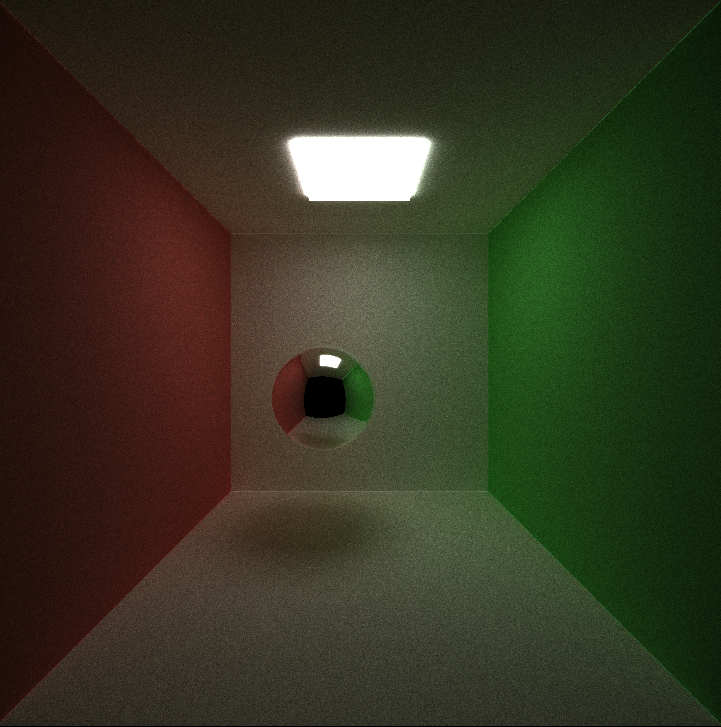
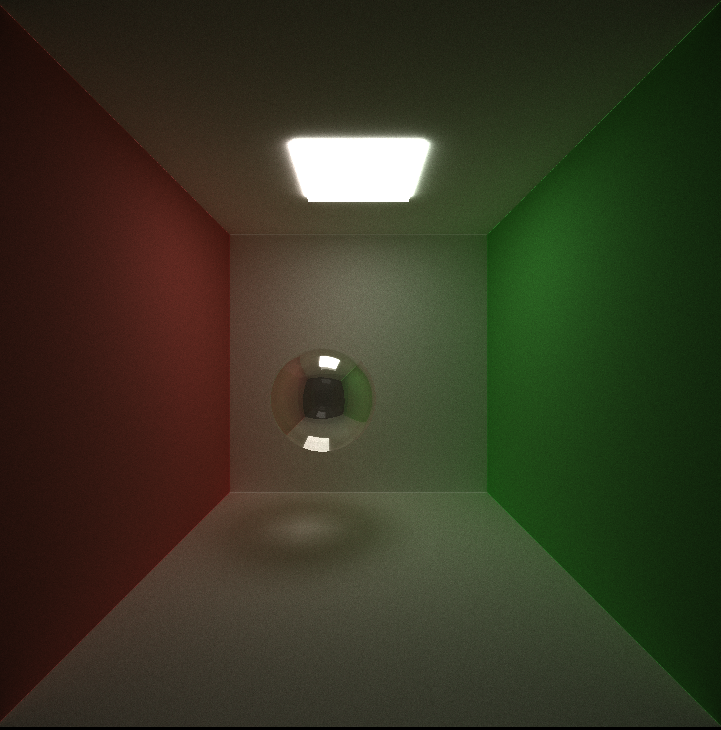
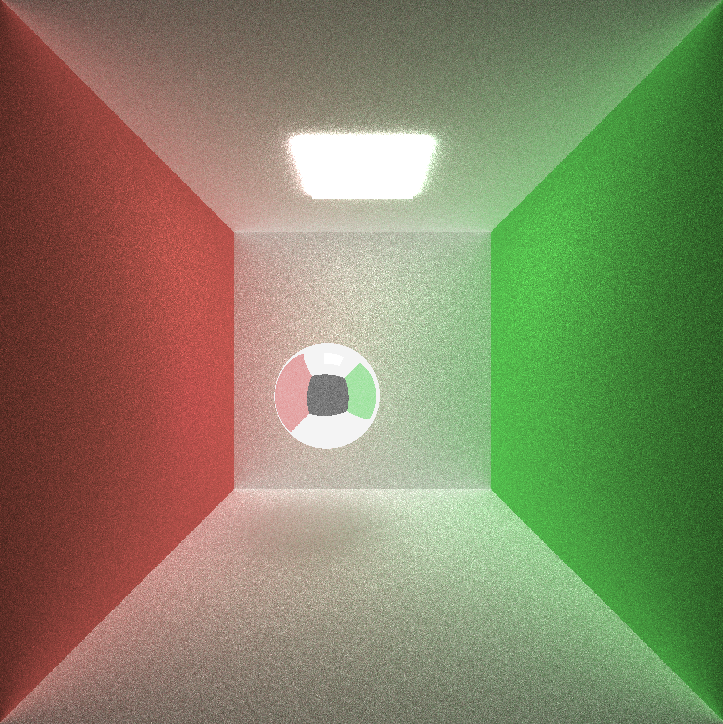
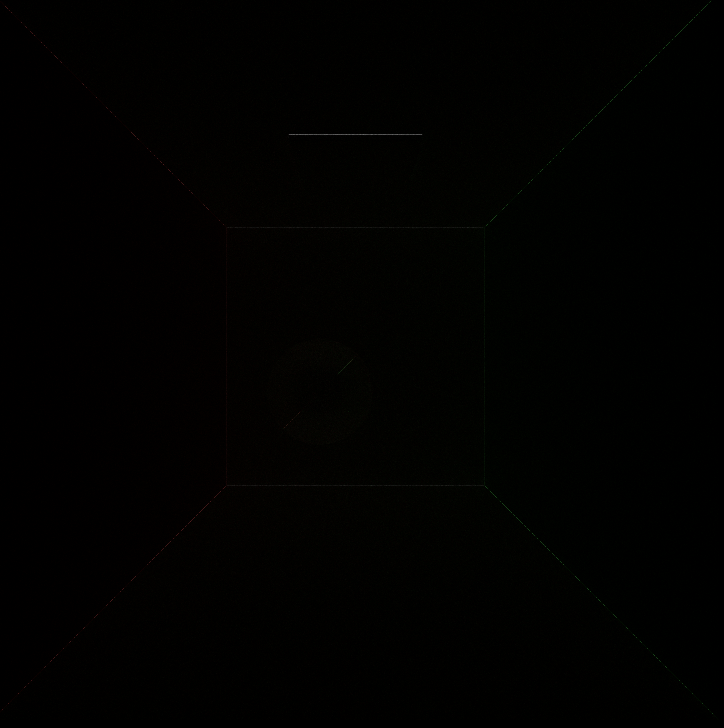

CUDA Path Tracer
================

**University of Pennsylvania, CIS 565: GPU Programming and Architecture,
Project 3 - CUDA Path Tracer**

* Srinath Rajagopalan
  * [LinkedIn](https://www.linkedin.com/in/srinath-rajagopalan-07a43155), [twitter](https://twitter.com/srinath132)
* Tested on: Windows 10, i7-6700 @ 3.4GHz 16GB, Nvidia Quadro P1000 4GB (Moore 100B Lab)

## Path Tracer

### Introduction

Given the fundamental building blocks of a scene, how do we create it? That is the basic purpose of a path tracer. The building blocks will be the various objects present in the scene, along with their material properties. Is it a reflective material? refractive? diffusive? Or both? Is the material a light source? If so what is its illuminance? These properties are explicitly specified in the scene file.

We assume there is a camera present in the scene and project the 3D scene onto the 2D image screen of the camera. A basic path tracing algorithm is as follows:

1) Initialize a HxW image and construct Hxw rays generating from the camera _through_ the image. We have one ray per pixel. The rays serve as messenger vehicles that figures out the color of its corresponding pixel. The rays are initialized to RGB(1,1,1). So if you render this image, we expect to get a white screen. 
2) For each ray, we find which object in the scene they intersect. If the ray does not intersect any object, the ray is assigned a black color.Since each ray of a pixel is independent of one another, we can perform this computation for all the rays in parallel.
3) For a given ray, if the object of interesction is a light source, the ray is assigned the color of the light source. If the object is not a light source, then we check if we can either reflect or refract from the object. The nature of reflection/refraction is determined by the material properties of the object. From this, a _new_ ray is constructed which absorbs the color of the object. This process is done for all rays in parallel.
4) We can recursively perform steps 2) and 3) for a fixed number of bounces. After each bounce, the ray absorbs the color of the material it bounced from. A ray "dies" after a fixed number of bounces OR if it hits a light source before. The final color of the ray is the product of colors of all the material it intersected. The color of the pixel in our final 2D image is the color of its corresponding ray.

The above process is a 10000-ft view of a basic path-tracer. In reality, when we see an object, a light ray from some light source strikes the object, reflects a million times, and finally enters the retina. A path tracer tries to simulate this but in the _reverse_ direction. For each final pixel in our retina/camera, we ask where did this come from by shooting a ray from the pixel and observing its life.

## BSDF Computation

We explore three different possibilities for calculation of the new ray.
1) Ideal Diffuse Reflection - the new ray does not depend on the incident ray, but can scatter in all the directions. We approximate this by probabilistically choosing a ray from the hemisphere enclosing the surface and point of intersection. The probability of a ray in a given direction is weighted by the cosine of the angle between that ray and the normal to the surface. So most of the diffused rays will be in the direction closer to the normal.
2) Ideal Specular Reflection - The new ray perfectly reflects from the surface.
3) Refraction - A ray can pass _through_ the object and we can calculate it from Snell's law. 

For the Cornell scene, three different cases illustrating the above are included below

Diffusion                    |  Reflection               | Transmission
:-------------------------:|:-------------------------:|:-------------------------:
|  |

We can also have a material to be a _combination_ of reflection, refraction, and diffusion. If reflection coeffecient is `p1`, refraction coefficient is `p2`, then for a given a ray we sample a specular reflected ray with probability `p1`, refracted ray with probability `p2`, and diffused ray with probability `1 - p1 - p2`.

<figure>
	
	<figcaption>			Combining reflection and refraction              </figcaption>
</figure>

We can see the red wall and the green wall on the corresponding side of the sphere. This highlights the reflective property of the material. But, more importantly, notice the shiny surface at the bottom of the sphere and the shadow sprinkled with a speck of white light. This is _because_ of refraction. The white light passed through the sphere by refracting from air to glass and came out by refracting from glass to air. 

## Deeper the better

We can control the the number of bounces for each ray using a `depth` parameter.  Higher the depth, more realistic we can expect our image to be but, like everything else in life, that comes at the tradeoff of expensive computation. 

Depth 1                    |  Depth 3               | Depth 8
:-------------------------:|:-------------------------:|:-------------------------:
| 		 	|

The effect on realism can be better visualized by completely removing the light source. If there is no light source, everything should be black. But if depth is low enough, it won't be.

No Light Depth 0                    |  No Light Depth 8               | No Light Depth 15
:-------------------------:|:-------------------------:|:-------------------------:
| 		 	|

## Stream Compaction

Since we are parallelizing by rays, and after each depth, some rays will terminate because they didn't intersect any object or terminated at a light source, it is better to launch threads for number of rays still alive. By stream compacting on alive rays and bringing them ttogeher, we can reduce warp divergence as we are only dealing with the active threads _that are grouped together_.  

Performance for a complete shader call after each depth is included below

We can see that the time taken reduces, unsurprisingly. But this by itself doesn't justify why stream compacttion is better. For that we analyze the time taken for an entire iteration (across all depth). The performance graph is given below.

For smaller image resolutions, the effect of stream compaction is neglible. In fact, it might even be slower because the overhead might not be worth it. But as we scale to larger image resolutions, we have a clear winner.

## Overall performance analysis

Sorting by material id, though a good idea to limit warp divergence, did not turn out to be a good idea in the present case because our scenes are not big enough to justify the sorting overhead. So I incurred a heavy penalty to sort.

