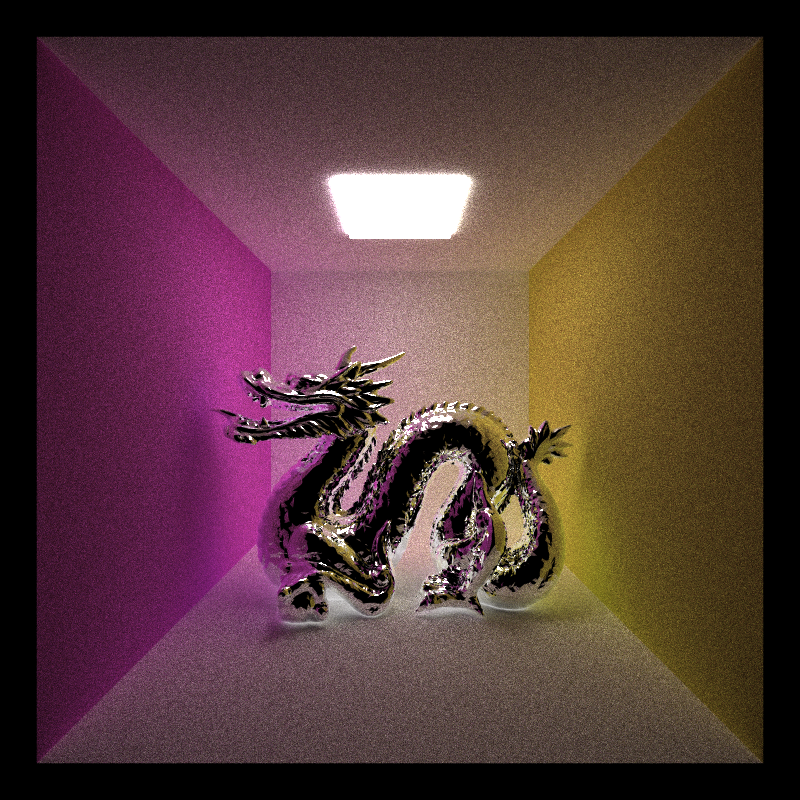

CUDA Path Tracer
================

**University of Pennsylvania, CIS 565: GPU Programming and Architecture, Project 3**

* Grace Gilbert
  * https://www.linkedin.com/in/grace-gilbert-2493a0156, http://gracelgilbert.com
* Tested on: Windows 10, i9-9900K @ 3.60GHz 64GB, GeForce RTX 2080 40860MB (Personal Laptop)


<p align="center">
  Glass Instruments <br>
  5000 Samples, Refractive material with IOR 1.52, Lens Radius 0.75, Focal Length 6
</p>

## Overview
For this project I implemented a path tracer that runs on the GPU. Path tracing takes a picture of a 3D scene by casting rays from a camera through each pixel into the scene and tracing them as they bounce around the scene until they terminate. Rays terminate when they hit light, obtaining energy to display color, or when they hit nothing, absorbing no color to hit the camera. The material of the objects that the ray hits in the scene determine the direction of its next bounce. After many iterations of bouncing the rays through the scene, the colors returned to the camera's eye at each pixel gradually converge, creating a realistic image of the scene. 

I implemented various features of a path tracer, such as different materials, camera effects, geometry, and optimizations.  These features are described in detail below.

# AMY LU PACA IMAGES
Diffuse                    |  Perfect Specular         | Refractive
:-------------------------:|:-------------------------:|:-------------------------:
|  |

## Features
### Materials
The material of an object in the scene determines which direction a ray will bounce after hitting an interesction with that object. The material also affects what color the ray will absorb from the object when it hits it. 

Certain materials may have multiple material properties. To account for this, we probabilistically choose the material we will use to bounce our ray at each iteration.  If an object is 50% diffuse and 50% specular, we will choose either a diffuse or specular bounce distribution with a probability of 0.5 each. To account for the fact that we don't represent the entire set of material properties at each bounce, we scale up the contribution of each bounce proportionatly.  So in the given example, we would scale up both the specular and diffuse color values by 2. 
#### Diffuse
A diffuse material will bounce the ray in any direction, evenly distributed in a hemisphere about the intersection point with the diffuse object. This creates a soft, flat appearance on the surface. The process for determining the new direction of a ray after intresecting with a diffuse object is the following:
```
newDirection = normalize(calculateRandomDirectionInHemisphere(intersectionNormal, randomNumberGenerator))
```
We also offset the origin of the new ray a little bit along the interesction normal to make sure that it is outside of the intersected geometry.  Otherwise, the new ray might fall just inside the object and get trapped inside.
```
newOrigin = intersectionPoint + EPSILON * intersectionNormal
```
Finally, the ray incorporates the color of the material it just hit:
```
pathColor *= materialColor
```
#### Perfect Specular
A pure specular material will reflect the ray along the reverse of its incoming angle, creating a mirror effect. Unlike in diffuse, there is no distribution involved in this bounce. A ray incoming at a certain angle will deterministically bounce in a single direction.
```
newDirection = normalize(reflect(originalDirection, intersectionNormal))
```
Just like with diffuse, we offset the new origin so that it will not be inside the hit object. For the color, we now take into account the specular color of the material, as a material can have a different specular color from its diffuse albedo:
```
pathColor *= materialSpecularColor
```
#### Refractive
A refractive material will bounce the ray through the material at a certain angle depending on the index of refraction (IOR). The refection will change if the ray is outside entering the geometry or inside exiting, as the index of refraction is inverted. Refraction also has a property called total internal reflection.  This means that if the incoming ray hits an object at a grazing angle, it will reflect off the object rather than refracting through it. This may also occur while the ray is inside of the object, reflecting interally. 

For refraction, I ended up using the eta property of the material, which is simply 1/IOR:
```
eta = 1 /  materialIOR
if insideLeaving:
    theta = acos(dot(normal, originalDirection))
    criticalAngle = asin(1/eta)
    refractedDirection = normalize(refract(originalDirection, -normal, eta))
    if (1/eta < 1 and theta > criticalAngle):
        refractedDirection - normalize(reflect(originalDirection, -normal))
if outsideEntering:
    theta = acos(dot(normal, -originalDirection))
    criticalAngle = asin(eta)
    refractedDirection = normalize(refract(originalDirection, normal, eta))
    if (eta < 1 and theta > criticalAngle):
        refractedDirection = normalize(reflect(originalDirection, -normal))
```
Note that my implementation of refraction does not update the color of the path, as the light just passes through the material and gets bent, but does not pick up color from the material itself.

### OBJ Loading
### Camera
#### Depth of Field
#### Anti-Aliasing
### Optimizations
#### Stream Compaction
#### Material Sorting
#### First Bounce Cache
### Bloopers
#### OBJ Intersection
#### First Bounce Cache
#### Anti-Aliasing
#### Depth of Field
