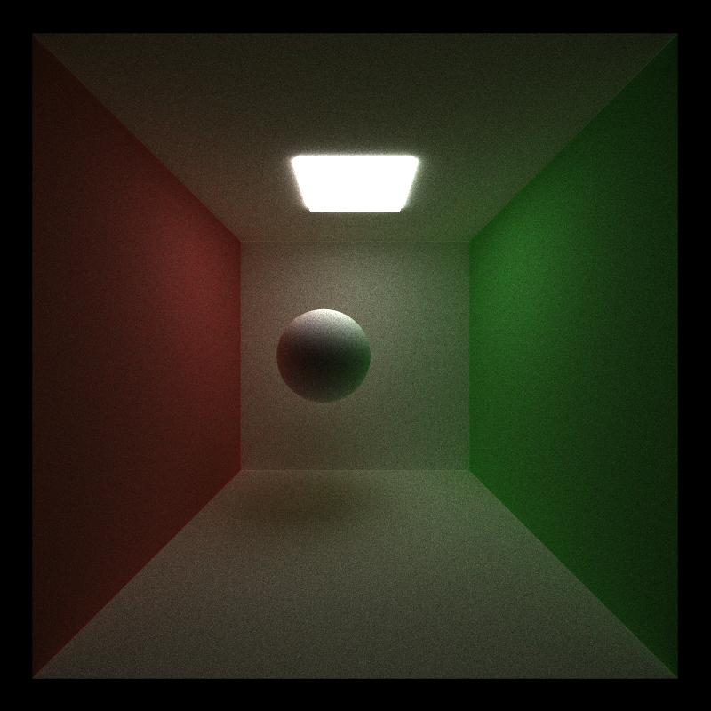

CUDA Path Tracer
================

**University of Pennsylvania, CIS 565: GPU Programming and Architecture, Project 3**

* Saket Karve
  * [LinkedIn](https://www.linkedin.com/in/saket-karve-43930511b/), [twitter](), etc.
* Tested on:  Windows 10 Education, Intel(R) Core(TM) i7-6700 CPU @ 3.40GHz 16GB, NVIDIA Quadro P1000 @ 4GB (Moore 100B Lab)

### Highlights


### Features implemented

- Visual artefacts
  - Shading different materials
    - Ideal diffuse and shading
    - Perfect Specular reflection
    - Refraction with Fresnel effects and total internal reflection \[EXTRA CREDIT\]
  - Stochastic Anti-aliasing \[EXTRA CREDIT\]
  - Motion Blur \[EXTRA CREDIT\]
  - Arbitrary mesh loading and rendering (OBJ) \[EXTRA CREDIT\]
- Performance improvements
  - Path termination using Stream Compaction
  - Cache first bounce
  - Sort by materials
  - Stream Compaction using shared memory \[EXTRA CREDIT\]

### Shading different materials

#### Ideal Diffuse

When rays fall on an object with ideal diffuse, the ray is scattered randomnly sampled from a uniform distribution in any direction within the hemisphere centered at the point of incidence. This gives a matt finish to the object.



#### Perfect Specular reflection

When rays fall on an object with perfectly specular material, it always (with 100% probability) reflects at an angle equal to the incidence angle on the other side of the normal. This gives a shiny mirror like finish to the object. Reflectons of objects around can be seen. Since it does not allow any light to pass through, we can see a shadow on the side which is away from light.


#### Refraction

When a ray falls on a refractive surface, it penetrates inside the object making an angle with the normal determined by the refractive index of the material the rays comes from and that of the object. This angle is determined by Snell's law. 

A perfectly refractive object is rendered as below.


However, objects are not perfectly refractive. Some proportion of the rays are reflected depending on the refractive indices of the materials and the angle of incidence of the ray. The reflectance coefficient (proportion of rays which refract) is calculated by Fresnel's law. Also, for rays coming from a material with higher refractive index to one with a lower refractive index, some rays reflect perfectly if the angle of incidence is more than a perticuar value (called critical angle). This is called total internal reflection. 

The render of an object with refraction wil be as follows.


Render of a sphere with refractive index = 2.41 (diamond)


Render of sphere with 50% reflection and 50% chance of refraction (with Fresnel's effect)


### Anti-Aliasing

Depending on the resolution, when images are rendered, the pixels show a stair-step like lines near the edges of objects. This can be reduced by approximating the pixel values around that pixel. This makes the edge more smooth. For thie path tracer, this is implemented by adding some random noise (jitter) to the pixel value when generating rays from the camera. This means, we shoot a ray to a point in an area around the actual pixel randomly sampling from a unifrom distribution. At every iteration, the ray strikes at a different point around the pixel (stochastically) and thus across iterations, creates an average effect at each pixel.

The render with and without antialiasing can be seen in the following figure. These renders are obtained after running the path tracer for 2000 iterations for both cases.

| Without Antialiasing | With visualization |
| ---------------------|---------------------- |
|  |                  |

The zoomed in version of the above images are as follows. This shows how the render is jittery without antialiasing more clearly.

| Without Antialiasing | With visualization |
| ---------------------|---------------------- |
|  |                  |

### Motion Blur

Motion blur shows the effect of an object in motion which results when the image being recorded changes due to long exposure to the camera. The following renders are obtained for an object with ideal diffuse and a refractive object with motion blur.


### Arbitrary mesh loading and rendering

Different objects are loaded from their OBJ files using the TinyObj library functions. Objects are loaded as a list of triangles represented by their vertices. To render these objects, the intersection of the ray is computed with all the triangles part of the object (mesh) to check if it intersects with the object. If it does, the closest point of intersection among all the triangles is determined.

Different objects were loaded in the scene.


### Path termination using stream compaction

When rays are either generated from the camera or bounced off some object do not hit any object in the scene the rays are terminated. This means these rays do not bounce further. Since our implementation of path tracing is per ray i.e. we launch threads per ray (rather than per pixel), the threads for such terminated rays are simply idling. So, if we compact the array of rays after every bounce we can save a lot of GPU resources by launching only as many thread as there are active rays.

The following graph shows the remaining active rays after certain number of iterations.


Time taken to complete 500 iterations

- With stream compaction = 
- Without stream compaction = 

Stream compaction has a greater effect when the scene is open as opposed to cornell which is a closed scene. With an open scene, the time taken for 1000 iterations with stream compaction is,

- Closed scene = 
- Open scene = 


### Cache First Bounce

Since the first ray which is generated from the camera hits the same point, the first bounce will be the same for all iterations. Diffused materials scatter the ray in some random direction with some probability, but this caching does not cause any difference in the render even if we always use the same first bounce. So, I save the first bounce for each ray and load it directly from the cached version at each iteration.

Time taken to complete 500 iterations

- With caching = 
- Without  = 

### Sort by materials

Sorting rays by the materials it hits allows the threads in a single warp to have more chances of hitting the same material. This reduces warp divergence and is thus expected to improve performance. The imporvement in performance is not visible for simple scenes with less objects. For complex scenes, the image rendering takes lesser time when sorted.

### Stream Compaction with shared memory

I implemented stream compaction using shared memory to improve stream compaction's performance. The stream compaction analysis shown above is done using Thrust's ```thrust::partition()``` function. The work efficient stream compaction implemented in the [previous project]() has a lot of global memory accesses for the up-sweep and down-sweep. This creates a bottleneck as global memory is slow to access and thus reduces efficiency. Using shared memory helps reduce the global memory access by loading required data to shared memory and then doing the required computations. However, since shared memory is limited and threads can not be synced across blocks, so this implementation is not trivial. 

I implemented the stream compaction with shared memory in project 2's repository and it resulted in the following improvement in time for stream compaction.


The above graph shows how shared memory takes lesser time with increasing array size for stream compaction.

When adding stream compaction with shared memory to the Path Tracer, I was getting some Out of Memory issues for images with 800 x 800 resolution. The path tracer works perfectly with lesser resolution of upto 400 x 400
