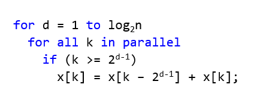
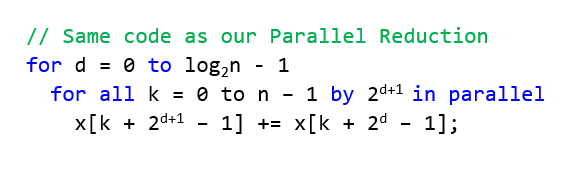
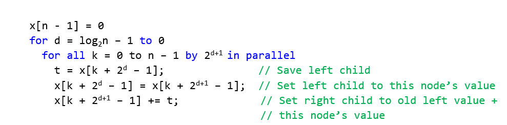
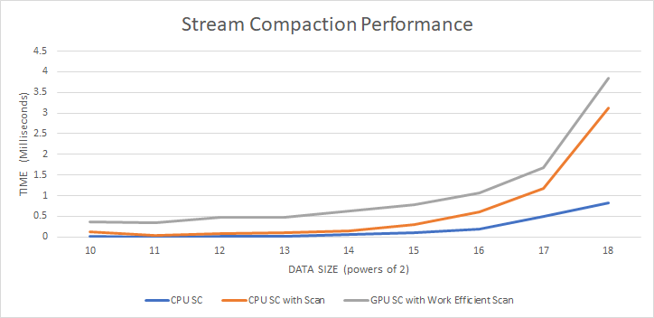
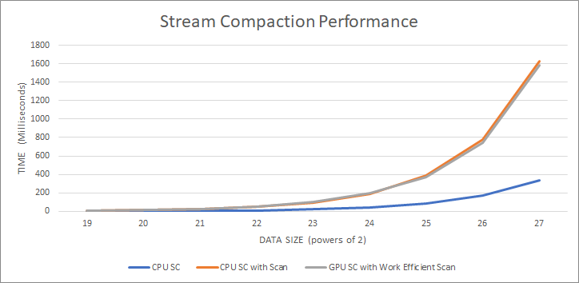

## Project 2 Part 1 - CUDA Stream Compaction
**University of Pennsylvania
CIS 565: GPU Programming and Architecture**

* Author: Chhavi Sharma ([LinkedIn](https://www.linkedin.com/in/chhavi275/))
* Tested on: Windows 10, Intel Core(R) Core(TM) i7-6700 CPU @ 3.40GHz 16GB, 
             NVIDIA Quadro P1000 4GB (MOORE100B-06)

### Index

- [Introduction](https://github.com/chhavisharma/Project2-Number-Algorithms/blob/master/Project2-Stream-Compaction/README.md#introduciton)
- [Algorithms](https://github.com/chhavisharma/Project2-Number-Algorithms/blob/master/Project2-Stream-Compaction/README.md#algorithms)
- [Questions and Performance Analysis](https://github.com/chhavisharma/Project2-Number-Algorithms/blob/master/Project2-Stream-Compaction/README.md#questions-and-performance-analysis)


### Introduciton

In this project, we implement GPU based Stream Compaction in CUDA. To aid stream compaction, we also implement various versions of the *Scan* (*Prefix Sum*) algorithm, such as CPU, GPU Naive and GPU Work Efficient versions.
algorithm

Stream compaction, also known as stream filtering or selection, usually produces a smaller output array which contains only the wanted elements from the input array based on some criteria for further processing, while preserving order. For our implementation, We will attemp to remove '0's from an array of ints.


### Algorithms

#### 1: CPU Scan & Stream Compaction
 
 We implement stream compaction in two ways:
 
 - CPU based stream compaction: 
   - Loop over the input data array
      - Copy non-zero elements to output array
      - count copies to track size
   ```
   compactWithoutScan(N, Odata, Idata)
     if n > 0
       int size=0;
       for i in Idata
           if (idata[i] != 0) 
              Odata[counter] = Idata[i]
              size+=1
       return size
   ```
   
 - CPU based stream compaction with CPU based scan: 
   - Compute *Indicator Array* of the input data size that is 1 for non zero elements, an 0 otherwise.
   - Compute *Scan* over indicator Array to get another array. This gives us write indices for the valid elements in the output array. It also gives us the total valid elelemts.
   - *Scatter* data, read from the input array where Indiacator Array is 1, write to the outut array at index given by the scan array. That is:
  ```
      - map
        goal: map our original data array (integer, Light Ray, etc) to a bool array
        input  [1 5 0 1 2 0 3]
        output [1 1 0 1 1 0 1]
    - scan
        take the output of last step as input
        input   [1 1 0 1 1 0 1]
        output  [0 1 2 2 3 4 4]
    - scatter
        preserve non-zero elements and compact them into a new array
        original array  [1 5 0 1 2 0 3]
        mapped array    [1 1 0 1 1 0 1]
        scanned array   [0 1 2 2 3 4 4]
        output          [1 5 1 2 3]
  ```
  
-Scan : The goal is to produce a prefic sum of the input array.
    ```
    input  [1 1 0 1 1 0 1]
    output [0 1 2 2 3 4 4]
    ```  


#### 2: Naive GPU Scan
We can naively parallelize the scan algorithm on the GPU to reduce the loop to ```log2(n)``` iterations. At the first iteraction, n-1 threads add a pair of values and store it in the next array, but as iteractions progress, the number of additions come down to 'O(1)'. Thus this scan has a runtime of 'log2(n)' where as the CPU sequential scan has the runtime of 'O(n)'. The number of additions in this scenario increase to ```O(n*log2(n))```.




#### 3: Work-Efficient GPU Scan

We can further parallelize the scan algorithm to bring down the number of addition operations to ```O(n)``` and make it *Work Efficient*. This is done by implementing the scan algorithm using a Balanced Binary Tree and perfroming the UpSweep and DownSweep algorithm. During Upsweep, we start from the tree's leaf nodes and compute partial sums upto the root. These operations are in place. 



Finally in the downsweep, starting from the Root node, we perfom the following steps to get the preorder sum.



#### 4: Work-Efficient Stream Compaction
Work efficient stram compaction is nothing but the stream compaction algorithm explained above that uses the work-efficient scan. 
    ```
     compactWithScan(n, odata, idata) 
        Compute indicator array (Parallely)
        Compute scan (Work efficiently)
        Scatter 
    ```
#### 5: Using Thrust's Implementation
We also experiemented with CUDA's `thrust::exclusive_scan(first, last, result)` function to compute scan and compare performance.


### Questions and Performance Analysis

  * **BlockSize Optimization for each Implementation**
  We compare the rumtime of GPU Naive scan and and the work efficient naive scan with the number of threads per block to pick  the most optimal configuration for furhter tests.

   *Block Size v/s Runtime*
  

  From the above plot, we find that BlockSize 128 was the most optimal for both Naive and Work Efficient Scan.

  * **Compare all of these GPU Scan implementations (Naive, Work-Efficient, and Thrust) to the serial CPU version of Scan. Plot a graph of the comparison (with array size on the independent axis).**

     The following plots show the runtime comparasion of all the above scan implementations. 
     
     SCAN with increasing data size: Lower Runtime -> Faster Algorithm

        
        


     SCAN with increasing data size and nonPowersOf2: Lower Runtime -> Faster Algorithm

        
       
    
  * **Write a brief explanation of the phenomena you see here.Can you find the performance bottlenecks? Is it memory I/O? Computation? Is it different for each implementation?**

  **Scan Comparasion**
  Varying the data from '2^10' to '2^28', we observe the following:-
  - The CPU implementation of Scan is realtively faster than all the GPU implementations when the data size is small. This is becuase the compute time is not able to hide the other kernel overheads such as allocating threads and multiple kernel launches. 
  - As the data size grows, serial compute scan on the CPU grows in time. The naive GPU scan and Work efficint scan are faster. 
  - For really large data sizes, CPU scan runs faster than Naive GPU scan, which could be becuause the 'n* log2(n)' additional compute in the naive GPU scan overpowers the parallelization. 
  - Work efficient scan perfroms the best on large data sizes, as comapred to Naive nad CPU scan, becuase of compute 'log(n)' and time 'log(n)' optimization. 
  - Thrust scan perfroms far better than any other implementation for large data sizes. Thrust maybe optimizing the memory I/O and kernel launching overheads further as comapred to our implementation of Work-efficient scan where we launch a kernel every time in a for loop for upstream and downstream. 
    
    
  **Compaction Comparasion**

   
    
   

  Varying the data from '2^10' to '2^28', we observe the following:-
  - Internstingly, stream compction without scan on the cpu outperforms stream compaction with scan in terms of computation time. The drawback of stream compaction without scan is that it is not in place and uses double the memory of input size. 
  

  * **Paste the output of the test program **

  
